# Lab 1 – Containerization & Cloud Deployment

Welcome to Module 51! In Module 50, you built a complete authentication system with user registration, JWT login, and refresh tokens. In this module, you'll learn how to deploy your application to the cloud as a containerized service that runs reliably throughout your lab session.

You've actually been using Poridhi Cloud throughout Module 50 without realizing it. Every time you used the Poridhi Load Balancer to expose your FastAPI application running on a Poridhi VM, you were deploying to Poridhi Cloud. The load balancer gave you a public URL like `https://lb-xxxxx.poridhi.io` that worked during your lab session. But your FastAPI application wasn't containerized. In this lab, you'll package everything your application needs into a Docker image, orchestrate it with PostgreSQL using docker-compose, and deploy it as a managed service that runs reliably throughout the lab duration.

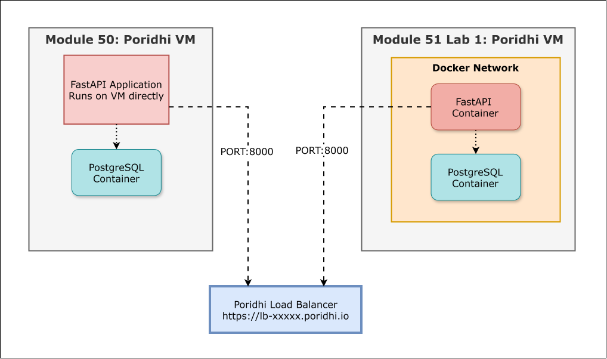

## Objectives

- Understand why containerization matters for production deployment
- Write a production-ready Dockerfile for FastAPI applications
- Create a multi-service docker-compose configuration
- Configure environment variables for containerized applications
- Build and run Docker images locally
- Deploy containerized applications to Poridhi Cloud
- Verify all authentication endpoints work in the cloud environment

## Background

### What is Poridhi Cloud?

Poridhi Cloud is an environment designed for educational purposes and hands-on learning. It provides virtual machines where you can run your applications along with a load balancing service that gives you public URLs. Throughout Module 50, whenever you created a Poridhi VM, ran your FastAPI application, and exposed it via the Poridhi Load Balancer, you were using Poridhi Cloud.

The key components you've been using are the Poridhi VM (a Linux virtual machine where your code runs) and the Poridhi Load Balancer (which provides a public HTTPS URL and routes traffic to your VM). The load balancer handles SSL certificates automatically, so you get HTTPS without any configuration.

**Important**: Poridhi Cloud labs are time-limited sessions. When you start a lab, a VM is automatically created for you. The VM and your application remain active for the duration of the lab session. When the lab ends, the VM is terminated and the load balancer URL stops working. This is perfect for learning and experimentation without worrying about cloud costs or infrastructure management.

### Why Poridhi Cloud?

Poridhi Cloud is the perfect stepping stone between running on localhost and deploying to full-scale cloud platforms like AWS or Google Cloud. You get hands-on experience with containerized deployment without the complexity of managing infrastructure. You don't need to configure firewalls, set up SSL certificates, manage DNS, or deal with AWS billing surprises. Everything just works.

In later labs, you'll move to AWS where you'll provision EC2 virtual machines, configure security groups, and manage networking. You'll also explore AWS Lambda for serverless deployment. But starting with Poridhi Cloud lets you focus on containerization and deployment patterns first, without the overhead of cloud infrastructure management.

### What You'll Build

In this lab, you'll containerize your authentication API using Docker. You'll create a Dockerfile that packages your FastAPI application with all its dependencies, update your docker-compose configuration to run both the application and PostgreSQL as containers, configure environment variables properly, and deploy the containerized application to Poridhi Cloud using the same load balancer approach you used in Module 50.

The key difference from Module 50 is that your application now runs as a managed service using Docker Compose. You can close your terminal, disconnect your SSH session, and the application continues running as a background service throughout the lab duration. If a container crashes, Docker automatically restarts it. This is how production-ready deployments work - applications run as managed services, not as commands in a terminal.

## Prerequisites

This lab builds on the code from Module 50 Lab 3 (the refresh token implementation). You'll start on a fresh Poridhi VM, so you'll need to get the Lab 3 code first.

**Option 1: Clone the Lab 3 code from Poridhi's GitHub (Recommended)**

```bash
git clone https://github.com/poridhioss/Building-Systems-With-FastAPI.git
cd Building-Systems-With-FastAPI/
git checkout -b mod-50/lab-3 origin/mod-50/lab-3
```

**Option 2: Use your own Lab 3 implementation**

If you completed Lab 3 and pushed your code to GitHub, you can clone your own repository.

Either way, you should have:
- Complete Module 50 Lab 3 code with refresh tokens
- PostgreSQL setup in docker-compose
- All authentication endpoints working (register, login, refresh, logout)

Check Python version:

```bash
python --version
```

If it doesn't work, install Python 3.12:

```bash
sudo apt update
sudo apt install python3.12-venv -y
alias python=python3.12
source ~/.bashrc
```

## Project Structure

We'll add Docker-related files to your existing project:

```
Root directory/
├── docker-compose.yml          # Multi-container orchestration (MODIFIED)
├── Dockerfile                  # NEW: Application container definition
├── .dockerignore              # NEW: Files to exclude from Docker image
├── .env                       # Environment variables (MODIFIED)
├── .env.example
├── requirements.txt
├── alembic.ini
├── .gitignore
│
├── app/
│   ├── __init__.py
│   ├── main.py
│   ├── database.py
│   ├── models.py
│   ├── schemas.py
│   ├── utils.py
│   ├── auth.py
│   └── config.py
│
└── alembic/
    └── versions/
```

## Step-by-Step Implementation Guide

### Step 1: Understand the Current Setup

Before we containerize, let's understand what's currently running. In Module 50, you were running two separate processes:

1. **PostgreSQL** - Running in a Docker container via docker-compose
2. **FastAPI** - Running directly on poridhi VM with uvicorn

Your FastAPI application connected to PostgreSQL at `localhost:5432` because the database container exposed port 5432 to your VM. This worked fine, but your FastAPI app wasn't containerized. In this lab, we'll containerize the FastAPI app too, so both services run as containers.

### Step 2: Create a Dockerfile

The Dockerfile is a recipe for building your application container. Create a file named `Dockerfile` in your project root (same directory as docker-compose.yml).

```dockerfile
# Start from official Python 3.12 slim image
# Slim version is smaller than full Python image but includes everything we need
FROM python:3.12-slim

# Set working directory inside the container
# All subsequent commands will run from this directory
WORKDIR /app

# Install system dependencies required by psycopg2
# psycopg2 needs PostgreSQL client libraries to compile
RUN apt-get update && apt-get install -y \
    gcc \
    postgresql-client \
    libpq-dev \
    && rm -rf /var/lib/apt/lists/*

# Copy requirements file first
# Docker caches layers, so if requirements.txt doesn't change,
# this layer won't be rebuilt even if code changes
COPY requirements.txt .

# Install Python dependencies
# --no-cache-dir reduces image size by not storing pip cache
RUN pip install --no-cache-dir -r requirements.txt

# Copy application code
# This comes after installing dependencies so code changes don't
# trigger dependency reinstallation
COPY . .

# Expose port 8000
# This is documentation - it tells users which port the app uses
# The actual port binding happens in docker-compose
EXPOSE 8000

# Run database migrations before starting the server
# The && ensures server only starts if migrations succeed
CMD alembic upgrade head && uvicorn app.main:app --host 0.0.0.0 --port 8000
```

### Step 3: Create .dockerignore

Just like `.gitignore` tells Git which files to skip, `.dockerignore` tells Docker which files to skip when copying your project into the container. Create a file named `.dockerignore` in your project root:

```
# Virtual environment - we'll install packages fresh in the container
.venv
venv
env

# Python cache files - will be regenerated in container
__pycache__
*.pyc
*.pyo
*.pyd
.Python

# Git directory - no need for version control inside container
.git
.gitignore

# IDE settings - not needed in container
.vscode
.idea
*.swp
*.swo

# Environment files - these will be injected at runtime
.env

# Docker files - no need for these inside the container
Dockerfile
.dockerignore
docker-compose.yml

# Documentation - not needed for running the app
README.md
*.md

# Test files - we're building a production image
tests/
test_*.py
*_test.py

# macOS system files
.DS_Store

# Alembic compiled files
alembic/__pycache__
```

This file is important for two reasons. First, it makes your Docker builds faster by skipping unnecessary files. Second, it keeps your image smaller - why include your Git history or IDE settings in a production container? Most importantly, it prevents copying `.env` into the image, which would be a security risk. Environment variables should be injected at runtime, not baked into the image.

### Step 4: Update docker-compose.yml

Now we need to update docker-compose to include both the PostgreSQL database and our FastAPI application. Here's the COMPLETE `docker-compose.yml` file:

```yaml
version: "3.9"

services:
  # PostgreSQL database service (FROM LAB 1)
  db:
    image: postgres:16
    container_name: auth_postgres
    environment:
      POSTGRES_USER: postgres
      POSTGRES_PASSWORD: postgres
      POSTGRES_DB: auth_lab1_db
    ports:
      - "5432:5432"
    volumes:
      - pgdata:/var/lib/postgresql/data
    healthcheck:
      test: ["CMD-SHELL", "pg_isready -U postgres -d auth_lab1_db"]
      interval: 5s
      timeout: 5s
      retries: 20
    networks:
      - auth_network

  # FastAPI application service (NEW IN MODULE 51 LAB 1)
  app:
    build:
      context: .
      dockerfile: Dockerfile
    container_name: auth_fastapi
    env_file:
      - .env
    environment:
      # Override DATABASE_URL to use Docker service name instead of localhost
      - DATABASE_URL=postgresql+psycopg2://postgres:postgres@db:5432/auth_lab1_db
    ports:
      - "8000:8000"
    depends_on:
      db:
        condition: service_healthy
    networks:
      - auth_network
    restart: unless-stopped

# Define volumes for persistent data
volumes:
  pgdata:

# Define network for service communication
networks:
  auth_network:
    driver: bridge
```


### Step 5: Update Environment Configuration

Create a new `.env` file for production settings. Here's the COMPLETE `.env` file:

```env
# Application Settings
APP_NAME=FastAPI Auth Lab - Containerized

# Database Connection
# Note: When running in Docker Compose, use service name 'db' as host
# When running app locally, use 'localhost'
DATABASE_URL=postgresql+psycopg2://postgres:postgres@db:5432/auth_lab1_db

# JWT Configuration - KEEP THIS SECRET!
# Generate a secure secret: openssl rand -hex 32
JWT_SECRET=your-super-secret-key-change-this-in-production-min-32-chars
JWT_ALGORITHM=HS256
ACCESS_TOKEN_EXPIRE_MINUTES=15
REFRESH_TOKEN_EXPIRE_DAYS=7
```

**Important Security Notes:**

The `.env` file contains sensitive information like your `JWT_SECRET`. This file should **NEVER** be committed to Git. Make sure your `.gitignore` file includes `.env` (it should already from Module 50).

Docker Compose automatically reads the `.env` file when it's in the same directory as `docker-compose.yml`. You don't need to explicitly tell docker-compose where the file is - it just works. This means all the variables defined in `.env` are available to your containers without exposing them in the docker-compose.yml file.

For production, you should generate a strong random secret for `JWT_SECRET`:

```bash
openssl rand -hex 32
```

Copy the output and replace the `JWT_SECRET` value in your `.env` file.

The DATABASE_URL uses `db` as the hostname (the Docker service name). When your FastAPI container needs to connect to PostgreSQL, Docker's DNS resolves `db` to the database container's IP address on the internal network. Note that in docker-compose.yml, we override this value, so technically the value here doesn't matter when running with docker-compose, but it's good to keep it consistent.

### Step 6: Build and Run with Docker Compose

Build the FastAPI application image:

```bash
docker compose build
```

This reads your Dockerfile and builds an image. You'll see each step of the Dockerfile execute. The first build takes a few minutes because it's installing all system packages and Python dependencies. Subsequent builds are much faster because Docker caches layers that haven't changed.

Start all services:

```bash
docker compose up -d
```

Check that both containers are running:

```bash
docker compose ps
```

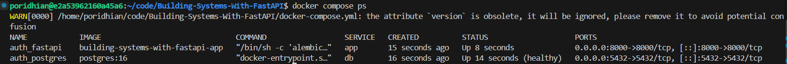

You should see two containers: `auth_postgres` and `auth_fastapi`, both with status "Up". The database should show "(healthy)" status.

View logs from the FastAPI container:

```bash
docker compose logs app
```

You should see uvicorn start up messages and the Alembic migration output. If there are errors, they'll appear here.

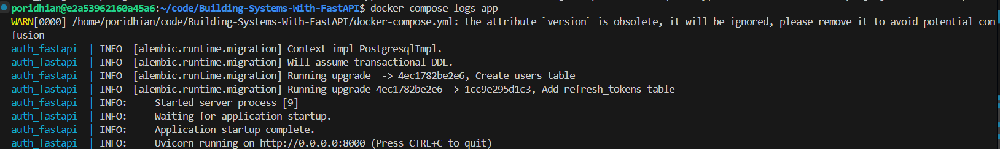

View logs from the database:

```bash
docker compose logs db
```

You can also follow logs in real-time:

```bash
docker compose logs -f app
```

Press Ctrl+C to stop following logs (this doesn't stop the container).

### Step 7: Verify the Application Works

Your application is now running inside a Docker container. Test the health endpoint to make sure it's accessible:

```bash
curl http://localhost:8000/ping | jq
```

You should see:

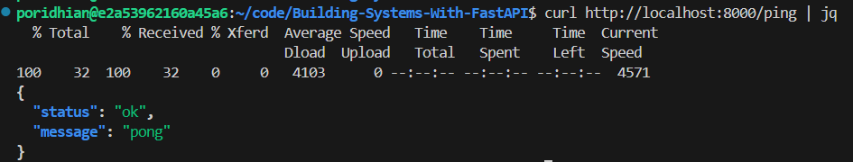

### Step 8: Verify Database Connection

Let's confirm that data is actually being stored in the PostgreSQL container. Connect to the database using Docker:

```bash
docker compose exec db psql -U postgres -d auth_lab1_db
```

This opens a PostgreSQL shell inside the database container. Run some queries:

```sql
-- List all tables
\dt

-- View all users
SELECT id, email, is_active, created_at FROM users;

-- View refresh tokens
SELECT id, user_id, expires_at, created_at FROM refresh_tokens;

-- Exit psql
\q
```

You should see the user you just registered and any refresh tokens from your logins.


### Step 9: Set Up Poridhi Load Balancer

Now we'll expose your containerized application to the internet using Poridhi's load balancer. First, find your wt0 IP address:

```bash
ifconfig wt0
```

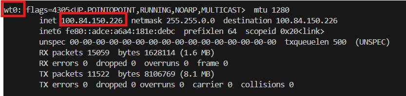

Look for the `inet` address. It will be something like `100.125.xxx.xxx`.

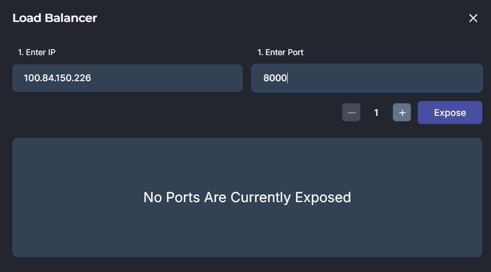

Go to the Poridhi Load Balancer dashboard in your browser. Create a new load balancer with these settings:

- **Backend IP**: Your wt0 IP address
- **Backend Port**: 8000

Click "Create" and you'll get a public URL like `https://lb-xxxxx.poridhi.io`.


### Step 10: Test Your Deployed Application with Postman

Open Postman on your machine. If you don't have Postman installed, download it from [postman.com](https://www.postman.com/downloads/).

We'll test the complete authentication flow using your public load balancer URL. Throughout this section, replace `https://lb-xxxxx.poridhi.io` with your actual load balancer URL.

**Step 10.1: Register a user**

Create a new POST request in Postman:
- **Method**: POST
- **URL**: `https://lb-xxxxx.poridhi.io/register`
- **Headers**:
  - `Content-Type`: `application/json`
- **Body** (select "raw" and "JSON"):

```json
{
  "email": "production@example.com",
  "password": "ProductionPass123!"
}
```

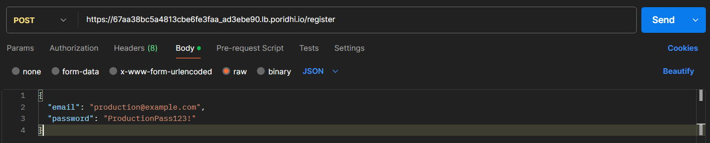

Click "Send". You should get a 201 response with the user details.

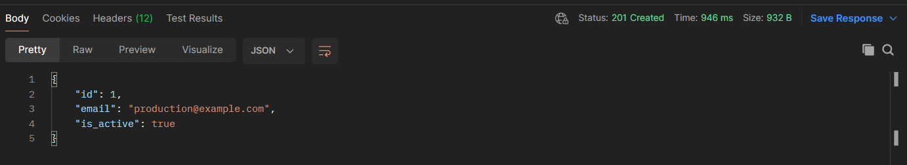

**Step 10.2: Login**

Create a new POST request:
- **Method**: POST
- **URL**: `https://lb-xxxxx.poridhi.io/login`
- **Headers**:
  - `Content-Type`: `application/json`
- **Body** (raw JSON):

```json
{
  "email": "production@example.com",
  "password": "ProductionPass123!"
}
```

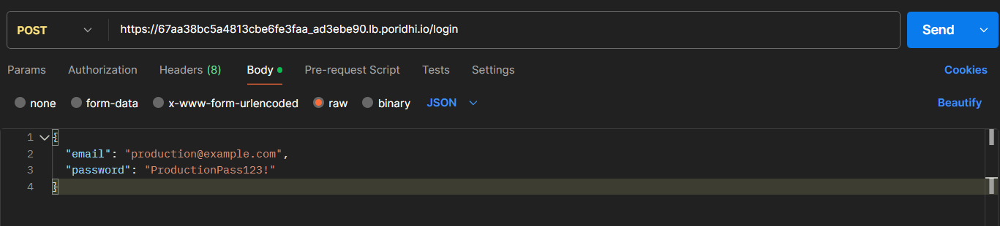

Click "Send". You'll receive both access and refresh tokens in the response. Copy the `access_token` value - you'll need it for the next step.

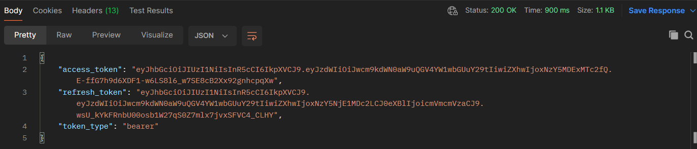

**Step 10.3: Access protected endpoint**

Create a new GET request:
- **Method**: GET
- **URL**: `https://lb-xxxxx.poridhi.io/users/me`
- **Headers**:
  - `Authorization`: `Bearer <paste-your-access-token-here>`

Make sure to include the word "Bearer" followed by a space, then your access token. For example:
```
Bearer eyJhbGciOiJIUzI1NiIsInR5cCI6IkpXVCJ9...
```

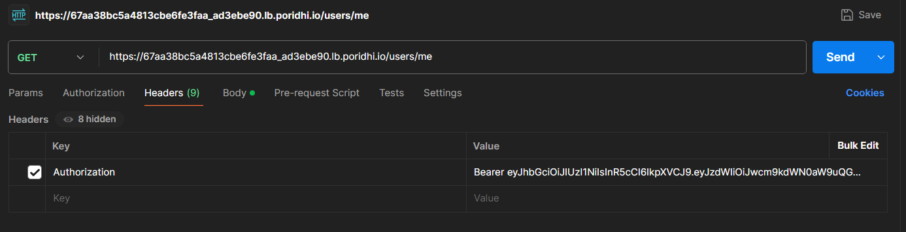

Click "Send". You should see your user information in the response.

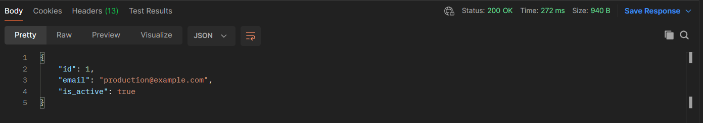

**Step 10.4: Test refresh token**

Create a new POST request:
- **Method**: POST
- **URL**: `https://lb-xxxxx.poridhi.io/refresh`
- **Headers**:
  - `Content-Type`: `application/json`
- **Body** (raw JSON):

```json
{
  "refresh_token": "paste-your-refresh-token-here"
}
```

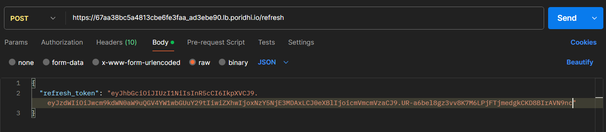

Click "Send". You should get a new access token back. The refresh token remains the same.

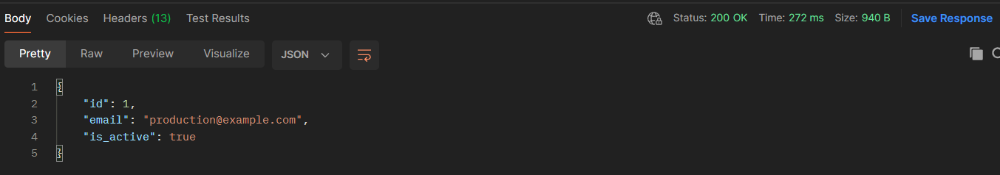

**Step 10.5: Test logout**

Create a new POST request:
- **Method**: POST
- **URL**: `https://lb-xxxxx.poridhi.io/logout`
- **Headers**:
  - `Content-Type`: `application/json`
- **Body** (raw JSON):

```json
{
  "refresh_token": "paste-your-refresh-token-here"
}
```

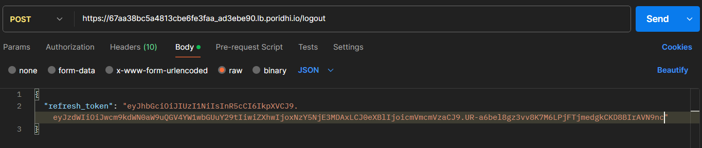

Click "Send". You should see a success message saying you've been logged out.

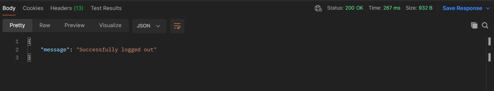

**Step 10.6: Verify token revocation**

Try to use the `/refresh` endpoint again with the same refresh token. You should get a 401 error saying "Refresh token has been revoked".

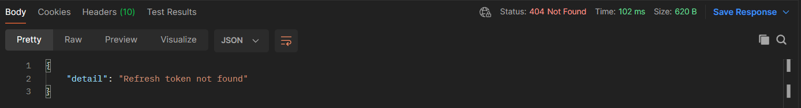

Congratulations! Your containerized authentication API is now running as a managed service in Poridhi Cloud. You've successfully tested all the authentication endpoints using Postman, and your application will continue running throughout the lab session even if you close your terminal.

### Step 11: Understanding What Just Happened

Let's review what you've accomplished. You took an application that ran directly on your VM and packaged it into a Docker container. This container includes Python, all your dependencies, and your application code in a single, portable unit.

Your application and database run in separate containers that communicate over a private Docker network. The containers can restart independently - if your application crashes, it doesn't affect the database. If you need to update your application code, you can rebuild just the app container without touching the database.

The Poridhi load balancer acts as a reverse proxy. External requests come to the load balancer's public URL, and it forwards them to your container running on the VM. This provides a clean separation between your internal infrastructure and the public internet. You could scale to multiple VMs running the same container, and the load balancer would distribute traffic among them.

Most importantly, your application is now truly portable. The exact same Docker image could run on AWS, Google Cloud, Azure, or any other platform that supports Docker. You're no longer tied to a specific server configuration or operating system.

## Conclusion

Congratulations on containerizing your authentication API! You've learned how to write production-ready Dockerfiles, orchestrate multi-service applications with docker-compose, and deploy containerized services to Poridhi Cloud. While Poridhi labs are time-limited for learning purposes, the Docker skills you've gained are universal - the same images and configurations work on AWS, Google Cloud, Azure, or any platform supporting Docker. In the next labs, you'll deploy this containerized application to AWS EC2 for long-running production systems and adapt it for serverless deployment on AWS Lambda.

