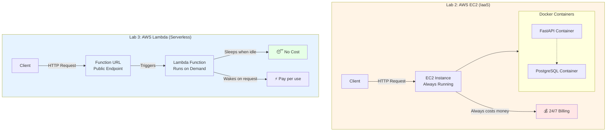

# Lab 3 – Serverless Deployment with AWS Lambda

Welcome to Lab 3, the final lab in Module 51! In Lab 2, you deployed your containerized application to AWS EC2, giving you full control over the infrastructure. But there's a cost to that control - you're paying for the server to run 24/7, even when no one is using your API. What if your application only needs to run when someone actually makes a request?

In this lab, you'll refactor your authentication API for serverless deployment on AWS Lambda. Instead of a server running continuously, your code will exist as a function that AWS invokes only when needed. Between requests, it costs you nothing. This is the modern approach to cloud deployment - pay only for what you use.



## Objectives

- Understand serverless architecture and when to use it
- Adapt FastAPI applications for AWS Lambda using Mangum
- Package Python applications with dependencies for Lambda deployment
- Deploy functions to AWS Lambda and configure Function URLs
- Test serverless APIs and understand cold start behavior
- Compare serverless vs traditional deployment tradeoffs

## Background

### What is Serverless?

Serverless doesn't mean there are no servers - it means you don't manage them. In Lab 2, you SSH'd into an EC2 instance, installed Docker, managed containers, and configured security groups. That server runs 24/7, waiting for requests. If you get 1 request per hour or 1000 requests per second, you're paying for the same always-on server.

AWS Lambda flips this model. You upload your code as a "function," and AWS runs it only when triggered by an event. Someone makes an HTTP request? Lambda spins up an execution environment, runs your code, returns the response, and shuts down. The whole lifecycle might take 200 milliseconds. You pay only for those 200 milliseconds of compute time.

This has profound implications. A blog API that gets 100 requests per day might cost you $20/month on EC2 (the cheapest instance running 24/7) but only $0.02/month on Lambda (100 requests × 200ms × AWS pricing). The tradeoff is that the first request after idle time experiences "cold start" latency - AWS needs 1-2 seconds to initialize your function. For many applications, this is acceptable.

### How Lambda Works

Traditional servers listen on a port for HTTP requests. Your FastAPI app in Lab 2 had uvicorn listening on port 8000, waiting for connections. Lambda functions don't work this way. They don't listen on ports or run continuously. Instead, they expose a handler function that AWS invokes with an event object.

When an HTTP request arrives at your Lambda Function URL, AWS creates an event object containing the request details (method, path, headers, body). It then invokes your handler function with this event. Your handler processes the event, generates a response, and returns it to AWS. AWS converts that response back into HTTP format and sends it to the client.

The challenge is that FastAPI expects to receive HTTP requests directly through ASGI. It doesn't know how to work with Lambda events. This is where Mangum comes in - it's an adapter that translates Lambda events into ASGI format that FastAPI understands, and translates FastAPI responses back into the format Lambda expects.

### Lambda Limitations

Lambda isn't suitable for every application. There are several constraints you need to understand. First, functions have a maximum execution time of 15 minutes - if your code runs longer, it's killed. Second, you have limited disk space (512MB in /tmp). Third, there's the cold start problem - functions that haven't run recently take 1-2 seconds to initialize on the first request.

Most importantly for our authentication API, Lambda functions are stateless and ephemeral. You can't run a PostgreSQL database inside Lambda. Each function invocation is isolated, and when it completes, everything is destroyed. For stateful data, you need external services like RDS (managed PostgreSQL) or DynamoDB (AWS's NoSQL database).

In this lab, we'll simplify by removing database functionality and creating a mock authentication flow. In production, you'd connect Lambda to RDS or use DynamoDB for data persistence.

### Why Serverless for Authentication APIs?

Authentication APIs are perfect candidates for serverless. They typically have spiky traffic - lots of logins in the morning when people start work, quiet periods overnight. They're fast operations - generating a JWT token takes milliseconds. And they're stateless after authentication - the JWT itself carries the session state.

Consider a startup with 1000 users who each log in once per day. That's 1000 requests spread over 24 hours, maybe 100ms each. On EC2, you're paying for 24 hours of server time. On Lambda, you're paying for 100 seconds (1000 requests × 100ms) of compute time. The cost difference is dramatic.

The authentication pattern also tolerates cold starts well. Users don't mind waiting an extra second to log in if they haven't visited in a while. Compare that to a real-time gaming API where every millisecond matters - that's not a good fit for Lambda.

### What You'll Build

In this lab, you'll adapt your FastAPI authentication application for Lambda. You'll install Mangum as an adapter, modify your main.py to include a Lambda handler, package your application with its dependencies into a ZIP file, deploy it to AWS Lambda, configure a Function URL to make it publicly accessible, and test the complete serverless authentication flow.

The key learning is understanding the architectural shift. You're moving from "deploy a container that runs forever" to "upload code that runs on demand." This is the future of cloud computing for many use cases.

## Prerequisites

1. **Completed Module 51 Lab 2:** You should understand containerized deployment and have the Lab 2 code available.
2. **Active AWS Account:** You'll need access to AWS Lambda console.
3. **Local Machine with Python:** You'll build the deployment package locally before uploading to AWS.

## Step-by-Step Implementation Guide

### Step 1: Clone the Lab 2 Code Locally

Unlike Labs 1 and 2 where you worked on Poridhi VMs, you'll prepare the Lambda package on your **local machine**. Lambda deployment requires bundling your code with all its dependencies, which is easier to do locally.

**On your local machine:**

```bash
# Clone the repository
git clone https://github.com/poridhioss/Building-Systems-With-FastAPI.git
cd Building-Systems-With-FastAPI/

# Checkout the Lab 2 branch
git checkout -b mod-51/lab-1 origin/mod-51/lab-1
```

If you have your own Lab 2 code, clone your repository instead.

### Step 2: Simplify the Application for Lambda

Lambda functions can't run PostgreSQL databases. For this lab, we'll create a simplified version that demonstrates Lambda deployment without database dependencies. In production, you'd connect to RDS or DynamoDB.

Create a new directory for the Lambda version:

```bash
mkdir lambda-deployment
cd lambda-deployment
```

### Step 3: Create Simplified Application Structure

Create the basic file structure:

```bash
mkdir app
touch app/__init__.py
touch app/main.py
touch requirements.txt
```

### Step 4: Write the Lambda-Compatible Application

Create `app/main.py` with a simplified authentication API that uses in-memory storage instead of a database. Here's the COMPLETE `app/main.py` file:

```python
# Lambda-compatible FastAPI authentication API
# Uses in-memory storage instead of database

from fastapi import FastAPI, HTTPException, status, Depends
from fastapi.security import HTTPBearer, HTTPAuthorizationCredentials
from pydantic import BaseModel, EmailStr
from datetime import datetime, timedelta, timezone
from jose import JWTError, jwt
from passlib.context import CryptContext
from typing import Optional
from mangum import Mangum

# ========== Configuration ==========
JWT_SECRET = "lambda-secret-key-change-in-production"
JWT_ALGORITHM = "HS256"
ACCESS_TOKEN_EXPIRE_MINUTES = 15

# ========== FastAPI App ==========
app = FastAPI(
    title="Lambda Auth API",
    description="Serverless authentication API running on AWS Lambda",
    version="1.0.0"
)

# ========== Security ==========
pwd_context = CryptContext(schemes=["bcrypt"], deprecated="auto")
security = HTTPBearer()

# ========== In-Memory Storage ==========
# In production, use RDS or DynamoDB
users_db = {}

# ========== Models ==========
class UserCreate(BaseModel):
    email: EmailStr
    password: str

class UserLogin(BaseModel):
    email: EmailStr
    password: str

class Token(BaseModel):
    access_token: str
    token_type: str

class UserOut(BaseModel):
    email: EmailStr

# ========== Helper Functions ==========
def get_password_hash(password: str) -> str:
    return pwd_context.hash(password)

def verify_password(plain_password: str, hashed_password: str) -> bool:
    return pwd_context.verify(plain_password, hashed_password)

def create_access_token(data: dict, expires_delta: Optional[timedelta] = None):
    to_encode = data.copy()

    if expires_delta:
        expire = datetime.now(timezone.utc) + expires_delta
    else:
        expire = datetime.now(timezone.utc) + timedelta(minutes=ACCESS_TOKEN_EXPIRE_MINUTES)

    to_encode.update({"exp": expire})
    encoded_jwt = jwt.encode(to_encode, JWT_SECRET, algorithm=JWT_ALGORITHM)

    return encoded_jwt

def get_current_user(credentials: HTTPAuthorizationCredentials = Depends(security)):
    credentials_exception = HTTPException(
        status_code=status.HTTP_401_UNAUTHORIZED,
        detail="Could not validate credentials",
        headers={"WWW-Authenticate": "Bearer"},
    )

    try:
        token = credentials.credentials
        payload = jwt.decode(token, JWT_SECRET, algorithms=[JWT_ALGORITHM])
        email: str = payload.get("sub")

        if email is None:
            raise credentials_exception

        if email not in users_db:
            raise credentials_exception

        return email

    except JWTError:
        raise credentials_exception

# ========== Endpoints ==========
@app.get("/")
def root():
    return {
        "message": "Lambda Auth API",
        "status": "running",
        "platform": "AWS Lambda"
    }

@app.get("/ping")
def ping():
    return {"status": "ok", "message": "pong"}

@app.post("/register", response_model=UserOut, status_code=status.HTTP_201_CREATED)
def register(user: UserCreate):
    if user.email in users_db:
        raise HTTPException(
            status_code=status.HTTP_409_CONFLICT,
            detail="Email already registered"
        )

    hashed_password = get_password_hash(user.password)
    users_db[user.email] = {
        "email": user.email,
        "hashed_password": hashed_password
    }

    return UserOut(email=user.email)

@app.post("/login", response_model=Token)
def login(user: UserLogin):
    if user.email not in users_db:
        raise HTTPException(
            status_code=status.HTTP_401_UNAUTHORIZED,
            detail="Incorrect email or password"
        )

    user_data = users_db[user.email]

    if not verify_password(user.password, user_data["hashed_password"]):
        raise HTTPException(
            status_code=status.HTTP_401_UNAUTHORIZED,
            detail="Incorrect email or password"
        )

    access_token = create_access_token(data={"sub": user.email})

    return Token(access_token=access_token, token_type="bearer")

@app.get("/users/me", response_model=UserOut)
def get_me(email: str = Depends(get_current_user)):
    return UserOut(email=email)

# ========== Lambda Handler ==========
# This is what Lambda invokes
handler = Mangum(app, lifespan="off")
```

**Key changes for Lambda:**
- No database imports or connections
- In-memory dictionary (`users_db`) for user storage
- Simplified models (no database IDs)
- **Mangum handler** at the bottom - this is the critical addition that makes FastAPI work with Lambda
- Removed refresh token functionality to keep it simple

### Step 5: Create Requirements File

Create `requirements.txt` with the minimal dependencies needed:

```txt
fastapi==0.115.5
uvicorn==0.32.0
pydantic[email]==2.9.2
python-jose[cryptography]==3.3.0
passlib[bcrypt]==1.7.4
mangum==0.18.0
```

**What's new:**
- **mangum** - The ASGI adapter for AWS Lambda
- **uvicorn** - Needed for local testing (not used in Lambda)
- Removed SQLAlchemy, psycopg2, alembic (no database needed)

### Step 6: Install Dependencies Locally

Create a virtual environment and install dependencies:

```bash
# Create virtual environment
python -m venv .venv

# Activate it
source .venv/bin/activate

# Install dependencies
pip install -r requirements.txt
```

### Step 7: Test Locally (Optional)

You can test the application locally before deploying:

```bash
uvicorn app.main:app --reload --host 0.0.0.0 --port 8000
```

Open http://localhost:8000/docs and verify the endpoints work. When satisfied, stop the server (Ctrl+C).

### Step 8: Package for Lambda Deployment

Lambda needs all your code and dependencies in a single ZIP file. Create the deployment package:

```bash
# Deactivate virtual environment first
deactivate

# Create a clean directory for packaging
mkdir package
cd package

# Install dependencies into this directory
pip install -r ../requirements.txt --target .

# Copy your application code
cp -r ../app .

# Create the ZIP file
# Option A: Using zip command (install if needed)
zip -r ../lambda-deployment.zip .

# If you get "zip: command not found", install it:
# sudo apt-get update && sudo apt-get install -y zip
# Then run: zip -r ../lambda-deployment.zip .

# Option B: Using Python (no installation needed)
# python3 -c "import shutil; shutil.make_archive('../lambda-deployment', 'zip', '.')"

# Go back to parent directory
cd ..
```

You should now have a `lambda-deployment.zip` file that contains your application and all dependencies.

### Step 9: Create Lambda Function in AWS Console

Open the AWS Console and navigate to AWS Lambda.

**9.1: Create Function**

Click "Create function" and configure:
- **Function name**: `fastapi-auth-lambda`
- **Runtime**: Python 3.12
- **Architecture**: x86_64
- **Execution role**: Create a new role with basic Lambda permissions

Click "Create function".

**9.2: Upload Deployment Package**

Once the function is created:
1. Scroll down to "Code source"
2. Click "Upload from" → ".zip file"
3. Click "Upload" and select your `lambda-deployment.zip` file
4. Click "Save"

Wait for the upload to complete. You should see your code in the Lambda console editor.

**9.3: Configure Handler**

In the "Runtime settings" section, click "Edit":
- **Handler**: Change from `lambda_function.lambda_handler` to `app.main.handler`
- Click "Save"

This tells Lambda to call the `handler` function in `app/main.py`.

**9.4: Adjust Timeout**

In "Configuration" → "General configuration" → "Edit":
- **Timeout**: Change from 3 seconds to 30 seconds
- Click "Save"

This gives your function more time to handle cold starts.

### Step 10: Configure Function URL

Lambda Function URLs provide a simple way to expose your function via HTTPS without needing API Gateway.

**10.1: Create Function URL**

1. In your Lambda function, go to "Configuration" → "Function URL"
2. Click "Create function URL"
3. **Auth type**: Select "NONE" (public access)
4. Click "Save"

You'll get a URL like: `https://abcd1234.lambda-url.us-east-1.on.aws/`

Copy this URL - this is your public API endpoint!

### Step 11: Test Your Serverless API with Postman

Now let's test the complete authentication flow using Postman. Replace `YOUR_FUNCTION_URL` with your actual Lambda Function URL throughout these tests.

**Test 1: Health Check**

First, verify the function is accessible:

- **Method**: GET
- **URL**: `https://YOUR_FUNCTION_URL/`

You should see:
```json
{
  "message": "Lambda Auth API",
  "status": "running",
  "platform": "AWS Lambda"
}
```

**Test 2: Register a User**

Create a new POST request in Postman:
- **Method**: POST
- **URL**: `https://YOUR_FUNCTION_URL/register`
- **Headers**:
  - `Content-Type`: `application/json`
- **Body** (raw JSON):

```json
{
  "email": "lambda@example.com",
  "password": "LambdaTest123!"
}
```

Click "Send". You should get a 201 response with the user email.

**Important note:** Because Lambda uses in-memory storage, this user data will disappear when the function goes idle. That's expected for this demo. In production, you'd use RDS or DynamoDB.

**Test 3: Login**

Create a new POST request:
- **Method**: POST
- **URL**: `https://YOUR_FUNCTION_URL/login`
- **Headers**:
  - `Content-Type`: `application/json`
- **Body** (raw JSON):

```json
{
  "email": "lambda@example.com",
  "password": "LambdaTest123!"
}
```

Click "Send". You'll receive an access token:

```json
{
  "access_token": "eyJhbGciOiJIUzI1NiIsInR5cCI6IkpXVCJ9...",
  "token_type": "bearer"
}
```

Copy the `access_token` value.

**Test 4: Access Protected Endpoint**

Create a new GET request:
- **Method**: GET
- **URL**: `https://YOUR_FUNCTION_URL/users/me`
- **Headers**:
  - `Authorization`: `Bearer <paste-your-access-token-here>`

Make sure to include "Bearer " before the token.

Click "Send". You should see your user information:

```json
{
  "email": "lambda@example.com"
}
```

Congratulations! Your serverless authentication API is working!

### Step 12: Understanding Cold Starts

Let's observe the cold start behavior:

1. **Wait 5 minutes** without making any requests to your Lambda function
2. **Make a request** to `/ping` and note the response time
3. **Immediately make another request** to `/ping` and note the response time

The first request after idle time will take 1-2 seconds (cold start). The second request will be much faster (50-100ms) because the function is "warm." This is the serverless tradeoff - occasional latency spikes for massive cost savings.

### Step 13: View Lambda Logs

AWS automatically logs every Lambda invocation to CloudWatch Logs.

1. In the Lambda console, go to "Monitor" → "Logs"
2. Click "View CloudWatch logs"
3. Click on the latest log stream
4. You'll see logs for each function invocation, including print statements and errors

This is how you debug serverless applications - through CloudWatch Logs, not SSH and log files.

### Step 14: Check Costs (Optional)

1. Go to "Monitor" → "Metrics" in the Lambda console
2. You'll see graphs of invocations, duration, and errors
3. AWS provides 1 million free Lambda requests per month and 400,000 GB-seconds of compute time
4. For a low-traffic authentication API, you'll likely stay in the free tier

Compare this to an EC2 instance that costs $5-20/month even if you never use it.

### Step 15: Cleanup (When Done)

If you want to remove the Lambda function to avoid any charges:

1. In the Lambda console, select your function
2. Click "Actions" → "Delete"
3. Type "delete" to confirm

Your Function URL will stop working immediately.

## Comparison: EC2 vs Lambda

Let's review what you've learned across Labs 2 and 3:

**Lab 2 (EC2 with Docker):**
- Full control over infrastructure
- Run any code, any language, any dependencies
- Persistent connections (WebSockets, long-running processes)
- Predictable performance (no cold starts)
- Costs 24/7 whether you use it or not
- You manage OS updates, security patches, scaling

**Lab 3 (Lambda Serverless):**
- No infrastructure management
- Limited runtime options (Python, Node.js, etc.)
- Stateless, short-lived executions (max 15 minutes)
- Cold start latency on first request after idle
- Pay only for actual usage (per request)
- AWS manages everything - you just upload code

**When to use what:**
- **EC2**: High-traffic applications, real-time features, databases, complex dependencies
- **Lambda**: Sporadic traffic, simple operations, cost optimization, rapid deployment

For authentication APIs, both work well. Choose based on your traffic patterns and priorities.

## Conclusion

Congratulations on completing Module 51! You've now deployed the same authentication application three different ways: as a containerized service on Poridhi Cloud (Lab 1), as containers on AWS EC2 (Lab 2), and as a serverless function on AWS Lambda (Lab 3). Each approach has different tradeoffs in cost, control, complexity, and performance.

You've learned that containerization with Docker makes your code portable across platforms. The same Dockerfile worked on Poridhi and AWS EC2. You've also learned that serverless requires architectural changes - you can't just containerize and deploy to Lambda. Functions must be stateless, handle cold starts, and work within execution time limits.

Most importantly, you now understand the cloud deployment spectrum. At one end is full control (EC2) with maximum flexibility and cost. At the other end is serverless (Lambda) with minimal management and pay-per-use pricing. Modern applications often use both - Lambda for APIs and background jobs, EC2 or ECS for databases and real-time services.

The authentication patterns you learned in Module 50 - password hashing, JWT tokens, refresh tokens - work across all deployment models. The deployment strategy is separate from the application logic. This is the power of modern cloud architecture - build once, deploy anywhere, in the way that best fits your needs.
