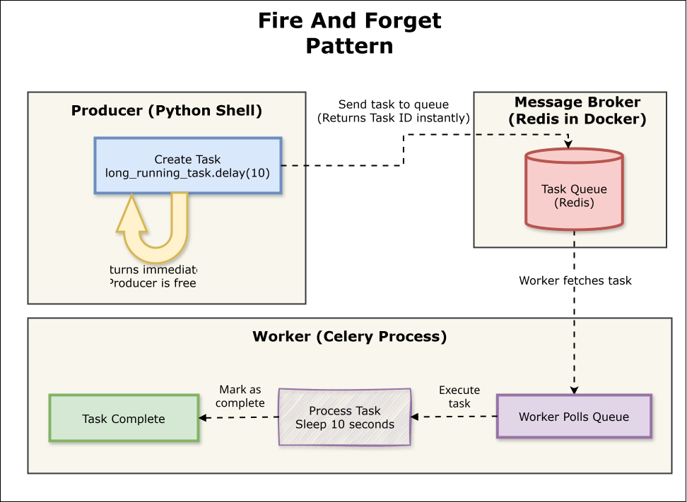
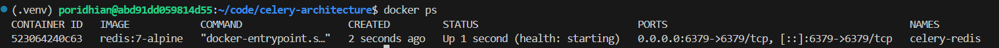
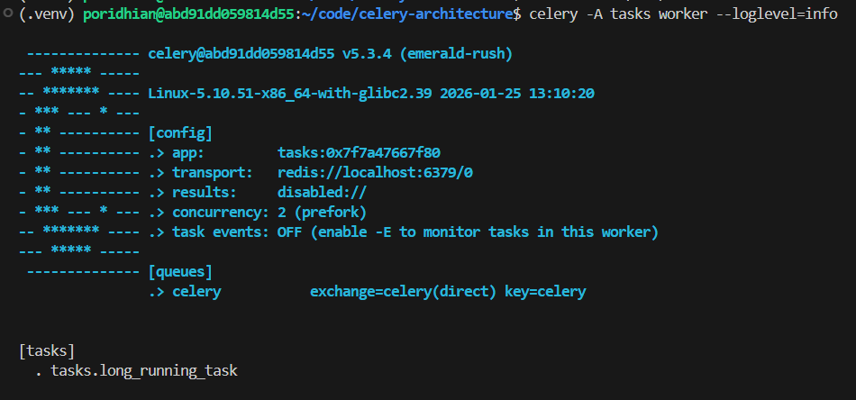
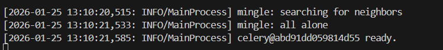
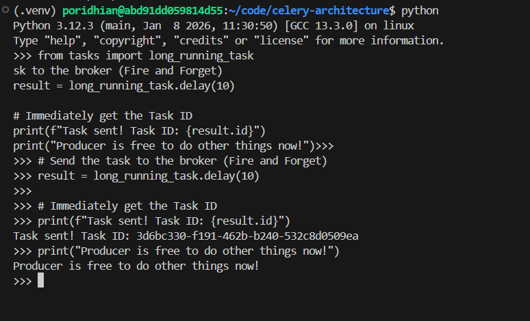
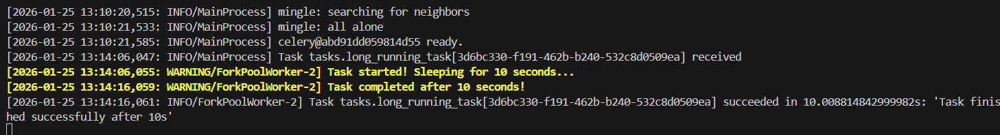

# Lab 1: The Asynchronous Architecture (Producer, Broker, Worker)

Welcome to your first lab in distributed task processing. In this lab, we're going to strip away all the complexity of web frameworks and build the "Hello World" of asynchronous computing. You'll manually set up and interact with the three core components that make distributed systems work: the Producer (who creates tasks), the Broker (who delivers messages), and the Worker (who processes tasks).

Here's the core problem we're solving: when your application needs to do something slow—like processing a video, sending an email, or generating a PDF—you don't want your users waiting around for it to finish. Instead, you want to hand off that work to a background process and immediately give users a response. This "Fire and Forget" model is exactly what we're building today.



**Key Concept - "Fire and Forget":**
- Producer sends the task and gets a Task ID back **immediately** (in milliseconds)
- Producer doesn't wait for the task to complete
- Worker runs independently in the background, processing tasks as they arrive
- This decouples fast operations (responding to users) from slow operations (heavy processing)


## Objectives

By the end of this lab, you will:

1. Understand the three-component architecture of distributed task processing (Producer, Broker, Worker)
2. Set up Redis as a message broker using Docker
3. Create a Celery worker that processes tasks in the background
4. Send tasks from a Python shell and observe asynchronous execution
5. Verify the "Fire and Forget" pattern where producers return instantly while workers process in the background

## Architecture Overview

Before we start coding, let's understand what we're building. In asynchronous task processing, we have three key players:

**1. The Producer (Sender):** This is the part of your application that creates tasks. When you call a function, instead of waiting for it to finish, the Producer immediately gets back a Task ID and moves on. In our lab, we'll use a Python shell as our Producer.

**2. The Broker (Message Queue):** This is the middleman that holds tasks until a worker is ready to process them. We're using Redis for this because it's fast, reliable, and simple to set up. Think of it as a todo list that workers can pull from.

**3. The Worker (Consumer):** This is a separate process that constantly watches the Broker for new tasks. When a task arrives, the Worker picks it up, processes it, and marks it as done. The Worker runs independently from the Producer.


The key insight: The Producer doesn't wait for the Worker. It fires the task and forgets about it, allowing your application to stay responsive.

## Project Structure

By the end of this lab, your project directory will look like this:

```
celery-architecture/
├── docker-compose.yml    # Redis broker configuration
├── tasks.py              # Celery app and task definitions
├── requirements.txt      # Python dependencies
└── .venv/                # Python virtual environment (created automatically)
```

We're keeping it minimal for this lab. Just four components:
- **docker-compose.yml**: Defines our Redis service running in Docker
- **tasks.py**: Contains the Celery application and our long-running task
- **requirements.txt**: Python dependencies (Celery and Redis client)
- **.venv/**: Virtual environment with installed packages

Check Python version:

```bash
python --version
```

If it doesn't work, install Python 3.12:

```bash
sudo apt update
sudo apt install python3.12-venv -y
alias python=python3.12
source ~/.bashrc
```


## Step 1: Set Up Your Project Directory

Let's start fresh. Create a new directory for this lab and set up the basic structure:

```bash
mkdir celery-architecture
cd celery-architecture
```

## Step 2: Install Python Dependencies

We need two main libraries: Celery (the task queue framework) and Redis (the Python client for Redis). Create a `requirements.txt` file:

```txt
celery==5.3.4
redis==5.0.1
```

Now create a virtual environment and install the dependencies:

```bash
# Create virtual environment
python -m venv .venv

# Activate it
source .venv/bin/activate

# Install dependencies
pip install -r requirements.txt
```

**What we just installed:**
- **celery**: The framework that handles task queuing, routing, and execution
- **redis**: The Python client that allows Celery to communicate with our Redis broker

## Step 3: Set Up Redis as the Message Broker

We need a Redis server to act as our message broker. Instead of installing Redis directly, we'll use Docker to run it in a container. This keeps our VM clean and makes it easy to start and stop.

Create a file called `docker-compose.yml`:

```yaml
version: '3.8'

services:
  redis:
    image: redis:7-alpine
    container_name: celery-redis
    ports:
      - "6379:6379"
    command: redis-server
    healthcheck:
      test: ["CMD", "redis-cli", "ping"]
      interval: 5s
      timeout: 3s
      retries: 5
```

**What this does:**
- Pulls the lightweight Alpine-based Redis 7 image
- Exposes Redis on port 6379 (the default Redis port)
- Includes a healthcheck so we can verify Redis is running properly

Now start the Redis container:

```bash
docker compose up -d
```

Verify Redis is running:

```bash
docker ps
```


You should see the `celery-redis` container in the list. You can also check if Redis responds to commands:

```bash
docker exec -it celery-redis redis-cli ping
```

If everything is working, you'll see `PONG` as the response.

## Step 4: Create the Celery Worker

Now let's create the Worker component. This is a Python script that defines a Celery application and registers tasks that can be executed asynchronously.

Create a file called `tasks.py`:

```python
from celery import Celery
import time

# Create Celery application instance
app = Celery(
    'tasks',
    broker='redis://localhost:6379/0'
)

# Configure Celery
app.conf.update(
    task_serializer='json',
    accept_content=['json'],
    result_serializer='json',
    timezone='UTC',
    enable_utc=True,
)

@app.task
def long_running_task(duration=10):
    """
    Simulates a long-running task by sleeping for the specified duration.
    In real applications, this could be processing images, sending emails,
    generating reports, or any time-consuming operation.
    """
    print(f"Task started! Sleeping for {duration} seconds...")
    time.sleep(duration)
    print(f"Task completed after {duration} seconds!")
    return f"Task finished successfully after {duration}s"
```

**Let's break down what this code does:**

- **Celery instance**: We create a Celery app called 'tasks' and tell it to use Redis at `localhost:6379` as the broker
- **Configuration**: We configure Celery to use JSON for serializing task data (converting Python objects to a format that can be sent over the network)
- **Task decorator**: The `@app.task` decorator registers `long_running_task` as a Celery task that can be called asynchronously
- **Simulated work**: The function sleeps for 10 seconds to simulate a time-consuming operation like processing a video or generating a report

## Step 5: Start the Worker Process

Now we need to start the Worker that will watch the Redis broker for incoming tasks. Open a terminal and run:

```bash
# Make sure your virtual environment is activated
source .venv/bin/activate

# Start the Celery worker
celery -A tasks worker --loglevel=info
```

**What this command does:**
- `-A tasks`: Tells Celery to load the application from the `tasks.py` file
- `worker`: Starts Celery in worker mode (as opposed to producer mode)
- `--loglevel=info`: Shows informative log messages so we can see what's happening

You should see output similar to this:




The key things to look for:
- **transport**: Confirms the worker is connected to Redis
- **concurrency**: Shows how many tasks can run simultaneously (defaults to number of CPU cores)
- **[tasks]**: Lists the registered tasks (`tasks.long_running_task`)
- **[ready]**: The worker is now waiting for tasks

**Note about concurrency:** You'll see something like `.> concurrency: 2 (prefork)`. This means your single worker process can handle 2 tasks at the same time by forking 2 child processes. We'll see this in action in Step 8.

**Important:** Keep this terminal open and running. The worker needs to stay active to process tasks.

## Step 6: Send Tasks from the Producer

Now comes the exciting part. Open a **second terminal** (keep the worker terminal running), navigate to the same directory, and activate the virtual environment:

```bash
cd celery-architecture
source .venv/bin/activate
```

Start a Python interactive shell:

```bash
python
```

In the Python shell, import your task and send it to the broker:

```python
from tasks import long_running_task

# Send the task to the broker (Fire and Forget)
result = long_running_task.delay(10)

# Immediately get the Task ID
print(f"Task sent! Task ID: {result.id}")
print("Producer is free to do other things now!")
```



**What just happened:**

1. We called `long_running_task.delay(10)` which tells Celery to execute this task asynchronously
2. Instead of waiting 10 seconds, the function returned **immediately** with a Task ID
3. The task was pushed to the Redis broker
4. The Producer (our Python shell) is now free to do other work

## Step 7: Observe the Architecture in Action

This is where the magic becomes visible. Look at your two terminals side by side:

**Terminal A (Producer - Python Shell):**
```
>>> from tasks import long_running_task
>>> result = long_running_task.delay(10)
>>> print(f"Task sent! Task ID: {result.id}")
Task sent! Task ID: a1b2c3d4-5678-90ef-ghij-klmnopqrstuv
>>> print("Producer is free to do other things now!")
Producer is free to do other things now!
>>>
```

Notice how the Python shell returned **instantly** even though the task takes 10 seconds.

**Terminal B (Worker):**



Notice the timestamps:
- **13:14:06** - Task received by worker
- **13:14:16** - Task completed (10 seconds later)

The worker was doing the heavy lifting while the Producer remained responsive.

## Step 8: Send Multiple Tasks

Let's demonstrate the power of this architecture by sending multiple tasks in rapid succession. In your Producer terminal (Python shell), run:

```python
# Send 5 tasks quickly
for i in range(5):
    result = long_running_task.delay(5)
    print(f"Task {i+1} sent! Task ID: {result.id}")

print("All 5 tasks sent in less than a second!")
```

In the Producer terminal, all 5 tasks are queued **instantly**.

Now watch the Worker terminal carefully. You'll notice something interesting: **two tasks start processing at the exact same time**. This is because when you started the worker, Celery configured it with a **concurrency of 2** using the "prefork" execution pool.

**Understanding Worker Concurrency:**

You started **1 worker process**, but that single worker can handle **2 tasks simultaneously** by forking 2 child processes:
- `ForkPoolWorker-1`
- `ForkPoolWorker-2`

When you send 5 tasks that each take 5 seconds:
1. **t=0s**: Tasks 1 and 2 start processing (one on each forked worker)
2. **t=5s**: Tasks 1 and 2 complete; Tasks 3 and 4 start processing
3. **t=10s**: Tasks 3 and 4 complete; Task 5 starts processing
4. **t=15s**: Task 5 completes

Total time: ~15 seconds instead of 25 seconds (if tasks were processed one by one).

In your Worker terminal logs, you'll see entries like:
```
[...WARNING/ForkPoolWorker-2] Task started! Sleeping for 5 seconds...
[...WARNING/ForkPoolWorker-1] Task started! Sleeping for 5 seconds...
```

These are **not two separate workers**—they are two child processes of the single worker you started. The number of concurrent processes is determined by your CPU cores (Celery defaults to the number of CPU cores on your machine).

This demonstrates the core benefit: **decoupling producers from consumers**. Your application can handle user requests quickly while heavy work happens in the background, and the worker can process multiple tasks in parallel.

## Understanding What We Built

Let's recap the architecture you just implemented:

**Component 1: Redis Broker**
- Running in a Docker container
- Listens on port 6379
- Stores task messages in memory until workers retrieve them
- Acts as the communication bridge between Producers and Workers

**Component 2: Celery Worker**
- A Python process running `celery -A tasks worker`
- Continuously polls Redis for new tasks
- Executes tasks in separate processes (using prefork concurrency)
- Logs task status (received, succeeded, failed)

**Component 3: Producer (Python Shell)**
- Calls `task_name.delay()` to send tasks asynchronously
- Gets back a Task ID immediately
- Doesn't wait for task completion (Fire and Forget)
- Can continue with other operations

**The Flow:**
1. Producer calls `long_running_task.delay(10)`
2. Celery serializes the task (converts it to JSON)
3. Task is pushed to Redis under the 'celery' queue
4. Worker polls Redis and sees the new task
5. Worker retrieves the task and executes it
6. Worker marks the task as succeeded in the logs

## Summary

In this lab, you built the foundation of distributed task processing. You set up a Redis broker, created a Celery worker with a long-running task, and used a Python shell as a Producer to send tasks asynchronously. You observed the "Fire and Forget" pattern where Producers return instantly while Workers process tasks in the background.

The key takeaway: **asynchronous task processing decouples slow operations from fast user interactions**. Your web application can respond to users immediately while heavy work (like processing images, sending emails, or generating reports) happens in the background.

However, there's a limitation to what we built today: the Producer has no way to get the result back. When you call `long_running_task.delay()`, you get a Task ID, but you can't ask "Did it finish? What was the result?" This is the pure "Fire and Forget" model.

In the next lab, we'll close this loop by adding a **Result Backend**. You'll learn how to check task status (PENDING, SUCCESS, FAILURE) and retrieve return values. This transforms our one-way architecture into a round-trip system where Producers can follow up on tasks they've sent.
