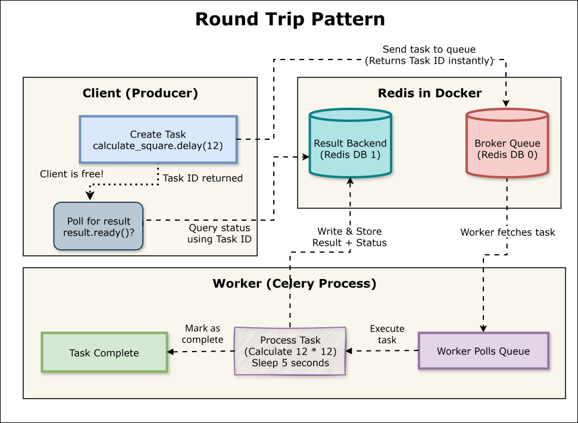
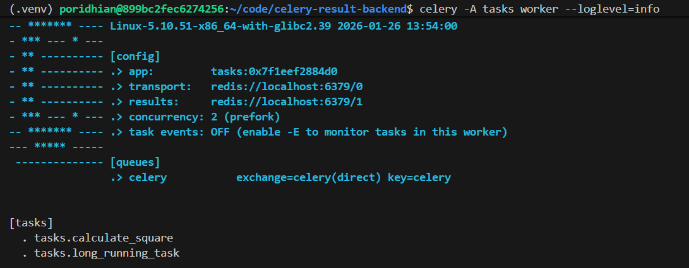
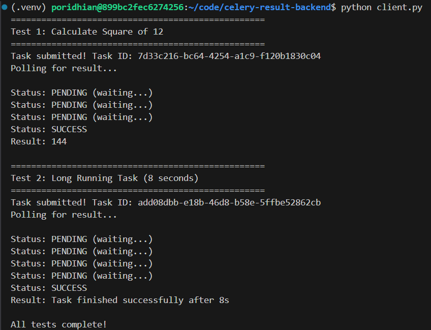
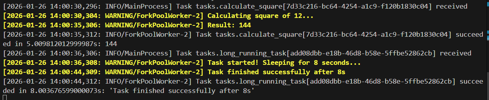

# Lab 2: Closing the Loop (The Result Backend)

In Lab 1, you built a pure "Fire and Forget" system where the Producer sends tasks and immediately moves on without any way to check what happened. The Producer gets a Task ID, but that's all—there's no mechanism to ask "Did it finish?" or "What was the result?"

This works fine for tasks where you genuinely don't care about the outcome (like sending a notification email). But what about tasks that compute something you need later? What if you're processing an image and need to retrieve the processed version? Or calculating analytics and need the final numbers?

In this lab, we're closing the loop by adding the fourth component of distributed task processing: the **Result Backend**. This is a storage system where Workers write their results, and Producers can query them later. We'll use the same Redis instance for this, but in a different role—now it's not just passing messages, it's also storing outcomes.



**Key Concept - "Round Trip Architecture":**
- Producer sends task and gets Task ID (instant)
- Worker processes task and writes result to Result Backend
- Producer uses Task ID to query status: PENDING → SUCCESS/FAILURE
- Producer retrieves the actual return value from the Result Backend

## Objectives

By the end of this lab, you will:

1. Configure Celery to use Redis as both a Broker and a Result Backend
2. Understand the difference between the Broker (message delivery) and Result Backend (result storage)
3. Create tasks that return meaningful results (not just print statements)
4. Build a client script that polls task status and retrieves results
5. Observe the complete lifecycle: task submission → processing → result storage → result retrieval

## Prerequisites

- Completion of Lab 1 concepts (you understand Producer, Broker, Worker)
- Fresh VM with Python 3.8+ installed
- Docker and docker-compose installed

## What's New in Lab 2

In Lab 1, we had:
- **Producer**: Python shell sending tasks
- **Broker**: Redis queue holding task messages
- **Worker**: Celery process executing tasks

In Lab 2, we're adding:
- **Result Backend**: Redis storing task results and status
- **Client Script**: A proper Python script (not just shell) that polls for results
- **Result Retrieval**: Ability to get return values from tasks (tasks returned values in Lab 1 too, but we had no way to retrieve them)

The same Redis instance now plays two roles:
1. **As Broker** (unchanged): Routes task messages from Producer to Worker
2. **As Result Backend** (new): Stores task results and status from Worker

## Project Structure

By the end of this lab, your project directory will look like this:

```
celery-result-backend/
├── docker-compose.yml    # Redis broker + result backend
├── tasks.py              # Celery app with result backend config (UPDATED)
├── client.py             # Script to send tasks and poll results (NEW)
├── requirements.txt      # Python dependencies
└── .venv/                # Virtual environment
```

**What changed from Lab 1:**
- `tasks.py`: Now includes `backend='redis://...'` configuration
- `client.py`: New script that demonstrates the full task lifecycle
- Same Redis, same worker command, but now we can retrieve results

Check Python version:

```bash
python --version
```

If it doesn't work, install Python 3.12:

```bash
sudo apt update
sudo apt install python3.12-venv -y
alias python=python3.12
source ~/.bashrc
```

## Step 1: Set Up Your Project Directory

Create a new directory for this lab:

```bash
mkdir celery-result-backend
cd celery-result-backend
```

## Step 2: Install Python Dependencies

Create a `requirements.txt` file with the same dependencies as Lab 1:

```txt
celery==5.3.4
redis==5.0.1
```

Create a virtual environment and install:

```bash
# Create virtual environment
python -m venv .venv

# Activate it
source .venv/bin/activate

# Install dependencies
pip install -r requirements.txt
```

## Step 3: Set Up Redis (Broker + Result Backend)

The Redis configuration is identical to Lab 1. We're using the same Redis instance for both roles.

Create `docker-compose.yml`:

```yaml
version: '3.8'

services:
  redis:
    image: redis:7-alpine
    container_name: celery-redis
    ports:
      - "6379:6379"
    command: redis-server
    healthcheck:
      test: ["CMD", "redis-cli", "ping"]
      interval: 5s
      timeout: 3s
      retries: 5
```

Start Redis:

```bash
docker compose up -d
```

Verify:

```bash
docker ps
docker exec -it celery-redis redis-cli ping
```

You should see `PONG`.

## Step 4: Create the Celery Worker with Result Backend

This is where things change from Lab 1. We're adding the `backend` parameter to our Celery configuration.

Create `tasks.py`:

```python
from celery import Celery
import time

# FROM LAB 1: Celery instance with broker
# NEW IN LAB 2: Added backend parameter
app = Celery(
    'tasks',
    broker='redis://localhost:6379/0',
    backend='redis://localhost:6379/1'
)

app.conf.update(
    task_serializer='json',
    accept_content=['json'],
    result_serializer='json',
    timezone='UTC',
    enable_utc=True,
)
```

**Understanding the Redis URL Format:**

Let's break down the URL syntax: `redis://localhost:6379/0`

```
redis://localhost:6379/0
  ↑        ↑       ↑    ↑
  |        |       |    |
Protocol  Host   Port  Database Number
```

**Each component explained:**

1. **Protocol (`redis://`)**:
   - Tells Celery we're connecting to a Redis server
   - Other protocols could be `amqp://` (RabbitMQ) or `sqla://` (SQLAlchemy)

   **Why `redis://` and not `http://`?**

   The protocol tells the client **what language to speak** when connecting to the server:

   - **HTTP (`http://`)**: Designed for web browsers and web servers. It's request-response based, stateless, and has lots of overhead (headers, cookies). Good for websites, not for high-speed data storage.

   - **Redis Protocol (`redis://`)**: Designed specifically for fast data operations. Uses binary format (much faster than text), maintains persistent connections, and supports Redis-specific features like pub/sub and transactions.

   Each server software speaks its own protocol. PostgreSQL uses `postgresql://`, RabbitMQ uses `amqp://`, and Redis uses `redis://`. You can't use HTTP to talk to Redis directly because Redis doesn't understand HTTP requests—it expects commands in its own binary protocol format.

   When Celery sees `redis://localhost:6379/0`, it knows to use Redis's native protocol and sends commands like `LPUSH`, `GET`, `SET` directly to the Redis server. Fast and efficient.

2. **Host (`localhost`)**:
   - The server where Redis is running
   - `localhost` means Redis is on the same machine as your Python code
   - Could be an IP address like `192.168.1.100` or domain like `redis.example.com`

3. **Port (`6379`)**:
   - The network port where Redis is listening
   - `6379` is the default Redis port
   - Matches the port we exposed in docker-compose.yml

4. **Database Number (`/0` or `/1`)**:
   - Redis supports 16 separate databases numbered 0-15
   - Each database is isolated from others (like separate namespaces)
   - `/0` for broker (task messages)
   - `/1` for backend (task results)
   - Using different databases keeps broker and backend data separate

**Why use different databases?**

```python
broker='redis://localhost:6379/0'   # Task messages go here
backend='redis://localhost:6379/1'  # Task results go here
```

When a Producer sends a task:
- Message stored in database 0: `{"task": "calculate_square", "args": [12]}`

When a Worker completes a task:
- Result stored in database 1: `{"status": "SUCCESS", "result": 144}`

Both use the same Redis instance (same host and port), but data is organized in separate databases.

**Continuing with the task definitions:**

```python
@app.task
def long_running_task(duration=10):
    """
    FROM LAB 1: Same task that returns a result
    NEW IN LAB 2: With Result Backend configured, we can now retrieve this return value
    """
    print(f"Task started! Sleeping for {duration} seconds...")
    time.sleep(duration)
    result = f"Task finished successfully after {duration}s"
    print(result)
    return result

@app.task
def calculate_square(number):
    """
    NEW IN LAB 2: A task that performs a calculation and returns the result
    """
    print(f"Calculating square of {number}...")
    time.sleep(5)  # Simulate complex computation
    result = number * number
    print(f"Result: {result}")
    return result
```

**Summary of changes from Lab 1:**

1. **Backend Configuration**: Added `backend='redis://localhost:6379/1'` parameter to enable result storage (see URL format explanation above)

2. **Result Retrieval**: Same tasks still return values, but now those values are stored in Redis database 1 and can be retrieved

3. **New Task**: Added `calculate_square` to demonstrate retrieving computed values from the result backend

## Step 5: Create the Client Script

In Lab 1, we used a Python shell to send tasks. That was fine for experimentation, but in real applications you need a proper script that can check if tasks are done.

Create `client.py`:

```python
from tasks import calculate_square, long_running_task
import time

def poll_task_result(task_result, check_interval=2):
    """
    Polls a task until it completes and returns the result.

    Args:
        task_result: AsyncResult object returned by task.delay()
        check_interval: Seconds to wait between status checks
    """
    print(f"Task submitted! Task ID: {task_result.id}")
    print("Polling for result...\n")

    while not task_result.ready():
        print(f"Status: {task_result.state} (waiting...)")
        time.sleep(check_interval)

    if task_result.successful():
        print(f"Status: {task_result.state}")
        print(f"Result: {task_result.result}")
        return task_result.result
    else:
        print(f"Status: FAILURE")
        print(f"Error: {task_result.info}")
        return None

if __name__ == "__main__":
    print("=" * 50)
    print("Test 1: Calculate Square of 12")
    print("=" * 50)

    result = calculate_square.delay(12)
    final_result = poll_task_result(result)

    print("\n" + "=" * 50)
    print("Test 2: Long Running Task (8 seconds)")
    print("=" * 50)

    result = long_running_task.delay(8)
    final_result = poll_task_result(result)

    print("\nAll tests complete!")
```

**What this script does:**

1. **Sends Tasks**: Calls `task.delay()` just like in Lab 1
2. **Polls Status**: Uses `task_result.ready()` to check if the task is done
3. **Checks State**: Shows the current status (PENDING, SUCCESS, FAILURE)
4. **Retrieves Result**: Gets the actual return value with `task_result.result`

**Key AsyncResult Methods:**
- `.id`: The unique task identifier
- `.state`: Current status (PENDING, STARTED, SUCCESS, FAILURE)
- `.ready()`: Returns True if task is complete (success or failure)
- `.successful()`: Returns True only if task completed successfully
- `.result`: The return value of the task function
- `.info`: Error information if task failed

## Step 6: Start the Worker

The worker command is identical to Lab 1. Celery automatically detects the backend configuration from `tasks.py`.

```bash
# Make sure your virtual environment is activated
source .venv/bin/activate

# Start the Celery worker
celery -A tasks worker --loglevel=info
```

You'll see the same output as Lab 1, with one addition—the worker now knows about the result backend:



Notice:
- **transport** (broker): Database 0
- **results** (backend): Database 1

**Important:** Keep this terminal open and running.

## Step 7: Run the Client Script

Open a **second terminal**, navigate to your project directory, and activate the virtual environment:

```bash
cd celery-result-backend
source .venv/bin/activate
```

Run the client script:

```bash
python client.py
```

**Expected Output:**



**Meanwhile, in the Worker terminal:**



## Step 8: Understanding the Complete Flow

Let's trace what happens when you run `calculate_square.delay(12)`:

**1. Client Sends Task (Instant)**
```python
result = calculate_square.delay(12)  # Returns immediately with Task ID
```
- Celery serializes the task: `{"task": "tasks.calculate_square", "args": [12]}`
- Pushes message to Redis database 0 (broker)
- Returns an `AsyncResult` object with a Task ID
- Client is now free to do other things

**2. Worker Picks Up Task**
- Worker continuously polls Redis database 0
- Sees new task message
- Deserializes it and calls `calculate_square(12)`
- Executes the function (sleeps 5 seconds, calculates 144)

**3. Worker Writes Result**
- Worker writes to Redis database 1 (result backend):
  - Key: `celery-task-meta-{task_id}`
  - Value: `{"status": "SUCCESS", "result": 144, "traceback": null, ...}`

**4. Client Polls for Result**
```python
while not task_result.ready():
    print(f"Status: {task_result.state}")
    time.sleep(2)
```
- Client queries Redis database 1 using the Task ID
- Reads the status: PENDING → PENDING → SUCCESS
- Retrieves the result: 144

**5. Full Round Trip Complete**
- Producer submitted task (instant)
- Worker processed task (5 seconds)
- Result stored in backend
- Producer retrieved result
- Total Producer wait time: ~5 seconds (polling), but Producer was free to do other work

## Step 9: Verify Results in Redis Directly

You can inspect the result backend directly using Redis CLI. This helps you understand how Celery stores results.

Open a new terminal and connect to Redis:

```bash
docker exec -it celery-redis redis-cli
```

**Inside the Redis CLI:**

```bash
# Switch to database 1 (result backend)
SELECT 1

# List all keys
KEYS *

# You'll see keys like: celery-task-meta-a1b2c3d4-5678-90ef-ghij-klmnopqrstuv

# Get the result for a specific task ID (replace with your actual task ID)
GET celery-task-meta-a1b2c3d4-5678-90ef-ghij-klmnopqrstuv
```

You'll see JSON output:

```json
{
  "status": "SUCCESS",
  "result": 144,
  "traceback": null,
  "children": [],
  "date_done": "2026-01-25T15:30:15.456789",
  "task_id": "a1b2c3d4-5678-90ef-ghij-klmnopqrstuv"
}
```

**Check the broker queue (database 0):**

```bash
# Switch to database 0 (broker)
SELECT 0

# List all keys
KEYS *

# Check queue length (should be 0 if all tasks are processed)
LLEN celery

# Exit Redis CLI
exit
```

This shows you exactly how Celery uses Redis for both message passing and result storage.

## Understanding What We Built

Let's recap the complete architecture with the result backend:

**Component 1: Redis Broker (Database 0)**
- Stores task messages from Producer
- Worker polls this for new tasks
- Messages are deleted after worker retrieves them

**Component 2: Redis Result Backend (Database 1)**
- Stores task status (PENDING, SUCCESS, FAILURE)
- Stores return values from completed tasks
- Stores error information from failed tasks
- Results persist until explicitly deleted or expired

**Component 3: Celery Worker**
- Reads tasks from broker (database 0)
- Executes task functions
- Writes results to backend (database 1)
- Updates task status throughout lifecycle

**Component 4: Client/Producer**
- Sends tasks to broker
- Gets Task ID immediately (Fire and Forget still works!)
- Can optionally poll result backend for status
- Retrieves final result when task completes

**The Complete Flow:**
1. Client calls `task.delay()` → Task pushed to Redis DB 0 → Client gets Task ID
2. Worker polls Redis DB 0 → Retrieves task → Executes function
3. Worker writes result to Redis DB 1 with status=SUCCESS
4. Client queries Redis DB 1 using Task ID → Retrieves status and result

**Key Insight:** Adding the result backend doesn't break the "Fire and Forget" model. The Producer still returns instantly. But now you have the *option* to check back later if you care about the result.

## Conclusion

In this lab, you transformed the one-way "Fire and Forget" architecture from Lab 1 into a complete round-trip system. By adding Redis as a result backend, you enabled:

1. **Status Tracking**: Query whether a task is PENDING, SUCCESS, or FAILURE
2. **Result Retrieval**: Get the actual return value from completed tasks
3. **Error Handling**: Detect and inspect failed tasks
4. **Concurrent Monitoring**: Track multiple tasks independently

The key change was minimal—just one line in `tasks.py`:
```python
backend='redis://localhost:6379/1'
```

But this unlocked powerful capabilities. You can now build applications that:
- Submit expensive computations and check back later
- Monitor progress of long-running tasks
- Retrieve calculated results when needed
- Handle failures gracefully

However, there's still a limitation: you have to manually poll the result backend in a loop (`while not result.ready()`). This works, but it's not elegant. In a web application, you'd want users to submit a task via an API endpoint and get results through another endpoint without blocking.

In Module 53, we'll integrate this Celery setup into a FastAPI application, where you'll see how to expose task submission and result retrieval through RESTful APIs. Users will POST a task, get a Task ID, and GET the result later—all through clean HTTP endpoints.
