# Lab 1: Flask-Celery Integration with Real-World Use Cases

In Module 52, you ran Celery in isolation—using Python scripts and shells to send tasks and retrieve results. That was essential for understanding the core architecture (Producer, Broker, Worker), but real-world applications need to expose this functionality through web APIs.

In this lab, we're integrating Celery with Flask to build a complete web application that can respond to HTTP requests instantly while processing heavy tasks in the background. The challenge is that Flask uses "Application Context"—a concept where database connections, configurations, and app state are tied to the current request. If you naively initialize Celery alongside Flask, your background tasks won't have access to the database or app configuration, leading to cryptic errors.

We'll solve this using the **Application Factory Pattern**—a design pattern that ensures both Flask and Celery share the same application context. Then we'll implement three types of background tasks: a simple health check, email sending (network I/O), and PDF generation (CPU-intensive). You'll see firsthand how async task processing transforms slow operations into non-blocking API calls.

## Architecture Diagram

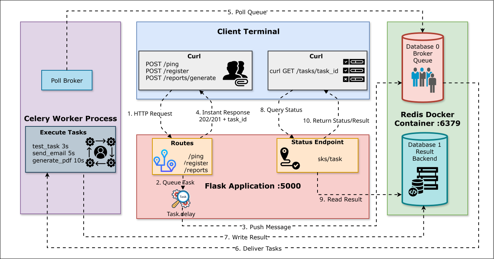

**Key Components:**

1. **Client**: Sends HTTP requests via curl and receives instant responses
2. **Flask Application**: Routes requests, queues tasks, returns immediately, provides status endpoint
3. **Redis Database 0 (Broker)**: Stores task messages for worker consumption
4. **Redis Database 1 (Result Backend)**: Stores task status and results
5. **Celery Worker**: Polls broker, executes tasks in Flask context, writes results

**The Flow:**
- **Submit**: Client → Flask → Broker → Instant 202 response with task_id
- **Process**: Worker polls Broker → Executes task → Writes to Result Backend
- **Check**: Client queries status endpoint → Flask reads Result Backend → Returns status/result

## Objectives

By the end of this lab, you will:

1. Set up a Flask application with Celery integration using the Application Factory pattern
2. Configure Flask and Celery to share Redis as broker and result backend
3. Understand Flask's application context and why Celery needs special handling
4. Implement three background tasks with different characteristics (test, network I/O, CPU)
5. Create HTTP endpoints that trigger these tasks asynchronously
6. Verify that API responses return instantly while tasks process in the background
7. Observe the performance difference between synchronous and asynchronous processing

## Project Structure

By the end of this lab, your project directory will look like this:

```
flask-celery-app/
├── app/
│   ├── __init__.py          # Flask app initialization with Celery
│   ├── routes.py            # API endpoints (/ping, /register, /reports/generate)
│   └── tasks.py             # Celery task definitions (3 tasks)
├── celery_utils.py          # make_celery() factory function
├── config.py                # Flask and Celery configuration
├── docker-compose.yml       # Redis broker + backend
├── requirements.txt         # Python dependencies
├── run.py                   # Application entry point
└── .venv/                   # Virtual environment
```

**What each file does:**
- **config.py**: Centralized configuration for both Flask and Celery
- **celery_utils.py**: The Application Factory logic that binds Celery to Flask's context
- **app/__init__.py**: Creates the Flask app and initializes Celery with the factory
- **app/tasks.py**: Three background task definitions (test, email, PDF)
- **app/routes.py**: Three HTTP endpoints that trigger tasks
- **run.py**: Entry point to start the Flask development server

Check Python version:

```bash
python --version
```

If it doesn't work, install Python 3.12:

```bash
sudo apt update
sudo apt install python3.12-venv -y
alias python=python3.12
source ~/.bashrc
```

## Step 1: Set Up Project Directory

Create the project structure:

```bash
mkdir flask-celery-app
cd flask-celery-app
mkdir app
touch app/__init__.py app/routes.py app/tasks.py
touch celery_utils.py config.py run.py docker-compose.yml requirements.txt
```

## Step 2: Install Python Dependencies

Create `requirements.txt`:

```txt
flask==3.0.0
celery==5.3.4
redis==5.0.1
```

Create virtual environment and install:

```bash
# Create virtual environment
python -m venv .venv

# Activate it
source .venv/bin/activate

# Install dependencies
pip install -r requirements.txt
```

**What we installed:**
- **flask**: Web framework for building HTTP APIs
- **celery**: Task queue framework
- **redis**: Python client for Redis

## Step 3: Set Up Redis (Broker + Result Backend)

Create `docker-compose.yml`:

```yaml
version: '3.8'

services:
  redis:
    image: redis:7-alpine
    container_name: flask-celery-redis
    ports:
      - "6379:6379"
    command: redis-server
    healthcheck:
      test: ["CMD", "redis-cli", "ping"]
      interval: 5s
      timeout: 3s
      retries: 5
```

Start Redis:

```bash
docker compose up -d
```

Verify:

```bash
docker ps
docker exec -it flask-celery-redis redis-cli ping
```

You should see `PONG`.

## Step 4: Create Configuration File

Flask and Celery both need configuration settings. Instead of hardcoding them, we'll centralize everything in a config file.

Create `config.py`:

```python
import os

class Config:
    # Flask settings
    SECRET_KEY = os.environ.get('SECRET_KEY') or 'dev-secret-key-change-in-production'

    # Celery settings
    CELERY_BROKER_URL = 'redis://localhost:6379/0'
    CELERY_RESULT_BACKEND = 'redis://localhost:6379/1'
    CELERY_TASK_SERIALIZER = 'json'
    CELERY_RESULT_SERIALIZER = 'json'
    CELERY_ACCEPT_CONTENT = ['json']
    CELERY_TIMEZONE = 'UTC'
    CELERY_ENABLE_UTC = True
```

**What this does:**
- **SECRET_KEY**: Used by Flask for session management and security
- **CELERY_BROKER_URL**: Redis database 0 for task messages
- **CELERY_RESULT_BACKEND**: Redis database 1 for task results
- Rest are serialization and timezone settings

This config will be loaded by both Flask and Celery to ensure they use the same Redis instance.

## Step 5: Create the Application Factory (celery_utils.py)

This is the critical piece that solves the Flask context problem. The `make_celery()` function creates a Celery instance that automatically pushes Flask's application context when tasks execute.

Create `celery_utils.py`:

```python
from celery import Celery

def make_celery(app):
    """
    Creates a Celery instance and ties it to the Flask app context.

    Without this, Celery workers run in separate processes and don't have
    access to Flask's app context (database, config, extensions).

    This factory ensures tasks execute inside Flask's application context.
    """
    celery = Celery(
        app.import_name,
        broker=app.config['CELERY_BROKER_URL'],
        backend=app.config['CELERY_RESULT_BACKEND']
    )

    celery.conf.update(app.config)

    class ContextTask(celery.Task):
        def __call__(self, *args, **kwargs):
            with app.app_context():
                return self.run(*args, **kwargs)

    celery.Task = ContextTask
    return celery
```

**How this works:**

1. **Creates Celery instance**: Takes broker and backend URLs from Flask config
2. **Updates Celery config**: Copies all Flask config settings starting with `CELERY_` to Celery
3. **ContextTask wrapper**: Overrides Celery's base Task class to wrap execution in Flask's `app.app_context()`
4. **Returns configured Celery**: Now tasks will automatically have access to Flask's database, config, etc.

**Why is this needed?**

When you call a Celery task from a Flask route, that task executes in a separate worker process. By default, that worker has no idea about your Flask app—it can't access `current_app`, the database session, or any Flask extensions. The `make_celery()` function solves this by wrapping every task execution in Flask's application context.

## Step 6: Initialize Flask Application

Create `app/__init__.py`:

```python
from flask import Flask
from celery_utils import make_celery
from config import Config

def create_app(config_class=Config):
    """
    Application factory that creates and configures the Flask app.
    """
    app = Flask(__name__)
    app.config.from_object(config_class)

    from app.routes import bp as routes_bp
    app.register_blueprint(routes_bp)

    return app

app = create_app()
celery = make_celery(app)

# IMPORTANT: Import tasks module so Celery worker registers the tasks
from app import tasks
```

**What this does:**

1. **create_app() function**: Creates a Flask app and loads config
2. **Register blueprint**: Imports and registers routes (we'll create this next)
3. **Create app instance**: Calls `create_app()` to get a Flask app
4. **Create celery instance**: Calls `make_celery(app)` to get a Celery instance bound to Flask's context
5. **Import tasks**: This is critical! When the Celery worker loads `app.celery`, it needs to also import `app.tasks` to register the task definitions. Without this line, you'll get "unregistered task" errors.

Both `app` and `celery` are now available for import in other modules.

## Step 7: Define Background Tasks

Create `app/tasks.py`:

```python
from app import celery
import time

@celery.task
def test_task():
    """
    Simple health check task for testing Flask-Celery integration.
    """
    print("Pong from Background!")
    time.sleep(3)
    print("Test task completed!")
    return "Pong from Background!"

@celery.task
def send_welcome_email(user_email):
    """
    Simulates sending a welcome email via SMTP.

    In production, this would use an email service (SendGrid, AWS SES, etc.)
    Network latency makes this slow (5 seconds to connect, authenticate, send).
    """
    print(f"[EMAIL TASK] Starting to send welcome email to {user_email}")

    # Simulate network I/O delay (connecting to SMTP server, sending email)
    time.sleep(5)

    print(f"[EMAIL TASK] Welcome email sent successfully to {user_email}")
    return f"Email sent to {user_email}"

@celery.task
def generate_monthly_report(user_id):
    """
    Simulates generating a complex PDF report.

    In production, this would query databases, aggregate data, render charts,
    and compile a multi-page PDF document. CPU-intensive work takes 10 seconds.
    """
    print(f"[PDF TASK] Starting report generation for user {user_id}")

    # Simulate CPU-intensive processing (data aggregation, PDF rendering)
    time.sleep(10)

    report_filename = f"report_user_{user_id}_{int(time.time())}.pdf"
    print(f"[PDF TASK] Report generated: {report_filename}")

    return {
        "filename": report_filename,
        "user_id": user_id,
        "status": "completed"
    }
```

**What this does:**

Three tasks with different characteristics:

1. **test_task**: Simple 3-second sleep for infrastructure verification
2. **send_welcome_email**: 5-second sleep simulating network I/O (SMTP)
3. **generate_monthly_report**: 10-second sleep simulating CPU-intensive work (PDF rendering)

All tasks print detailed logs so we can observe execution in the worker terminal, and all return meaningful results.

## Step 8: Create API Endpoints

Create `app/routes.py`:

```python
from flask import Blueprint, jsonify, request

bp = Blueprint('routes', __name__)

@bp.route('/ping', methods=['POST'])
def ping():
    """
    Health check endpoint that triggers a background task.
    Returns immediately while task processes in background.
    """
    from app.tasks import test_task

    task = test_task.delay()

    return jsonify({
        'message': 'Task queued',
        'task_id': task.id
    }), 202

@bp.route('/register', methods=['POST'])
def register():
    """
    User registration endpoint that triggers welcome email.

    In production, this would validate data, hash passwords, save to database.
    Then trigger the email task asynchronously so the API returns immediately.
    """
    from app.tasks import send_welcome_email

    data = request.get_json()
    user_email = data.get('email')

    if not user_email:
        return jsonify({'error': 'Email is required'}), 400

    # In production: save user to database here
    # user = User(email=user_email)
    # db.session.add(user)
    # db.session.commit()

    # Trigger email task asynchronously
    task = send_welcome_email.delay(user_email)

    return jsonify({
        'message': 'User registered successfully',
        'email': user_email,
        'email_task_id': task.id
    }), 201

@bp.route('/reports/generate', methods=['POST'])
def generate_report():
    """
    Report generation endpoint that triggers PDF task.

    Returns immediately with task ID. Client can use this ID to check
    status later (status checking will be implemented in a future module).
    """
    from app.tasks import generate_monthly_report

    data = request.get_json()
    user_id = data.get('user_id')

    if not user_id:
        return jsonify({'error': 'user_id is required'}), 400

    # Trigger PDF generation task asynchronously
    task = generate_monthly_report.delay(user_id)

    return jsonify({
        'message': 'Report generation started',
        'task_id': task.id,
        'user_id': user_id
    }), 202
```

**What this does:**

Three endpoints corresponding to the three tasks:

1. **POST /ping**: Triggers `test_task`, returns 202 Accepted
2. **POST /register**: Accepts email, triggers `send_welcome_email`, returns 201 Created
3. **POST /reports/generate**: Accepts user_id, triggers `generate_monthly_report`, returns 202 Accepted

All endpoints validate input, trigger tasks asynchronously using `.delay()`, and return immediately with task IDs.

## Step 9: Create Application Entry Point

Create `run.py`:

```python
from app import app

if __name__ == '__main__':
    app.run(debug=True, host='0.0.0.0', port=5000)
```

This simple script runs the Flask development server on port 5000.

## Step 10: Start the Celery Worker

The Celery worker needs to import the `celery` instance we created in `app/__init__.py`. Open a terminal and run:

```bash
# Make sure virtual environment is activated
source .venv/bin/activate

# Start Celery worker
celery -A app.celery worker --loglevel=info
```

**Breaking down the command:**
- `-A app.celery`: Import the `celery` object from `app/__init__.py`
- `worker`: Start in worker mode
- `--loglevel=info`: Show informative logs

**Alternative approach:**

You could also start the worker with:
```bash
celery -A app.tasks worker --loglevel=info
```

**What's the difference?**

- **`-A app.celery`**: Loads the celery instance from `app/__init__.py`. This requires you to explicitly import tasks in `__init__.py` (with `from app import tasks`) so the worker knows about them.

- **`-A app.tasks`**: Directly loads `app/tasks.py`, which automatically imports the celery instance from `app/__init__.py` (because tasks.py has `from app import celery`). Since we're loading the tasks module directly, the `@celery.task` decorators execute and register the tasks automatically.

Both approaches work, but `-A app.celery` is more common in production because it gives you a central entry point for the worker. We'll use `-A app.celery` in this lab, which is why we added `from app import tasks` in `app/__init__.py`.

You should see output similar to Module 52, confirming:
- Connected to Redis broker at `redis://localhost:6379/0`
- Result backend at `redis://localhost:6379/1`
- Registered tasks:
  - `app.tasks.test_task`
  - `app.tasks.send_welcome_email`
  - `app.tasks.generate_monthly_report`

**Important:** Keep this terminal open and running. This is your background worker process.

## Step 11: Start the Flask Application

Open a **second terminal**, navigate to the project directory, and activate the virtual environment:

```bash
cd flask-celery-app
source .venv/bin/activate
```

Start the Flask development server:

```bash
python run.py
```

You should see:

```
 * Serving Flask app 'app'
 * Debug mode: on
 * Running on http://0.0.0.0:5000
```

The Flask API is now running and ready to accept requests.

**Important:** Keep this terminal open as well. You now have two terminals running:
- Terminal 1: Celery Worker
- Terminal 2: Flask Application

## Step 12: Test the API - Health Check

Open a **third terminal** and test the `/ping` endpoint using curl:

```bash
curl -X POST http://localhost:5000/ping
```

**Expected Response (instant):**

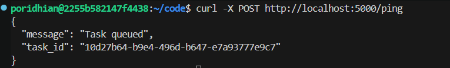

Notice how the response came back **immediately**—your Flask app didn't wait for the task to complete.

**Meanwhile, in the Celery Worker terminal:**

After about 3 seconds, you'll see:

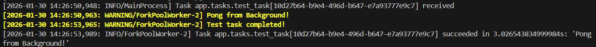

The task executed in the background while your Flask API remained responsive.

## Step 13: Test the API - User Registration with Email

Test the `/register` endpoint:

```bash
curl -X POST http://localhost:5000/register \
  -H "Content-Type: application/json" \
  -d '{"email": "alice@example.com"}'
```


**Expected Response (instant):**

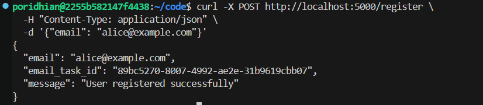

The response returned **immediately**.

**Meanwhile, in the Celery Worker terminal:**

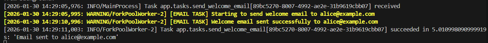

The API returned in milliseconds, but the email task took 5 seconds in the background.

## Step 14: Test the API - PDF Report Generation

Test the `/reports/generate` endpoint:

```bash
curl -X POST http://localhost:5000/reports/generate \
  -H "Content-Type: application/json" \
  -d '{"user_id": 123}'
```

Again, the response returned **immediately**.

**Meanwhile, in the Celery Worker terminal:**

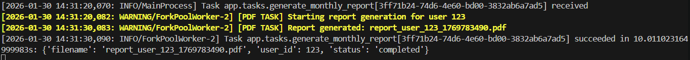

The API returned in milliseconds, but the PDF generation took 10 seconds in the background.

## Step 15: Observe Performance Difference

Let's quantify the performance improvement by comparing synchronous vs asynchronous execution.

**Synchronous Processing (the old way - NOT implemented):**

If we had implemented these operations synchronously (without Celery), the flow would be:

1. Client sends POST to `/register`
2. Flask receives request
3. Flask sends email (waits 5 seconds)
4. Flask returns response
5. **Total client wait time: ~5 seconds**

For the report endpoint, it would be **~10 seconds** of waiting.

**Asynchronous Processing (with Celery - what we built):**

Current flow:

1. Client sends POST to `/register`
2. Flask receives request
3. Flask queues email task in Redis (instant)
4. Flask returns response
5. **Total client wait time: ~50-100 milliseconds**

The email actually sends in the background over 5 seconds, but the client doesn't wait for it.

**Testing multiple requests:**

Send three registration requests rapidly:

```bash
curl -X POST http://localhost:5000/register -H "Content-Type: application/json" -d '{"email": "user1@example.com"}' && \
curl -X POST http://localhost:5000/register -H "Content-Type: application/json" -d '{"email": "user2@example.com"}' && \
curl -X POST http://localhost:5000/register -H "Content-Type: application/json" -d '{"email": "user3@example.com"}'
```

All three requests will return `201 Created` **instantly** with different task IDs.

In the Worker terminal, you'll see all three email tasks executing. If you have concurrency=2 (default for a 2-core VM), two emails will process simultaneously, then the third will process after one finishes.

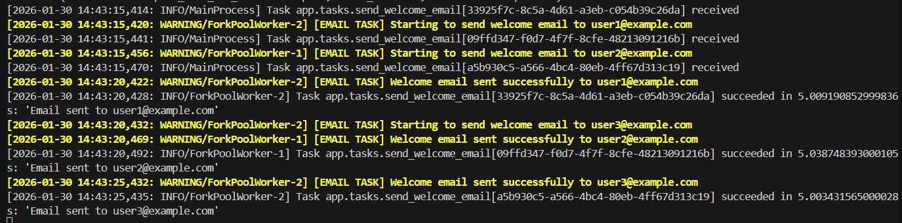

This demonstrates the power of asynchronous task processing: your API can handle hundreds of registration requests per second, even though each email takes 5 seconds to send.

## Step 16: Verify Input Validation

Test that the endpoints handle invalid input correctly.

**Test 1: Missing email in /register**

```bash
curl -X POST http://localhost:5000/register \
  -H "Content-Type: application/json" \
  -d '{}'
```

**Expected Response:**
```json
{
  "error": "Email is required"
}
```

The API returned immediately without queuing any task. Check the worker terminal—no task was triggered.

**Test 2: Missing user_id in /reports/generate**

```bash
curl -X POST http://localhost:5000/reports/generate \
  -H "Content-Type: application/json" \
  -d '{}'
```

**Expected Response:**
```json
{
  "error": "user_id is required"
}
```

Again, no task was queued because the request was invalid.

## Understanding What We Built

Let's examine the complete architecture.

**Component 1: Flask Application (Port 5000)**
- Receives HTTP requests from clients
- Routes requests to endpoint handlers
- Triggers Celery tasks using `.delay()`
- Returns HTTP responses immediately
- Runs in the main Python process

**Component 2: Celery Worker (Separate Process)**
- Polls Redis broker for new tasks
- Executes tasks inside Flask's application context
- Logs output to terminal
- Writes results to Redis backend
- Runs independently from Flask

**Component 3: Redis (Docker Container)**
- Database 0: Stores task messages (broker)
- Database 1: Stores task results (backend)
- Same Redis instance serves both roles

**Component 4: Application Factory (`make_celery`)**
- Bridges Flask and Celery
- Ensures tasks have access to Flask's app context
- Prevents "working outside of application context" errors

**The Flow:**

1. Client sends POST request to an endpoint
2. Flask route handler receives request
3. Handler calls `task.delay()` to queue task
4. Celery serializes task and sends to Redis broker (database 0)
5. Flask returns HTTP response with Task ID (instant)
6. Celery worker polls Redis broker
7. Worker retrieves task
8. Worker executes task **inside Flask's application context**
9. Task prints to worker terminal and sleeps
10. Worker writes result to Redis backend (database 1)

**Why the Application Factory Pattern Matters:**

Without `make_celery()`, you'd get errors when trying to access Flask features inside tasks:

```python
# This would FAIL without make_celery():
@celery.task
def broken_task():
    from flask import current_app
    print(current_app.config['SECRET_KEY'])  # RuntimeError: Working outside of application context!
```

With `make_celery()`, the same code works because the task executes inside `with app.app_context()`.

**Why This Matters - The Performance Impact:**

In a synchronous system, if your API server can handle 100 concurrent requests, and each registration takes 5 seconds to send an email, you can only process 20 registrations per second (100 / 5 = 20). Once all 100 threads are blocked waiting for emails, new requests start failing.

With async task processing, the same API server can handle 100 concurrent requests, and each registration returns in 50ms. That's 2,000 registrations per second (100 / 0.05 = 2,000)—a 100x improvement. The email sending is handled by workers, which can be scaled independently based on the email queue size.

## Step 17: Understanding When Application Context is Actually Needed

You might have noticed something interesting: the Application Factory pattern with the `ContextTask` wrapper seems like a lot of setup. Is it really necessary? Let's find out.

### The Application Context Problem

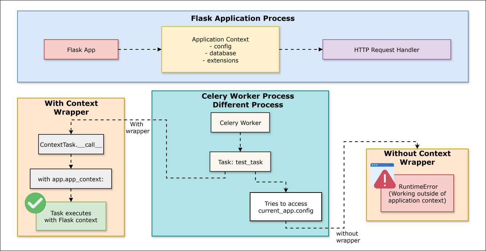

**The Problem:**

Flask applications use **Application Context**—a special environment where Flask stores configuration, database connections, and extensions. When you handle an HTTP request, Flask automatically creates this context.

But Celery workers run in **separate processes**—they don't have Flask's application context by default. If a task tries to access `current_app.config`, `db.session`, or any Flask feature, it crashes with:

```
RuntimeError: Working outside of application context
```

**The Solution:**

The `ContextTask` wrapper manually creates Flask's application context before running each task:

```python
class ContextTask(celery.Task):
    def __call__(self, *args, **kwargs):
        with app.app_context():  # Creates Flask context
            return self.run(*args, **kwargs)  # Runs task inside context
```

This ensures tasks can safely use Flask features like config, database, and extensions.

**Experiment: Comment Out the ContextTask Wrapper**

Open `celery_utils.py` and comment out the ContextTask wrapper:

```python
def make_celery(app):
    celery = Celery(
        app.import_name,
        broker=app.config['CELERY_BROKER_URL'],
        backend=app.config['CELERY_RESULT_BACKEND']
    )

    celery.conf.update(app.config)

    # Comment out these lines
    # class ContextTask(celery.Task):
    #     def __call__(self, *args, **kwargs):
    #         with app.app_context():
    #             return self.run(*args, **kwargs)

    # celery.Task = ContextTask

    return celery
```

**Restart the Celery worker** (this is important - stop with Ctrl+C and restart):

```bash
celery -A app.celery worker --loglevel=info
```

**Test the endpoints again:**

```bash
curl -X POST http://localhost:5000/ping
curl -X POST http://localhost:5000/register -H "Content-Type: application/json" -d '{"email": "test@example.com"}'
```

**Surprising result: Everything still works!**

Check the worker terminal—you'll see the tasks executing successfully. Why?

**The reason:** Our current tasks don't actually use Flask's application context. They only:
- Print to console
- Sleep (simulate work)
- Return simple values

They **don't** access:
- `current_app.config` (Flask configuration)
- Database sessions
- Flask extensions
- Any Flask-specific features

**Now let's demonstrate when it's actually needed:**

Modify the `test_task` in `app/tasks.py` to access Flask's config:

```python
@celery.task
def test_task():
    """
    Simple health check task for testing Flask-Celery integration.
    NOW UPDATED: Accesses Flask's application context.
    """
    from flask import current_app

    # This line requires Flask's application context
    secret_key = current_app.config.get('SECRET_KEY')

    print(f"Pong from Background! Secret Key: {secret_key[:10]}...")
    time.sleep(3)
    print("Test task completed!")
    return "Pong from Background!"
```

**Restart the Celery worker** to pick up the changes:

```bash
# Stop worker with Ctrl+C, then restart
celery -A app.celery worker --loglevel=info
```

**Test the `/ping` endpoint:**

```bash
curl -X POST http://localhost:5000/ping
```

**Now watch the worker terminal—you'll see an error:**

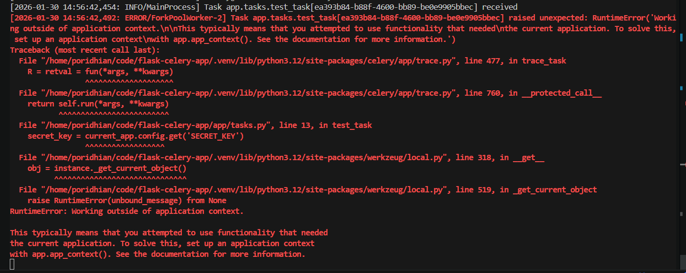

The task **fails** because it's trying to access `current_app.config`, which only exists inside Flask's application context.

**Fix it: Uncomment the ContextTask wrapper**

Go back to `celery_utils.py` and uncomment the ContextTask wrapper:

```python
def make_celery(app):
    celery = Celery(
        app.import_name,
        broker=app.config['CELERY_BROKER_URL'],
        backend=app.config['CELERY_RESULT_BACKEND']
    )

    celery.conf.update(app.config)

    # Uncomment these lines
    class ContextTask(celery.Task):
        def __call__(self, *args, **kwargs):
            with app.app_context():
                return self.run(*args, **kwargs)

    celery.Task = ContextTask

    return celery
```

**Restart the worker again:**

```bash
celery -A app.celery worker --loglevel=info
```

**Test the `/ping` endpoint:**

```bash
curl -X POST http://localhost:5000/ping
```

**Now it works!** Check the worker terminal:

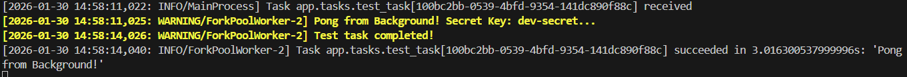

The task successfully accessed `current_app.config['SECRET_KEY']` because it's now executing inside Flask's application context.

**Key Takeaway:**

The Application Factory pattern with the `ContextTask` wrapper is **only necessary when your tasks need to access Flask-specific features**:
- Reading from `current_app.config`
- Using database sessions (`db.session`)
- Accessing Flask extensions (mail, cache, etc.)
- Generating URLs with `url_for()`

For simple tasks that just do computation or call external APIs without touching Flask internals, you technically don't need it. But it's a best practice to include it from the start, so your tasks can access Flask features whenever needed.

**Note:** You can revert `test_task` back to the simpler version without `current_app` if you prefer, or keep it as a reminder of when the context is needed.

## Step 18: Add Task Status Checking Endpoint

Now let's use the result backend we configured. So far, when you trigger a task, you get a task ID back, but you have no way to check "Is it done? What was the result?" Let's fix that by adding a status endpoint.

**Add this endpoint to `app/routes.py`:**

```python
@bp.route('/tasks/<task_id>', methods=['GET'])
def get_task_status(task_id):
    """
    Check the status of a background task using its task ID.

    This demonstrates using the Result Backend to retrieve task state and results.
    """
    from app import celery
    from celery.result import AsyncResult

    # Create an AsyncResult object using the task ID
    task_result = AsyncResult(task_id, app=celery)

    response = {
        'task_id': task_id,
        'state': task_result.state,
        'status': task_result.status  # Alias for state
    }

    if task_result.state == 'PENDING':
        # Task is waiting in queue or being processed
        response['message'] = 'Task is pending or being processed'
    elif task_result.state == 'SUCCESS':
        # Task completed successfully, retrieve the result
        response['message'] = 'Task completed successfully'
        response['result'] = task_result.result
    elif task_result.state == 'FAILURE':
        # Task failed, retrieve error information
        response['message'] = 'Task failed'
        response['error'] = str(task_result.info)
    else:
        # Other states: STARTED, RETRY, REVOKED
        response['message'] = f'Task state: {task_result.state}'

    return jsonify(response), 200
```

**What this endpoint does:**

1. **Accepts task_id from URL**: `/tasks/abc-123-def-456`
2. **Creates AsyncResult object**: Uses the task ID to query the result backend
3. **Checks task state**: PENDING, SUCCESS, FAILURE, or others
4. **Returns appropriate response**: Includes state, message, and result (if available)

**Understanding Task States:**

- **PENDING**: Task is waiting in the queue or currently being processed (default state)
- **SUCCESS**: Task completed successfully, result is available
- **FAILURE**: Task raised an exception, error info is available
- **STARTED**: Task execution has begun (requires `task_track_started=True` in config)
- **RETRY**: Task is being retried after a failure
- **REVOKED**: Task was cancelled

**Restart Flask** to pick up the new endpoint:

```bash
# Stop Flask with Ctrl+C in the Flask terminal, then restart
python run.py
```

The worker can keep running—no need to restart it.

## Step 19: Demonstrate the Complete Round-Trip

Now let's see the result backend in action. We'll submit a task, immediately check its status (PENDING), wait for it to complete, then check again (SUCCESS) and retrieve the result.

**Test: PDF Report Generation (10 seconds)**

We'll use the PDF generation task because it takes 10 seconds, giving you plenty of time to observe the PENDING state.

Open a third terminal and run these commands:

**1. Submit the PDF generation task:**

```bash
curl -X POST http://localhost:5000/reports/generate \
  -H "Content-Type: application/json" \
  -d '{"user_id": 789}'
```

**Response:**
```json
{
  "message": "Report generation started",
  "task_id": "e5f6g7h8-9012-34ij-klmn-5678901234op",
  "user_id": 789
}
```

**Copy the `task_id` from the response.** You'll use it in the next commands.

**2. Immediately check the task status (while it's still processing):**

```bash
# Replace TASK_ID with the actual task ID from step 1
curl http://localhost:5000/tasks/TASK_ID
```

**Expected Response (within first 10 seconds):**

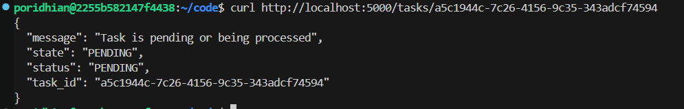

The task is still running in the background (PDF generation takes 10 seconds). You have plenty of time to run this command and see the PENDING state!

**3. Check status multiple times:**

You can keep checking every few seconds to see it's still PENDING:

```bash
# Run this same command multiple times
curl http://localhost:5000/tasks/TASK_ID
```

Each time you'll see PENDING until the task completes.

**4. After 10+ seconds, check again:**

```bash
# Same command, run it again after the task completes
curl http://localhost:5000/tasks/TASK_ID
```

**Expected Response (after task completes):**

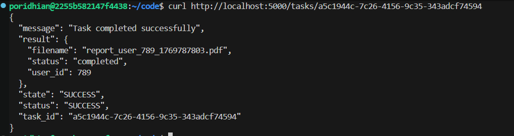

Now the task has completed! You can see:
- **state**: Changed from PENDING to SUCCESS
- **result**: The complete return value from the task function (a dictionary with filename, user_id, and status)

**What We've Achieved:**

We now have a **complete round-trip system**:
1.  **Submit task** → Get task ID (instant)
2.  **Check status** → PENDING while processing
3.  **Retrieve result** → SUCCESS with actual return value

This is the full power of the result backend—clients can submit tasks and check back later without blocking.

## Conclusion

In this lab, you successfully integrated Celery with Flask using the Application Factory pattern. You implemented a complete background task processing system with both Redis broker (for task queuing) and result backend (for status tracking and result retrieval).

You built a Flask API with four endpoints that can accept HTTP requests and return immediately (201/202 responses) while processing heavy tasks asynchronously in the background. The API can submit tasks, and clients can later check task status and retrieve results through the `/tasks/<task_id>` endpoint.

You also learned why the `ContextTask` wrapper is necessary—it ensures Celery workers can access Flask's application context when tasks need to use Flask features like config, database, or extensions.

In Module 54, you'll add production features like retry logic, timeout handling, error handling, logging, and task chaining to make this system production-ready.
