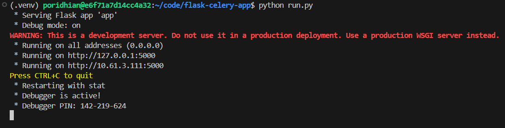
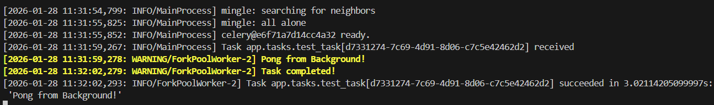
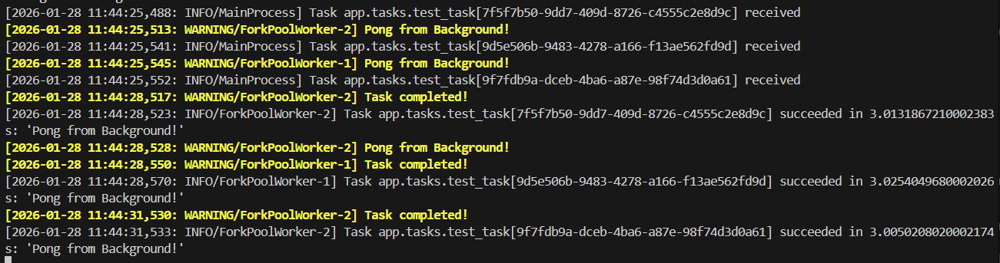

# Lab 1: The Flask-Celery Application Factory

In Module 52, you ran Celery in isolation—using Python scripts and shells to send tasks and retrieve results. That was essential for understanding the core architecture, but real-world applications need to expose this functionality through web APIs.

In this lab, we're integrating Celery with Flask to build a web application that can respond to HTTP requests instantly while processing heavy tasks in the background. However, there's a catch: Flask uses "Application Context" (a concept where database connections, configurations, and app state are tied to the current request). If you naively initialize Celery alongside Flask, your background tasks won't have access to the database or app configuration, leading to cryptic errors.

The solution is the **Application Factory Pattern**—a design pattern that ensures both Flask and Celery share the same application context. We'll implement a utility function called `make_celery()` that bridges the gap, allowing Celery workers to access Flask's configuration and extensions seamlessly.

## Architecture Diagram

```mermaid
graph TB
    subgraph "Client (Postman/Browser)"
        A[HTTP POST /ping]
    end

    subgraph "Flask Application"
        B[Flask Route Handler<br/>/ping endpoint]
        C[Enqueue Task<br/>test_task.delay()]
    end

    subgraph "Redis (Docker)"
        D[(Broker<br/>Redis DB 0)]
        E[(Result Backend<br/>Redis DB 1)]
    end

    subgraph "Celery Worker Process"
        F[Worker with Flask Context]
        G[Execute test_task<br/>Print 'Pong from Background!']
    end

    A -->|"1. POST request"| B
    B -->|"2. Trigger background task"| C
    C -->|"3. Send task to broker"| D
    B -->|"4. Return 202 Accepted (instant)"| A

    D -->|"5. Worker polls broker"| F
    F -->|"6. Execute task with Flask context"| G
    G -->|"7. Log output to terminal"| F

    style A fill:#e1f5ff,stroke:#01579b,stroke-width:2px
    style B fill:#c8e6c9,stroke:#1b5e20,stroke-width:2px
    style C fill:#c8e6c9,stroke:#1b5e20,stroke-width:2px
    style D fill:#fff9c4,stroke:#f57f17,stroke-width:2px
    style E fill:#ffe0b2,stroke:#e65100,stroke-width:2px
    style F fill:#f3e5f5,stroke:#4a148c,stroke-width:2px
    style G fill:#f3e5f5,stroke:#4a148c,stroke-width:2px
```

**Key Concept - Application Context:**
- Flask applications need context to access databases, config, and extensions
- Celery workers run in separate processes without automatic Flask context
- The `make_celery()` factory function bridges this gap
- Tasks execute inside Flask's application context, giving them full access to app resources

## Objectives

By the end of this lab, you will:

1. Set up a Flask application with Celery integration using the Application Factory pattern
2. Configure Flask and Celery to share Redis as broker and result backend
3. Understand the Flask application context and why Celery needs special handling
4. Create a health check endpoint (`/ping`) that triggers background tasks
5. Verify that HTTP responses return instantly while tasks process asynchronously

## Project Structure

By the end of this lab, your project directory will look like this:

```
flask-celery-app/
├── app/
│   ├── __init__.py          # Flask app initialization
│   ├── routes.py            # API endpoints
│   └── tasks.py             # Celery task definitions
├── celery_utils.py          # make_celery() factory function
├── config.py                # Flask and Celery configuration
├── docker-compose.yml       # Redis broker + backend
├── requirements.txt         # Python dependencies
├── run.py                   # Application entry point
└── .venv/                   # Virtual environment
```

**What each file does:**
- **config.py**: Centralized configuration for both Flask and Celery
- **celery_utils.py**: The Application Factory logic that binds Celery to Flask's context
- **app/__init__.py**: Creates the Flask app and initializes Celery with the factory
- **app/tasks.py**: Background task definitions (will execute inside Flask context)
- **app/routes.py**: HTTP endpoints that trigger tasks
- **run.py**: Entry point to start the Flask development server

Check Python version:

```bash
python --version
```

If it doesn't work, install Python 3.12:

```bash
sudo apt update
sudo apt install python3.12-venv -y
alias python=python3.12
source ~/.bashrc
```

## Step 1: Set Up Project Directory

Create the project structure:

```bash
mkdir flask-celery-app
cd flask-celery-app
mkdir app
touch app/__init__.py app/routes.py app/tasks.py
touch celery_utils.py config.py run.py docker-compose.yml requirements.txt
```

## Step 2: Install Python Dependencies

Create `requirements.txt`:

```txt
flask==3.0.0
celery==5.3.4
redis==5.0.1
```

Create virtual environment and install:

```bash
# Create virtual environment
python -m venv .venv

# Activate it
source .venv/bin/activate

# Install dependencies
pip install -r requirements.txt
```

**What we installed:**
- **flask**: Web framework for building HTTP APIs
- **celery**: Task queue framework (same as Module 52)
- **redis**: Python client for Redis

## Step 3: Set Up Redis (Broker + Result Backend)

Create `docker-compose.yml`:

```yaml
version: '3.8'

services:
  redis:
    image: redis:7-alpine
    container_name: flask-celery-redis
    ports:
      - "6379:6379"
    command: redis-server
    healthcheck:
      test: ["CMD", "redis-cli", "ping"]
      interval: 5s
      timeout: 3s
      retries: 5
```

Start Redis:

```bash
docker compose up -d
```

Verify:

```bash
docker ps
docker exec -it flask-celery-redis redis-cli ping
```

You should see `PONG`.

## Step 4: Create Configuration File

Flask and Celery both need configuration settings. Instead of hardcoding them, we'll centralize everything in a config file.

Create `config.py`:

```python
import os

class Config:
    # Flask settings
    SECRET_KEY = os.environ.get('SECRET_KEY') or 'dev-secret-key-change-in-production'

    # Celery settings
    CELERY_BROKER_URL = 'redis://localhost:6379/0'
    CELERY_RESULT_BACKEND = 'redis://localhost:6379/1'
    CELERY_TASK_SERIALIZER = 'json'
    CELERY_RESULT_SERIALIZER = 'json'
    CELERY_ACCEPT_CONTENT = ['json']
    CELERY_TIMEZONE = 'UTC'
    CELERY_ENABLE_UTC = True
```

**What this does:**
- **SECRET_KEY**: Used by Flask for session management and security
- **CELERY_BROKER_URL**: Redis database 0 for task messages (same as Module 52)
- **CELERY_RESULT_BACKEND**: Redis database 1 for task results (same as Module 52)
- Rest are serialization and timezone settings (same as Module 52)

This config will be loaded by both Flask and Celery to ensure they use the same Redis instance.

## Step 5: Create the Application Factory (celery_utils.py)

This is the critical piece that solves the Flask context problem. The `make_celery()` function creates a Celery instance that automatically pushes Flask's application context when tasks execute.

Create `celery_utils.py`:

```python
from celery import Celery

def make_celery(app):
    """
    Creates a Celery instance and ties it to the Flask app context.

    Without this, Celery workers run in separate processes and don't have
    access to Flask's app context (database, config, extensions).

    This factory ensures tasks execute inside Flask's application context.
    """
    celery = Celery(
        app.import_name,
        broker=app.config['CELERY_BROKER_URL'],
        backend=app.config['CELERY_RESULT_BACKEND']
    )

    celery.conf.update(app.config)

    class ContextTask(celery.Task):
        def __call__(self, *args, **kwargs):
            with app.app_context():
                return self.run(*args, **kwargs)

    celery.Task = ContextTask
    return celery
```

**How this works:**

1. **Creates Celery instance**: Takes broker and backend URLs from Flask config
2. **Updates Celery config**: Copies all Flask config settings starting with `CELERY_` to Celery
3. **ContextTask wrapper**: Overrides Celery's base Task class to wrap execution in Flask's `app.app_context()`
4. **Returns configured Celery**: Now tasks will automatically have access to Flask's database, config, etc.

**Why is this needed?**

When you call a Celery task from a Flask route, that task executes in a separate worker process. By default, that worker has no idea about your Flask app—it can't access `current_app`, the database session, or any Flask extensions. The `make_celery()` function solves this by wrapping every task execution in Flask's application context.

## Step 6: Initialize Flask Application

Create `app/__init__.py`:

```python
from flask import Flask
from celery_utils import make_celery
from config import Config

def create_app(config_class=Config):
    """
    Application factory that creates and configures the Flask app.
    """
    app = Flask(__name__)
    app.config.from_object(config_class)

    from app.routes import bp as routes_bp
    app.register_blueprint(routes_bp)

    return app

app = create_app()
celery = make_celery(app)

# IMPORTANT: Import tasks module so Celery worker registers the tasks
from app import tasks
```

**What this does:**

1. **create_app() function**: Creates a Flask app and loads config
2. **Register blueprint**: Imports and registers routes (we'll create this next)
3. **Create app instance**: Calls `create_app()` to get a Flask app
4. **Create celery instance**: Calls `make_celery(app)` to get a Celery instance bound to Flask's context
5. **Import tasks**: This is critical! When the Celery worker loads `app.celery`, it needs to also import `app.tasks` to register the task definitions. Without this line, you'll get "unregistered task" errors.

Both `app` and `celery` are now available for import in other modules.

## Step 7: Define Background Tasks

Create `app/tasks.py`:

```python
from app import celery
import time

@celery.task
def test_task():
    """
    A simple background task for testing the Flask-Celery integration.
    This will execute inside Flask's application context thanks to make_celery().
    """
    print("Pong from Background!")
    time.sleep(3)
    print("Task completed!")
    return "Pong from Background!"
```

**What this does:**
- Defines a Celery task decorated with `@celery.task`
- Prints a message (will appear in worker terminal)
- Sleeps for 3 seconds to simulate work
- Returns a result

Because we used `make_celery()`, this task will execute inside Flask's application context, even though it runs in a separate worker process.

## Step 8: Create API Endpoints

Create `app/routes.py`:

```python
from flask import Blueprint, jsonify

bp = Blueprint('routes', __name__)

@bp.route('/ping', methods=['POST'])
def ping():
    """
    Health check endpoint that triggers a background task.
    Returns immediately with 202 Accepted while task processes in background.
    """
    from app.tasks import test_task

    task = test_task.delay()

    return jsonify({
        'message': 'Task queued',
        'task_id': task.id
    }), 202
```

**What this does:**

1. **Blueprint**: Organizes routes in a modular way
2. **POST /ping**: Endpoint that triggers the background task
3. **test_task.delay()**: Queues the task asynchronously (same as Module 52)
4. **Returns 202 Accepted**: HTTP status code indicating request was accepted but not yet processed
5. **Returns Task ID**: Client can use this to check task status later (though we won't implement that in this lab)

The key observation: this endpoint returns **instantly** (within milliseconds) even though `test_task` sleeps for 3 seconds.

## Step 9: Create Application Entry Point

Create `run.py`:

```python
from app import app

if __name__ == '__main__':
    app.run(debug=True, host='0.0.0.0', port=5000)
```

This is a simple script that runs the Flask development server on port 5000.

## Step 10: Start the Celery Worker

The Celery worker needs to import the `celery` instance we created in `app/__init__.py`. Open a terminal and run:

```bash
# Make sure virtual environment is activated
source .venv/bin/activate

# Start Celery worker
celery -A app.celery worker --loglevel=info
```

**Breaking down the command:**
- `-A app.celery`: Import the `celery` object from `app/__init__.py`
- `worker`: Start in worker mode
- `--loglevel=info`: Show informative logs

**Alternative approach:**

You could also start the worker with:
```bash
celery -A app.tasks worker --loglevel=info
```

**What's the difference?**

- **`-A app.celery`**: Loads the celery instance from `app/__init__.py`. This requires you to explicitly import tasks in `__init__.py` (with `from app import tasks`) so the worker knows about them.

- **`-A app.tasks`**: Directly loads `app/tasks.py`, which automatically imports the celery instance from `app/__init__.py` (because tasks.py has `from app import celery`). Since we're loading the tasks module directly, the `@celery.task` decorators execute and register the tasks automatically.

Both approaches work, but `-A app.celery` is more common in production because it gives you a central entry point for the worker. We'll use `-A app.celery` in this lab, which is why we added `from app import tasks` in `app/__init__.py`.

You should see output similar to Module 52, confirming:
- Connected to Redis broker at `redis://localhost:6379/0`
- Result backend at `redis://localhost:6379/1`
- Registered tasks: `app.tasks.test_task`

**Important:** Keep this terminal open and running. This is your background worker process.

## Step 11: Start the Flask Application

Open a **second terminal**, navigate to the project directory, and activate the virtual environment:

```bash
cd flask-celery-app
source .venv/bin/activate
```

Start the Flask development server:

```bash
python run.py
```

You should see:



The Flask API is now running and ready to accept requests.

## Step 12: Test the API from Terminal

Now let's test the `/ping` endpoint using curl. Open a **third terminal** (keep Flask and Worker terminals running):

```bash
curl -X POST http://localhost:5000/ping
```

**Expected Response (instant):**

```json
{
  "message": "Task queued",
  "task_id": "a1b2c3d4-5678-90ef-ghij-klmnopqrstuv"
}
```

Notice how the response came back **immediately**—your Flask app didn't wait for the task to complete.

**Meanwhile, in the Celery Worker terminal:**

After about 3 seconds, you'll see:



The task executed in the background while your Flask API remained responsive.

**Test with multiple requests:**

Send multiple requests in rapid succession to verify async behavior:

```bash
curl -X POST http://localhost:5000/ping && \
curl -X POST http://localhost:5000/ping && \
curl -X POST http://localhost:5000/ping
```

All three requests will return `202 Accepted` **instantly** with different Task IDs. In the Worker terminal, you'll see tasks being processed in parallel (2 at a time if you have concurrency=2):



This demonstrates that:
1. Flask responds instantly (doesn't block waiting for tasks)
2. Tasks execute asynchronously in the Celery worker
3. Multiple tasks can be queued and processed independently

## Understanding What We Built

Let's break down the architecture you just implemented:

**Component 1: Flask Application (Port 5000)**
- Receives HTTP requests from clients
- Routes requests to endpoint handlers
- Triggers Celery tasks using `.delay()`
- Returns HTTP responses immediately
- Runs in the main Python process

**Component 2: Celery Worker (Separate Process)**
- Polls Redis broker for new tasks
- Executes tasks inside Flask's application context
- Logs output to terminal
- Writes results to Redis backend
- Runs independently from Flask

**Component 3: Redis (Docker Container)**
- Database 0: Stores task messages (broker)
- Database 1: Stores task results (backend)
- Same Redis instance serves both roles

**Component 4: Application Factory (`make_celery`)**
- Bridges Flask and Celery
- Ensures tasks have access to Flask's app context
- Prevents "working outside of application context" errors

**The Flow:**

1. Client sends POST request to `/ping`
2. Flask route handler receives request
3. Handler calls `test_task.delay()` to queue task
4. Celery serializes task and sends to Redis broker (database 0)
5. Flask returns `202 Accepted` with Task ID (instant)
6. Celery worker polls Redis broker
7. Worker retrieves task
8. Worker executes task **inside Flask's application context**
9. Task prints to worker terminal
10. Worker writes result to Redis backend (database 1)

**Why the Application Factory Pattern Matters:**

Without `make_celery()`, you'd get errors when trying to access Flask features inside tasks:

```python
# This would FAIL without make_celery():
@celery.task
def broken_task():
    from flask import current_app
    print(current_app.config['SECRET_KEY'])  # RuntimeError: Working outside of application context!
```

With `make_celery()`, the same code works because the task executes inside `with app.app_context()`.

## Conclusion

In this lab, you successfully integrated Celery with Flask using the Application Factory pattern. You created a web API that can accept HTTP requests and immediately return responses while processing tasks asynchronously in the background.

The key achievement was implementing `make_celery()`—a utility function that ensures Celery workers execute tasks inside Flask's application context. This is essential for accessing Flask features like database connections, configuration settings, and extensions from within background tasks.

You verified the integration by creating a `/ping` endpoint that triggers a simple background task. The endpoint returned `202 Accepted` instantly, while the task printed "Pong from Background!" in the worker terminal 3 seconds later.

However, this is just the infrastructure. The `test_task` doesn't do anything useful yet—it just prints a message and sleeps. In the next lab, we'll implement real-world use cases: sending welcome emails and generating PDF reports. You'll see how to structure your application to handle common bottlenecks like network latency (email sending) and CPU-intensive operations (PDF generation) without blocking your API responses.
