## Introduction

This lab teaches you to transform a basic Flask-Celery task queue into a production-ready system. Building on the async task processing from Module 53, you will implement automatic retries with exponential backoff, timeout enforcement, comprehensive logging, and structured error handling.

By the end of this lab, you will have a resilient task queue that handles transient failures, prevents runaway tasks, logs execution lifecycle events, and returns meaningful error messages to API clients—essential features for production deployment.

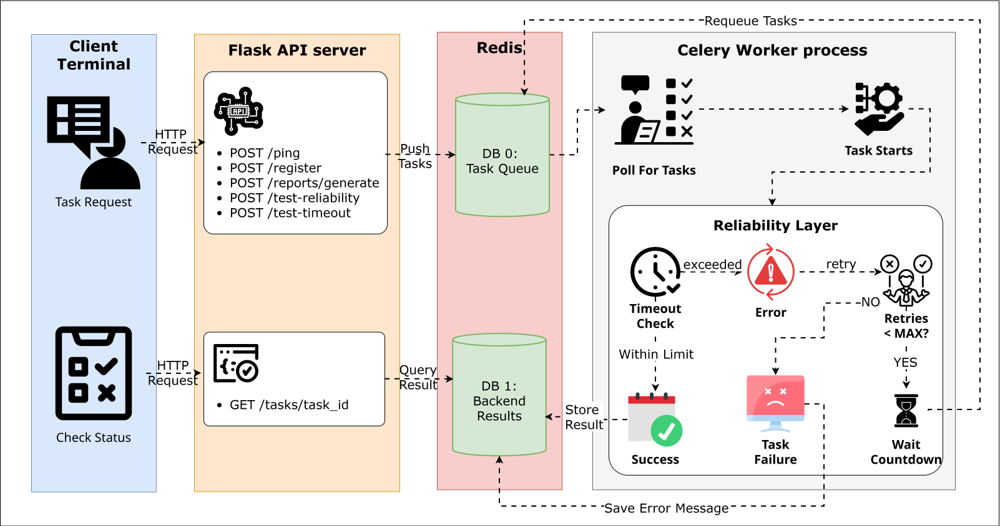

## Objectives

By the end of this lab, you will be able to:

1. Configure automatic retry behavior with max retries and exponential backoff
2. Implement manual retry logic using `self.retry()` for recoverable errors
3. Set hard and soft timeout limits to prevent runaway tasks
4. Add comprehensive logging to track task lifecycle events
5. Implement structured error handling with try-except blocks
6. Create tasks that simulate failures and timeouts for testing purposes
7. Observe retry attempts, timeout termination, and error states in worker logs
8. Verify RETRY and FAILURE states via the status endpoint

**Prerequisites:** Completion of Module 53 (Flask-Celery Integration) or familiarity with Flask, Celery, and REST APIs.

---

## Prologue: The Challenge

You join a development team maintaining a Flask-Celery task queue that processes background jobs: sending welcome emails, generating monthly reports, and performing data analysis. The system works perfectly in development—tasks execute successfully, and clients retrieve results without issues.

Then production happens. External email APIs timeout. Database queries lock. Network connections drop. A buggy task enters an infinite loop and consumes worker resources for hours. Tasks fail silently, leaving no trace in logs. Transient errors—like a 5-second network glitch—cause permanent task failures.

The operations team escalates: "We have no visibility into what's failing. Tasks that should retry just die. We can't debug production failures because there are no logs."

Your task is to add four critical reliability features:

- **Automatic retries** with exponential backoff to handle transient failures
- **Timeout enforcement** to kill runaway tasks before they consume resources
- **Comprehensive logging** to track execution and debug failures
- **Structured error handling** to return meaningful failure messages

One task queue. Production-ready reliability. No silent failures.

---

## Environment Setup

You will recreate the Flask-Celery project from Module 53 on a fresh VM, then add reliability features.

Check Python version:

```bash
python --version
```

If Python 3.12 is not available, install it:

```bash
sudo apt update
sudo apt install python3.12-venv -y
alias python=python3.12
source ~/.bashrc
```

Create the project directory:

```bash
mkdir flask-celery-app
cd flask-celery-app
mkdir app
touch app/__init__.py app/routes.py app/tasks.py
touch celery_utils.py config.py run.py docker-compose.yml requirements.txt
```

Create and activate a virtual environment:

```bash
python -m venv .venv
source .venv/bin/activate
```

Create `requirements.txt`:

```bash
cat > requirements.txt << 'EOF'
flask==3.0.0
celery==5.3.4
redis==5.0.1
EOF
```

Install dependencies:

```bash
pip install -r requirements.txt
```

Create `docker-compose.yml` for Redis:

```bash
cat > docker-compose.yml << 'EOF'
version: '3.8'

services:
  redis:
    image: redis:7-alpine
    container_name: flask-celery-redis
    ports:
      - "6379:6379"
    command: redis-server
    healthcheck:
      test: ["CMD", "redis-cli", "ping"]
      interval: 5s
      timeout: 3s
      retries: 5
EOF
```

Start Redis:

```bash
docker compose up -d
docker ps  # Verify Redis is running
```

---

## Chapter 1: Understanding Reliability Mechanisms

Before implementing reliability features, you need to understand what each mechanism does and why it matters in production systems.

### 1.1 The Four Reliability Pillars

Production task queues require four critical features:

1. **Retry Logic** — Handles transient failures that might succeed on subsequent attempts
2. **Timeout Enforcement** — Prevents runaway tasks from consuming resources indefinitely
3. **Logging** — Provides visibility into task execution for debugging
4. **Error Handling** — Returns meaningful failure messages instead of cryptic stack traces

Without these features, your task queue is fragile. With them, it becomes resilient.

### 1.2 Think First: When to Retry

Consider these scenarios:

**Scenario A:** A task attempts to send an email via an external API. The API returns a 503 Service Unavailable error.

**Scenario B:** A task attempts to register a user with an email address that already exists in the database. The database returns a unique constraint violation error.

**Question:** Which scenario should trigger a retry? Why?

<details>
<summary>Click to review answer</summary>

**Scenario A should retry.** The 503 error indicates a temporary condition—the API might recover in seconds or minutes. Retrying gives the service time to recover.

**Scenario B should NOT retry.** The unique constraint violation is a permanent error caused by business logic (duplicate email). Retrying the same operation will produce the same error indefinitely. Instead, return a clear error message to the client.

**Retry decision guide:**
- **Retry:** Network timeouts, service unavailable (503), rate limits, database deadlocks
- **Do not retry:** Validation errors, authentication failures, resource not found (404), business logic errors

</details>

### 1.3 Understanding Retry Flow

Celery supports two retry mechanisms:

1. **Automatic configuration:** Set `max_retries` and `default_retry_delay` in the task decorator
2. **Manual retry:** Call `self.retry(exc=exc, countdown=delay)` to programmatically retry

The retry flow with exponential backoff works like this:

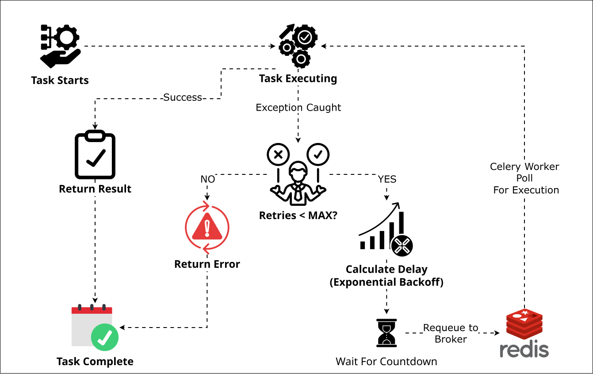

**Key concept:** Exponential backoff doubles the delay with each retry (5s → 10s → 20s). This prevents overwhelming a failing service with rapid retry attempts.

### 1.4 Understanding Timeout Enforcement

Timeouts prevent runaway tasks from consuming worker resources indefinitely. Celery provides two timeout levels:

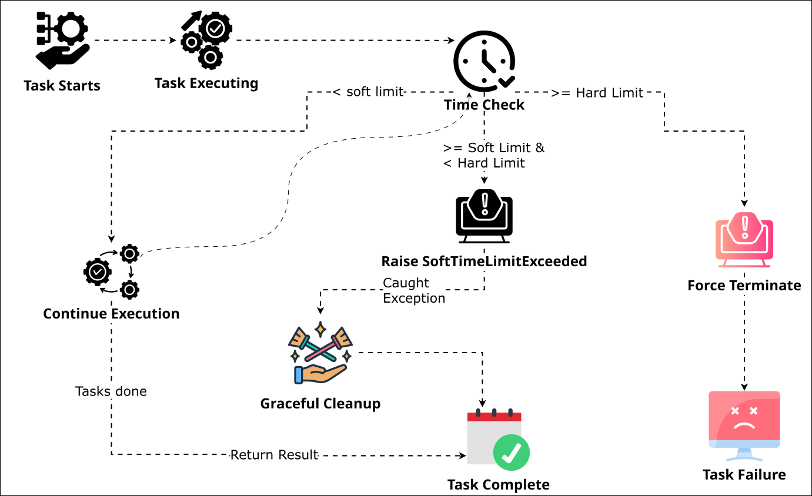

**Soft time limit:** Raises `SoftTimeLimitExceeded` exception, allowing graceful cleanup (close connections, save partial results).

**Hard time limit:** Forcefully terminates the worker process if cleanup takes too long.

### 1.5 Think First: Timeout Scenarios

**Scenario:** You set a task with `soft_time_limit=8` and `time_limit=10`. The task runs for 12 seconds without handling `SoftTimeLimitExceeded`.

**Question 1:** What happens at the 8-second mark?

**Question 2:** What happens at the 10-second mark?

**Question 3:** Why set a soft limit at all if the hard limit will kill the task anyway?

<details>
<summary>Click to review answers</summary>

**Answer 1:** At 8 seconds, Celery raises `SoftTimeLimitExceeded`. If the task has a try-except block catching this exception, it can perform cleanup (close database connections, save partial progress). If the task does not handle the exception, it propagates upward and the task fails.

**Answer 2:** At 10 seconds, Celery forcefully terminates the worker process using SIGKILL. No cleanup occurs. The worker may restart, and the task is marked as failed.

**Answer 3:** Soft limits allow graceful cleanup. Without them, connections remain open, locks stay held, and resources leak. Hard limits are a safety mechanism for when cleanup itself hangs.

**Production pattern:** Always handle `SoftTimeLimitExceeded` to clean up resources before hard termination.

</details>

### 1.6 Checkpoint

Before proceeding, verify you understand:

- [ ] The difference between transient errors (retry) and permanent errors (return error)
- [ ] How exponential backoff prevents overwhelming failed services
- [ ] The purpose of soft vs. hard timeout limits

---

## Chapter 2: Building the Base Application

You will recreate the Flask-Celery structure from Module 53, then incrementally add reliability features in subsequent chapters.

### 2.1 Create Configuration

Create `config.py`:

```python
import os

class Config:
    SECRET_KEY = os.environ.get('SECRET_KEY') or 'dev-secret-key-change-in-production'
    CELERY_BROKER_URL = 'redis://localhost:6379/0'
    CELERY_RESULT_BACKEND = 'redis://localhost:6379/1'
    CELERY_TASK_SERIALIZER = 'json'
    CELERY_RESULT_SERIALIZER = 'json'
    CELERY_ACCEPT_CONTENT = ['json']
    CELERY_TIMEZONE = 'UTC'
    CELERY_ENABLE_UTC = True
```

### 2.2 Create Celery Utility

Create `celery_utils.py`:

```python
from celery import Celery

def make_celery(app):
    celery = Celery(
        app.import_name,
        broker=app.config['CELERY_BROKER_URL'],
        backend=app.config['CELERY_RESULT_BACKEND']
    )

    celery.conf.update(app.config)

    class ContextTask(celery.Task):
        def __call__(self, *args, **kwargs):
            with app.app_context():
                return self.run(*args, **kwargs)

    celery.Task = ContextTask
    return celery
```

### 2.3 Create Flask Application with Logging

Create `app/__init__.py`:

```python
from flask import Flask
from celery_utils import make_celery
from config import Config
import logging

# NEW: Configure logging
logging.basicConfig(
    level=logging.INFO,
    format='[%(asctime)s] %(levelname)s in %(module)s: %(message)s',
    datefmt='%Y-%m-%d %H:%M:%S'
)

def create_app(config_class=Config):
    app = Flask(__name__)
    app.config.from_object(config_class)

    from app.routes import bp as routes_bp
    app.register_blueprint(routes_bp)

    return app

app = create_app()
celery = make_celery(app)

from app import tasks
```

**What changed:** The `logging.basicConfig()` configuration enables structured logging throughout your application. Every log message includes a timestamp, log level, module name, and message—critical for debugging production failures.

### 2.4 Create Run Script

Create `run.py`:

```python
from app import app

if __name__ == '__main__':
    app.run(debug=True, host='0.0.0.0', port=5000)
```

### 2.5 Checkpoint

- [ ] Flask application with logging configured
- [ ] Celery integration via application factory pattern
- [ ] Redis running for broker and result backend

---

## Chapter 3: Implementing Retry Logic

Retry logic handles transient failures—temporary errors that might succeed if you try again. Network timeouts, database deadlocks, and rate-limited API calls are classic examples.

### 3.1 Think First: Exponential Backoff

Consider a task that retries a failed API call:

**Option A:** Retry immediately three times
- Attempt 1 fails at 0s
- Attempt 2 fails at 0.1s
- Attempt 3 fails at 0.2s
- Total time: 0.3 seconds

**Option B:** Retry with 5-second delays
- Attempt 1 fails at 0s
- Attempt 2 fails at 5s
- Attempt 3 fails at 10s
- Total time: 15 seconds

**Option C:** Retry with exponential backoff (5s → 10s → 20s)
- Attempt 1 fails at 0s
- Attempt 2 fails at 5s
- Attempt 3 fails at 15s (5s + 10s delay)
- Total time: 35 seconds

**Question:** If the API is temporarily overloaded, which option is most likely to succeed? Why?

<details>
<summary>Click to review answer</summary>

**Option C (exponential backoff) is most likely to succeed.**

Option A overwhelms the failing service with rapid retries—the API is still overloaded 0.3 seconds later.

Option B gives the service time to recover, but applies constant pressure.

Option C gives progressively more time between retries. If the service recovers in 6 seconds, attempt 2 succeeds. If it needs 16 seconds, attempt 3 succeeds. The increasing delays prevent overwhelming the service while maximizing chances of success.

This is why major services (AWS, Google Cloud, Stripe) recommend exponential backoff for retry logic.

</details>

### 3.2 Create Tasks with Retry Configuration

Complete the task definitions below by filling in the blanks:

Create `app/tasks.py`:

```python
from app import celery
from celery.exceptions import SoftTimeLimitExceeded
import time
import random
import logging

logger = logging.getLogger(__name__)

@celery.task(
    bind=___,  # Q1: What value allows access to self?
    max_retries=3,
    default_retry_delay=5
)
def test_task(self):
    """
    Simple health check task with retry capability.
    """
    try:
        logger.info("test_task: Starting execution")

        from flask import current_app
        secret_key = current_app.config.get('SECRET_KEY')

        logger.info("test_task: Accessed Flask config successfully")
        time.sleep(3)

        logger.info("test_task: Completed successfully")
        return "Pong from Background!"

    except Exception as exc:
        logger.error(f"test_task: Failed with error: {exc}")
        raise self.___(exc=exc)  # Q2: What method triggers a retry?


@celery.task(
    bind=True,
    max_retries=3,
    default_retry_delay=10,
    time_limit=15,
    soft_time_limit=12
)
def send_welcome_email(self, user_email):
    """
    Simulates sending a welcome email with timeout protection.
    """
    try:
        logger.info(f"send_welcome_email: Starting for {user_email}")
        time.sleep(5)
        logger.info(f"send_welcome_email: Successfully sent to {user_email}")
        return f"Email sent to {user_email}"

    except ___:  # Q3: What exception indicates soft timeout?
        logger.warning(f"send_welcome_email: Soft time limit exceeded for {user_email}")
        return {"status": "timeout", "message": "Email sending timed out"}

    except Exception as exc:
        logger.error(f"send_welcome_email: Failed for {user_email} - {exc}")
        raise self.retry(exc=exc)


@celery.task(
    bind=True,
    max_retries=2,
    default_retry_delay=15,
    time_limit=30,
    soft_time_limit=25
)
def generate_monthly_report(self, user_id):
    """
    Simulates PDF generation with comprehensive error handling.
    """
    try:
        logger.info(f"generate_monthly_report: Starting for user {user_id}")
        time.sleep(10)

        report_filename = f"report_user_{user_id}_{int(time.time())}.pdf"
        logger.info(f"generate_monthly_report: Generated {report_filename}")

        return {
            "filename": report_filename,
            "user_id": user_id,
            "status": "completed"
        }

    except SoftTimeLimitExceeded:
        logger.warning(f"generate_monthly_report: Soft time limit exceeded for user {user_id}")
        return {
            "status": "timeout",
            "message": "Report generation exceeded time limit",
            "user_id": user_id
        }

    except Exception as exc:
        logger.error(f"generate_monthly_report: Failed for user {user_id} - {exc}")
        raise self.retry(exc=exc, countdown=15)
```

**Hints:**
- `bind=True` gives access to the task instance (`self`)
- The soft timeout exception is imported at the top of the file
- `self.retry()` triggers a manual retry

<details>
<summary>Click to see complete solution</summary>

```python
from app import celery
from celery.exceptions import SoftTimeLimitExceeded
import time
import random
import logging

logger = logging.getLogger(__name__)

@celery.task(
    bind=True,  # A1
    max_retries=3,
    default_retry_delay=5
)
def test_task(self):
    """
    Simple health check task with retry capability.
    """
    try:
        logger.info("test_task: Starting execution")

        from flask import current_app
        secret_key = current_app.config.get('SECRET_KEY')

        logger.info("test_task: Accessed Flask config successfully")
        time.sleep(3)

        logger.info("test_task: Completed successfully")
        return "Pong from Background!"

    except Exception as exc:
        logger.error(f"test_task: Failed with error: {exc}")
        raise self.retry(exc=exc)  # A2


@celery.task(
    bind=True,
    max_retries=3,
    default_retry_delay=10,
    time_limit=15,
    soft_time_limit=12
)
def send_welcome_email(self, user_email):
    """
    Simulates sending a welcome email with timeout protection.
    """
    try:
        logger.info(f"send_welcome_email: Starting for {user_email}")
        time.sleep(5)
        logger.info(f"send_welcome_email: Successfully sent to {user_email}")
        return f"Email sent to {user_email}"

    except SoftTimeLimitExceeded:  # A3
        logger.warning(f"send_welcome_email: Soft time limit exceeded for {user_email}")
        return {"status": "timeout", "message": "Email sending timed out"}

    except Exception as exc:
        logger.error(f"send_welcome_email: Failed for {user_email} - {exc}")
        raise self.retry(exc=exc)


@celery.task(
    bind=True,
    max_retries=2,
    default_retry_delay=15,
    time_limit=30,
    soft_time_limit=25
)
def generate_monthly_report(self, user_id):
    """
    Simulates PDF generation with comprehensive error handling.
    """
    try:
        logger.info(f"generate_monthly_report: Starting for user {user_id}")
        time.sleep(10)

        report_filename = f"report_user_{user_id}_{int(time.time())}.pdf"
        logger.info(f"generate_monthly_report: Generated {report_filename}")

        return {
            "filename": report_filename,
            "user_id": user_id,
            "status": "completed"
        }

    except SoftTimeLimitExceeded:
        logger.warning(f"generate_monthly_report: Soft time limit exceeded for user {user_id}")
        return {
            "status": "timeout",
            "message": "Report generation exceeded time limit",
            "user_id": user_id
        }

    except Exception as exc:
        logger.error(f"generate_monthly_report: Failed for user {user_id} - {exc}")
        raise self.retry(exc=exc, countdown=15)
```

**Answers:**
- Q1: `True` — Enables `bind=True`, giving access to `self`
- Q2: `retry` — The method `self.retry()` triggers a manual retry
- Q3: `SoftTimeLimitExceeded` — Exception raised when soft timeout is reached

</details>

### 3.3 Understanding the Retry Parameters

Match each parameter to its purpose:

| Parameter | Purpose (A-E) |
|-----------|---------------|
| `bind=True` | ___ |
| `max_retries=3` | ___ |
| `default_retry_delay=5` | ___ |
| `self.retry(exc=exc, countdown=10)` | ___ |
| `time_limit=15` | ___ |

**Options:**
- A: Maximum number of retry attempts before permanent failure
- B: Allows access to task instance (`self`) and request metadata
- C: Hard timeout that forcefully terminates the task
- D: Default seconds to wait before retrying
- E: Manually triggers a retry with a specific delay

<details>
<summary>Click to check your answers</summary>

| Parameter | Purpose |
|-----------|---------|
| `bind=True` | B: Allows access to task instance (`self`) and request metadata |
| `max_retries=3` | A: Maximum number of retry attempts before permanent failure |
| `default_retry_delay=5` | D: Default seconds to wait before retrying |
| `self.retry(exc=exc, countdown=10)` | E: Manually triggers a retry with a specific delay |
| `time_limit=15` | C: Hard timeout that forcefully terminates the task |

</details>

### 3.4 Checkpoint

- [ ] Tasks configured with retry parameters
- [ ] Logging statements tracking execution lifecycle
- [ ] Timeout limits preventing runaway tasks
- [ ] Try-except blocks catching and handling errors

---

## Chapter 4: Creating Demonstration Tasks

To observe retry and timeout behavior in action, you need tasks that intentionally fail and exceed time limits. These demonstration tasks simulate real-world failure scenarios.

### 4.1 Add the Flaky Task

Add this task to `app/tasks.py` to demonstrate retry behavior:

```python
@celery.task(
    bind=True,
    max_retries=3,
    default_retry_delay=5
)
def flaky_task(self, task_number):
    """
    Intentionally fails 70% of the time to demonstrate retry behavior.
    """
    try:
        logger.info(f"flaky_task: Attempt started for task #{task_number}")
        time.sleep(2)

        # 70% chance of failure
        if random.random() < 0.7:
            logger.warning(f"flaky_task: Simulated failure for task #{task_number}")
            raise Exception("Simulated transient error (network timeout)")

        logger.info(f"flaky_task: Successfully completed task #{task_number}")
        return {
            "status": "success",
            "task_number": task_number,
            "message": "Task succeeded after retries"
        }

    except Exception as exc:
        logger.error(f"flaky_task: Failed task #{task_number} - {exc}")

        # Check if we've exhausted retries
        if self.request.retries >= self.max_retries:
            logger.error(f"flaky_task: Max retries exhausted for task #{task_number}")
            return {
                "status": "failed",
                "task_number": task_number,
                "error": str(exc),
                "retries": self.request.retries
            }

        # Exponential backoff: 5s, 10s, 20s
        countdown = self.default_retry_delay * (2 ** self.request.retries)
        logger.info(f"flaky_task: Retrying task #{task_number} in {countdown} seconds")

        raise self.retry(exc=exc, countdown=countdown)
```

### 4.2 Think First: Exponential Backoff Calculation

Study the exponential backoff formula:

```python
countdown = self.default_retry_delay * (2 ** self.request.retries)
```

Given `default_retry_delay=5`:

**Question 1:** What is the countdown for the first retry (`self.request.retries=0`)?

**Question 2:** What is the countdown for the second retry (`self.request.retries=1`)?

**Question 3:** What is the countdown for the third retry (`self.request.retries=2`)?

<details>
<summary>Click to review answers</summary>

**Answer 1:** `5 * (2 ** 0) = 5 * 1 = 5 seconds`

**Answer 2:** `5 * (2 ** 1) = 5 * 2 = 10 seconds`

**Answer 3:** `5 * (2 ** 2) = 5 * 4 = 20 seconds`

The formula doubles the delay with each retry, creating a 5s → 10s → 20s progression.

</details>

### 4.3 Add the Slow Task

Add this task to `app/tasks.py` to demonstrate timeout enforcement:

```python
@celery.task(
    bind=True,
    time_limit=10,
    soft_time_limit=8
)
def slow_task(self, duration):
    """
    Intentionally runs longer than timeout to demonstrate termination.
    """
    try:
        logger.info(f"slow_task: Starting {duration}-second task")

        # This will exceed our 8-second soft limit if duration > 8
        time.sleep(duration)

        logger.info("slow_task: Completed successfully")
        return {
            "status": "completed",
            "duration": duration
        }

    except SoftTimeLimitExceeded:
        logger.warning("slow_task: Soft time limit (8s) exceeded")

        # Return gracefully before hard termination
        return {
            "status": "timeout",
            "message": f"Task exceeded {self.soft_time_limit}s soft limit",
            "attempted_duration": duration
        }
```

### 4.4 Checkpoint

- [ ] A flaky task that randomly fails to demonstrate retries
- [ ] Exponential backoff implementation that increases delays
- [ ] A slow task that exceeds timeout limits
- [ ] Structured error responses instead of exceptions

---

## Chapter 5: Creating API Endpoints

The tasks are defined. Now create Flask endpoints that trigger these tasks and check their status.

### 5.1 Create Routes

Create `app/routes.py`:

```python
from flask import Blueprint, jsonify, request
from celery.result import AsyncResult
import logging

bp = Blueprint('routes', __name__)
logger = logging.getLogger(__name__)

@bp.route('/ping', methods=['POST'])
def ping():
    """Health check endpoint that triggers test task."""
    from app.tasks import test_task

    logger.info("Endpoint /ping: Queuing test_task")
    task = test_task.delay()

    return jsonify({
        'message': 'Task queued',
        'task_id': task.id
    }), 202


@bp.route('/register', methods=['POST'])
def register():
    """User registration endpoint with background email."""
    from app.tasks import send_welcome_email

    data = request.get_json()
    user_email = data.get('email')

    if not user_email:
        logger.warning("Endpoint /register: Missing email parameter")
        return jsonify({'error': 'Email is required'}), 400

    logger.info(f"Endpoint /register: Queuing email task for {user_email}")
    task = send_welcome_email.delay(user_email)

    return jsonify({
        'message': 'User registered successfully',
        'email': user_email,
        'email_task_id': task.id
    }), 201


@bp.route('/reports/generate', methods=['POST'])
def generate_report():
    """Report generation endpoint."""
    from app.tasks import generate_monthly_report

    data = request.get_json()
    user_id = data.get('user_id')

    if not user_id:
        logger.warning("Endpoint /reports/generate: Missing user_id parameter")
        return jsonify({'error': 'user_id is required'}), 400

    logger.info(f"Endpoint /reports/generate: Queuing PDF task for user {user_id}")
    task = generate_monthly_report.delay(user_id)

    return jsonify({
        'message': 'Report generation started',
        'task_id': task.id,
        'user_id': user_id
    }), 202


@bp.route('/test-reliability', methods=['POST'])
def test_reliability():
    """
    Endpoint to test retry behavior with flaky task.
    """
    from app.tasks import flaky_task

    data = request.get_json() or {}
    task_number = data.get('task_number', 1)

    logger.info(f"Endpoint /test-reliability: Queuing flaky_task #{task_number}")
    task = flaky_task.delay(task_number)

    return jsonify({
        'message': 'Flaky task queued (70% chance of failure)',
        'task_id': task.id,
        'task_number': task_number,
        'info': 'This task will automatically retry up to 3 times with exponential backoff'
    }), 202


@bp.route('/test-timeout', methods=['POST'])
def test_timeout():
    """
    Endpoint to test timeout enforcement.
    """
    from app.tasks import slow_task

    data = request.get_json() or {}
    duration = data.get('duration', 15)

    logger.info(f"Endpoint /test-timeout: Queuing slow_task with {duration}s duration")
    task = slow_task.delay(duration)

    return jsonify({
        'message': f'Slow task queued (will run for {duration} seconds)',
        'task_id': task.id,
        'duration': duration,
        'timeout_info': 'Task has 8s soft limit and 10s hard limit'
    }), 202


@bp.route('/tasks/<task_id>', methods=['GET'])
def get_task_status(task_id):
    """
    Check task status and retrieve results.
    """
    from app import celery

    task_result = AsyncResult(task_id, app=celery)

    response = {
        'task_id': task_id,
        'state': task_result.state,
        'status': task_result.status
    }

    if task_result.state == 'PENDING':
        response['message'] = 'Task is pending or being processed'
    elif task_result.state == 'SUCCESS':
        response['message'] = 'Task completed successfully'
        response['result'] = task_result.result
    elif task_result.state == 'FAILURE':
        response['message'] = 'Task failed'
        response['error'] = str(task_result.info)
    elif task_result.state == 'RETRY':
        response['message'] = 'Task is being retried'
        response['retry_info'] = str(task_result.info)
    else:
        response['message'] = f'Task state: {task_result.state}'

    logger.info(f"Endpoint /tasks/{task_id}: State={task_result.state}")
    return jsonify(response), 200
```

### 5.2 Understanding the Status Endpoint

The `/tasks/<task_id>` endpoint handles multiple task states:

| State | Meaning | When it Occurs |
|-------|---------|----------------|
| PENDING | ___ | ___ |
| SUCCESS | ___ | ___ |
| FAILURE | ___ | ___ |
| RETRY | ___ | ___ |

<details>
<summary>Click to see completed table</summary>

| State | Meaning | When it Occurs |
|-------|---------|----------------|
| PENDING | Task queued but not started, or task ID does not exist | Task submitted via `.delay()` but worker hasn't picked it up yet |
| SUCCESS | Task completed successfully | Task returned a value without raising an exception |
| FAILURE | Task failed permanently | Task raised an exception and exhausted retries |
| RETRY | Task failed and is scheduled for retry | Task raised an exception and `self.retry()` was called |

</details>

### 5.3 Checkpoint

- [ ] Five endpoints that trigger different tasks
- [ ] A status endpoint that reports task state
- [ ] Logging throughout the request-response cycle

---

## Chapter 6: Testing Retry Behavior

Now start the system and observe retry behavior with the flaky task.

### 6.1 Start the System

Open three terminals.

**Terminal 1 — Celery Worker:**

```bash
cd flask-celery-app
source .venv/bin/activate
celery -A app.celery worker --loglevel=info
```

You should see the worker register all five tasks:
- `app.tasks.test_task`
- `app.tasks.send_welcome_email`
- `app.tasks.generate_monthly_report`
- `app.tasks.flaky_task`
- `app.tasks.slow_task`

**Terminal 2 — Flask Application:**

```bash
cd flask-celery-app
source .venv/bin/activate
python run.py
```

The Flask server starts on port 5000.

**Terminal 3 — Testing:**

This terminal remains available for curl commands.

### 6.2 Test Basic Tasks

Verify the health check works:

```bash
curl -X POST http://localhost:5000/ping
```

**Expected output:**

```json
{
  "message": "Task queued",
  "task_id": "abc-123-def-456"
}
```

Check Terminal 1 (Worker) for logs:

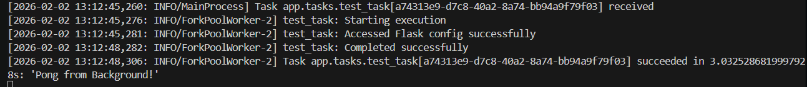

### 6.3 Predict: Retry Behavior

Before triggering the flaky task, predict what will happen:

**Given:**
- The task has a 70% failure rate
- `max_retries=3`
- Exponential backoff: 5s → 10s → 20s

**Question 1:** If the task fails on all attempts, how many total execution attempts occur (initial + retries)?

**Question 2:** What is the minimum time before the task finally fails (assuming all attempts fail immediately)?

**Question 3:** What state will the status endpoint return while the task is retrying?

<details>
<summary>Click to review answers</summary>

**Answer 1:** 4 attempts total (1 initial + 3 retries)

**Answer 2:** Minimum time = 5s (first retry) + 10s (second retry) + 20s (third retry) = 35 seconds (not counting execution time)

**Answer 3:** The status endpoint returns `"state": "RETRY"` while the task is scheduled for retry. Between retry attempts, it shows PENDING.

</details>

### 6.4 Trigger the Flaky Task

Trigger a flaky task:

```bash
curl -X POST http://localhost:5000/test-reliability \
  -H "Content-Type: application/json" \
  -d '{"task_number": 1}'
```

**Expected response:**

```json
{
  "message": "Flaky task queued (70% chance of failure)",
  "task_id": "xyz-789-abc-123",
  "task_number": 1,
  "info": "This task will automatically retry up to 3 times with exponential backoff"
}
```

Watch Terminal 1 (Worker) carefully. You will likely see retry attempts:

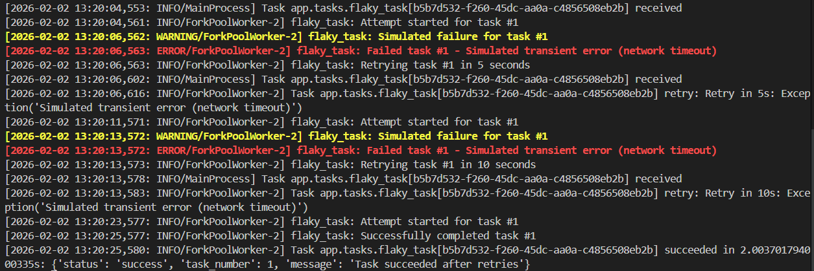

**Notice:** The logs show each attempt, the error, and the countdown for the next retry.

### 6.5 Check Task Status During Retry

Copy the `task_id` from the response and check its status:

```bash
curl http://localhost:5000/tasks/xyz-789-abc-123
```

If you query during a retry, you might see:

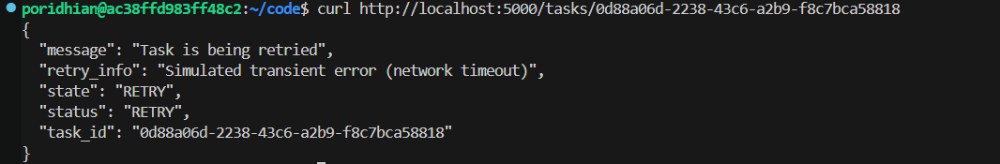

### 6.6 Check Final Status

After the task completes (either succeeds or exhausts retries), check status again:

```bash
curl http://localhost:5000/tasks/xyz-789-abc-123
```

**If successful:**

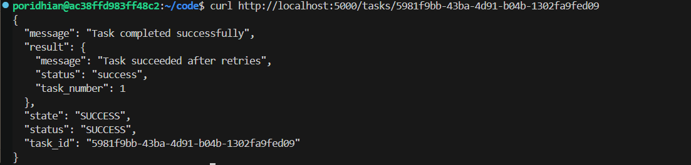

**If all retries failed:**

```json
{
  "task_id": "xyz-789-abc-123",
  "state": "SUCCESS",
  "status": "SUCCESS",
  "message": "Task completed successfully",
  "result": {
    "status": "failed",
    "task_number": 1,
    "error": "Simulated transient error (network timeout)",
    "retries": 3
  }
}
```

**Important:** The Celery state is SUCCESS because the task returned a value (the error dictionary) rather than raising an unhandled exception. This demonstrates intentional error handling—the task gracefully reports its failure instead of crashing.

### 6.7 Checkpoint

- [ ] Observed automatic retry behavior
- [ ] Seen exponential backoff delays in worker logs
- [ ] Checked task status during and after retries
- [ ] Verified that structured error responses return SUCCESS state

---

## Chapter 7: Testing Timeout Enforcement

Now observe how Celery enforces timeout limits to prevent runaway tasks.

### 7.1 Predict: Timeout Behavior

Consider the slow task configuration:
- `soft_time_limit=8`
- `time_limit=10`
- You will trigger it with `duration=15`

**Question 1:** What will happen at the 8-second mark?

**Question 2:** Will the task continue running after the soft timeout?

**Question 3:** What state will the task ultimately reach?

<details>
<summary>Click to review answers</summary>

**Answer 1:** At 8 seconds, Celery raises `SoftTimeLimitExceeded`. The task's except block catches it and returns a timeout response.

**Answer 2:** No. The except block executes immediately, returns the timeout response, and the task ends gracefully.

**Answer 3:** The task reaches SUCCESS state because it handled the timeout gracefully and returned a structured response.

If the task did NOT handle `SoftTimeLimitExceeded`, it would continue running until the 10-second hard limit, when Celery would forcefully terminate it with FAILURE state.

</details>

### 7.2 Trigger a Slow Task

Trigger a task that exceeds the timeout:

```bash
curl -X POST http://localhost:5000/test-timeout \
  -H "Content-Type: application/json" \
  -d '{"duration": 15}'
```

**Expected response:**

```json
{
  "message": "Slow task queued (will run for 15 seconds)",
  "task_id": "timeout-task-123",
  "duration": 15,
  "timeout_info": "Task has 8s soft limit and 10s hard limit"
}
```

Watch Terminal 1 (Worker). After 8 seconds, you will see:

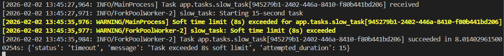

### 7.3 Check Task Status

Check the task status:

```bash
curl http://localhost:5000/tasks/timeout-task-123
```

**Expected output:**

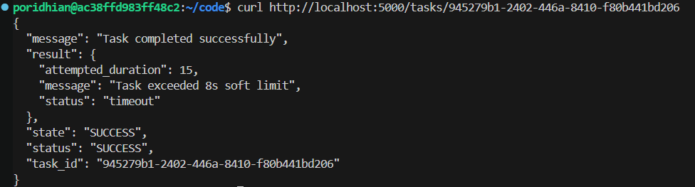

The task "succeeded" in the sense that it handled the timeout gracefully and returned a structured response.

### 7.4 Test Within Time Limit

Now trigger a task that completes within the timeout:

```bash
curl -X POST http://localhost:5000/test-timeout \
  -H "Content-Type: application/json" \
  -d '{"duration": 5}'
```

Watch Terminal 1 (Worker):

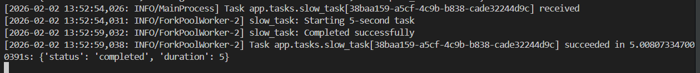

Check status:

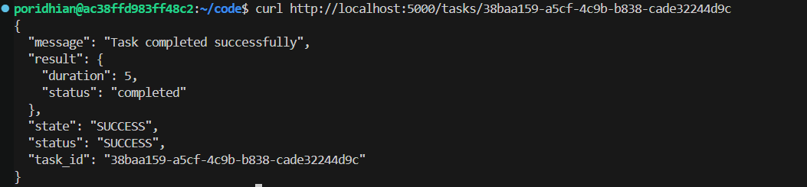

This demonstrates that timeouts only enforce when exceeded.

### 7.5 Experiment: Unhandled Timeout

To understand why handling `SoftTimeLimitExceeded` matters, create a version of the slow task that does NOT catch the exception.

**Question:** If the task does not handle `SoftTimeLimitExceeded`, what will happen?

<details>
<summary>Click to review answer</summary>

If the task does not catch `SoftTimeLimitExceeded`:

1. At the 8-second soft limit, the exception is raised
2. The exception propagates upward (no except block to catch it)
3. The task continues running until the 10-second hard limit
4. Celery forcefully terminates the worker process (SIGKILL)
5. The task is marked as FAILURE
6. No cleanup occurs (connections stay open, locks stay held)

**This is why you should always handle SoftTimeLimitExceeded.** It allows graceful cleanup before hard termination.

</details>

### 7.6 Checkpoint

- [ ] Observed soft timeout limits raising `SoftTimeLimitExceeded`
- [ ] Seen tasks handle timeouts gracefully and return structured responses
- [ ] Verified that tasks within time limits complete normally

---

## Chapter 8: Testing Concurrent Retry Behavior

In production, multiple tasks may be failing and retrying simultaneously. This chapter demonstrates how Celery manages concurrent retry schedules.

### 8.1 Trigger Multiple Flaky Tasks

Submit five flaky tasks rapidly:

```bash
for i in {1..5}; do
  curl -X POST http://localhost:5000/test-reliability \
    -H "Content-Type: application/json" \
    -d "{\"task_number\": $i}" &
done
wait
```

**Expected behavior:** Watch Terminal 1 (Worker). You will see multiple tasks executing concurrently (depending on worker concurrency settings), with some failing and retrying at different intervals.

**Example interleaved output:**

```
[10:50:10] INFO in tasks: flaky_task: Attempt started for task #1
[10:50:10] INFO in tasks: flaky_task: Attempt started for task #2
[10:50:12] WARNING in tasks: flaky_task: Simulated failure for task #1
[10:50:12] INFO in tasks: flaky_task: Retrying task #1 in 5 seconds
[10:50:12] INFO in tasks: flaky_task: Successfully completed task #2
[10:50:13] INFO in tasks: flaky_task: Attempt started for task #3
[10:50:15] WARNING in tasks: flaky_task: Simulated failure for task #3
[10:50:15] INFO in tasks: flaky_task: Retrying task #3 in 5 seconds
[10:50:17] INFO in tasks: flaky_task: Attempt started for task #1  <-- Retry
[10:50:19] INFO in tasks: flaky_task: Successfully completed task #1
```

This demonstrates how the retry system handles multiple tasks independently, each with its own retry schedule.

### 8.2 Checkpoint

- [ ] Observed concurrent task execution and retries
- [ ] Seen independent retry schedules for different tasks
- [ ] Verified that retries do not block other tasks

---

## Chapter 9: Understanding Error Handling Patterns

The tasks demonstrate two error handling patterns. Understanding when to use each pattern is essential for production systems.

### 9.1 Pattern 1: Retry and Raise

Used in `send_welcome_email` and `generate_monthly_report`:

```python
except Exception as exc:
    logger.error(f"Task failed: {exc}")
    raise self.retry(exc=exc, countdown=10)
```

**When the task exhausts retries:** Celery marks it as FAILURE. The exception information is stored in the result backend.

**When to use:** Critical tasks where permanent failure should be visible and trigger alerts.

### 9.2 Pattern 2: Retry Then Return Error Dict

Used in `flaky_task`:

```python
except Exception as exc:
    if self.request.retries >= self.max_retries:
        return {
            "status": "failed",
            "error": str(exc),
            "retries": self.request.retries
        }
    raise self.retry(exc=exc, countdown=...)
```

**When the task exhausts retries:** The task returns a structured dictionary with error details. Celery marks it as SUCCESS (because it returned a value, not an exception).

**When to use:** Tasks where you want to track attempts but still return structured data to the client. The client can parse the response and determine that `status=failed` indicates a problem.

### 9.3 Think First: Which Pattern to Use?

Consider these scenarios:

**Scenario A:** A critical billing task that charges a customer's credit card. If it fails after retries, the operations team must be alerted immediately.

**Scenario B:** A notification task that sends a push notification to a mobile device. If it fails after retries, you want to log the failure but not trigger an alert (the user can be notified through other channels).

**Question:** Which error handling pattern should each scenario use?

<details>
<summary>Click to review answer</summary>

**Scenario A should use Pattern 1 (Retry and Raise).** Billing failures are critical. The FAILURE state triggers alerts in monitoring systems (PagerDuty, CloudWatch, etc.). The operations team investigates immediately.

**Scenario B should use Pattern 2 (Retry Then Return Error Dict).** Notification failures are not critical. You want to log the failure for analytics, but you don't want to wake up an engineer at 3am because a push notification failed. The structured response allows tracking failure rates without triggering alerts.

**General guidance:**
- Critical path (billing, data integrity): Pattern 1
- Best-effort (notifications, analytics): Pattern 2

</details>

### 9.4 Checkpoint

At this point, you understand:
- [ ] The difference between raising exceptions and returning error dictionaries
- [ ] When to use each error handling pattern
- [ ] How task states (FAILURE vs SUCCESS) differ based on the pattern

---

## Epilogue: The Complete System

You step back to assess what you have built. A task queue that was once fragile now handles the messiness of production environments.

**Without reliability features:**
- Transient failures become permanent
- Runaway tasks consume resources indefinitely
- Failures disappear silently into logs
- Debugging requires guesswork

**With reliability features:**
- Transient failures retry automatically with exponential backoff
- Timeouts kill runaway tasks before resource exhaustion
- Comprehensive logging tracks every lifecycle event
- Structured errors return meaningful messages to clients

Your endpoints now handle:

| Endpoint | Method | Purpose |
|----------|--------|---------|
| `/ping` | POST | Health check with background task |
| `/register` | POST | User registration with email task |
| `/reports/generate` | POST | PDF generation with timeout protection |
| `/test-reliability` | POST | Demonstrates retry behavior |
| `/test-timeout` | POST | Demonstrates timeout enforcement |
| `/tasks/<task_id>` | GET | Check task status and results |

The operations team reports fewer alerts. Transient failures resolve themselves. When tasks do fail permanently, logs provide complete context for debugging.

---

## The Principles

Building a reliable task queue follows deliberate patterns:

1. **Distinguish transient from permanent errors.** Network timeouts retry. Validation errors return immediately.

2. **Use exponential backoff for retries.** Constant retries overwhelm failing services. Exponential backoff gives time to recover.

3. **Set timeout limits on all long-running tasks.** Infinite loops and hung connections must be terminated before resource exhaustion.

4. **Handle soft timeouts gracefully.** Close connections, save partial results, return structured responses before hard termination.

5. **Log lifecycle events comprehensively.** Start, success, failure, retry, and timeout events enable production debugging.

6. **Return structured errors, not exceptions.** Clients need parseable responses, not stack traces.

7. **Choose error handling patterns based on criticality.** Critical tasks raise exceptions. Best-effort tasks return error dictionaries.

## Next Steps

To continue building production-ready task queues, consider:

1. **Priority Queues** — Route critical tasks to high-priority queues
2. **Task Routing** — Send different task types to specialized workers
3. **Monitoring Integration** — Send task metrics to Prometheus or DataDog
4. **Dead Letter Queues** — Store permanently failed tasks for manual review
5. **Rate Limiting** — Prevent overwhelming external APIs with too many concurrent tasks
6. **Task Chains** — Create workflows where tasks trigger subsequent tasks
7. **Periodic Tasks** — Schedule recurring tasks with Celery Beat

---

## Additional Resources

- [Celery Documentation](https://docs.celeryq.dev/)
- [Celery Best Practices](https://docs.celeryq.dev/en/stable/userguide/tasks.html#best-practices)
- [Flask Documentation](https://flask.palletsprojects.com/)
- [Redis Documentation](https://redis.io/docs/)
