# Lab 1: Monitoring Celery Workers with Flower

## Introduction

This lab teaches you to implement real-time monitoring for Celery task queues using Flower, a web-based dashboard that provides visibility into task execution, worker health, and queue backlogs. Building on the production-ready task queue from Module 54, you will install Flower, configure it to monitor your existing Flask-Celery infrastructure, and use its interface to observe task state transitions, inspect failure tracebacks, and identify performance bottlenecks. By the end of this lab, you will have operational monitoring that transforms your task queue from an opaque background process into a transparent, debuggable system.

## Architecture Diagram

Flower sits alongside your existing Flask-Celery infrastructure and reads data from the Redis broker and result backend:

```
┌─────────────────────────────────────────────────────────────────┐
│                        Client (curl/browser)                    │
└────────┬───────────────────────────────────────┬────────────────┘
         │                                       │
         │ HTTP POST /register                   │ HTTP GET :5555
         │ (Trigger tasks)                       │ (Monitor tasks)
         ▼                                       ▼
┌──────────────────────┐              ┌─────────────────────────┐
│   Flask Application  │              │   Flower Dashboard      │
│   (Port 5000)        │              │   (Port 5555)           │
│                      │              │                         │
│  - POST /register    │              │  - Tasks page           │
│  - POST /reports     │              │  - Workers page         │
│  - GET /tasks/:id    │              │  - Monitor page         │
└──────────┬───────────┘              └────────┬────────────────┘
           │                                   │
           │ Queue task                        │ Read task data
           │                                   │ Read worker data
           ▼                                   ▼
┌─────────────────────────────────────────────────────────────────┐
│                      Redis (Port 6379)                          │
│  ┌────────────────────────┐  ┌────────────────────────────┐    │
│  │  Database 0 (Broker)   │  │  Database 1 (Result Backend)│   │
│  │  - Task queue          │  │  - Task states             │    │
│  │  - Pending tasks       │  │  - Task results            │    │
│  └────────────────────────┘  └────────────────────────────┘    │
└────────────┬────────────────────────────────────────────────────┘
             │
             │ Poll for tasks
             │ Write results
             ▼
┌─────────────────────────┐
│   Celery Worker         │
│   (Background Process)  │
│                         │
│  - Executes tasks       │
│  - Handles retries      │
│  - Enforces timeouts    │
└─────────────────────────┘
```

**Key Points:**
- **Flask API** and **Flower** are separate processes that both connect to Redis
- **Flower** reads from the broker (to see queued tasks) and the result backend (to see task states/results)
- **Flower** does NOT execute tasks—it's purely a monitoring/inspection tool
- Clients can trigger tasks via Flask and immediately switch to Flower to watch them execute

## Learning Objectives

By the end of this lab, you will be able to:

1. Install Flower as a monitoring layer for existing Celery infrastructures
2. Configure Flower to connect to Redis broker and result backend
3. Monitor tasks in real-time as they transition through execution states
4. Inspect task arguments, return values, and exception tracebacks via the web interface
5. Track worker health metrics including concurrency and task processing rates
6. Filter and search task histories to isolate specific executions
7. Identify queue backlogs by monitoring pending task counts
8. Secure the Flower dashboard with authentication mechanisms
9. Deploy Flower behind a reverse proxy for production environments

**Prerequisites:** Completion of Module 54 Lab 1 with a working Flask-Celery application including retry logic, timeout enforcement, and error handling. You must have Redis configured as both broker and result backend, with tasks `send_welcome_email`, `generate_monthly_report`, `flaky_task`, and `slow_task` defined.

## Prologue: The Challenge

You join a platform engineering team at a fast-growing e-commerce company. The Flask-Celery task queue processes thousands of background jobs daily: order confirmations, inventory updates, recommendation engine calculations, and fraud detection analyses. The system includes retry logic, timeout enforcement, and comprehensive error handling—everything the Module 54 lab taught you to implement.

On Monday morning, the customer support team reports that confirmation emails stopped arriving over the weekend. The on-call engineer checks the Celery worker logs but sees thousands of lines scrolling by. Searching for errors manually takes 20 minutes. By then, 50 customers have called support.

On Tuesday, the operations team notices that API response times have degraded. They suspect the task queue is involved but cannot determine whether workers are overloaded, tasks are failing silently, or the queue is backing up. Without real-time visibility, every investigation requires parsing logs or writing custom Redis queries.

On Wednesday, during a deployment, three workers restart simultaneously. Nobody notices that Worker-3 failed to come back online for 40 minutes, during which time hundreds of tasks piled up. The CEO receives a complaint email from an enterprise customer whose monthly report never generated.

Your task is to implement real-time monitoring that answers critical production questions instantly: Which tasks are currently executing? How many failures occurred in the last hour? Why did task X fail? Are tasks backing up faster than workers can process them? Which worker is the bottleneck?

You will install Flower, connect it to your existing infrastructure, and transform your opaque task queue into a transparent, debuggable system.

## Environment Setup

This lab extends the Module 54 project on a fresh virtual machine. You will recreate the Flask-Celery infrastructure from Module 54,then add Flower as a monitoring layer.


Check Python version:

```bash
python --version
```

If Python 3.12 is not available, install it:

```bash
sudo apt update
sudo apt install python3.12-venv -y
alias python=python3.12
source ~/.bashrc
```

Clone Module 54 project codebase:

```bash
git clone https://github.com/poridhioss/Building-Systems-With-FastAPI.git
cd Building-Systems-With-FastAPI/
git checkout -b mod-54/lab-1 origin/mod-54/lab-1
```

Create and activate a virtual environment:

```bash
cd flask-celery-app
python -m venv .venv
source .venv/bin/activate
```

Install the base dependencies from Module 54:

```bash
pip install -r requirements.txt
```

Ensure Redis is running via Docker Compose. Verify the Flask application and Celery worker from Module 54 are functional before proceeding. This lab assumes your Module 54 infrastructure is operational.

---

## Chapter 1: Understanding Flower's Role

Before installing monitoring tools, you must understand what Flower provides and how it integrates with your existing Celery infrastructure.

### 1.1 The Visibility Problem

Production task queues present a visibility challenge. When a Celery worker processes tasks in the background, you cannot see execution in real-time. Questions like "Which tasks are currently running?", "Why did this task fail?", and "Are tasks backing up?" require manual log parsing or custom Redis queries. This workflow is inefficient during incidents when seconds matter.

Flower solves this by providing a web-based dashboard that reads from your Redis broker and result backend. It displays task states, worker health, queue lengths, and exception tracebacks—all in real-time. Flower does not execute tasks. It observes and reports.

### 1.2 Flower's Architecture

Flower connects to the same Redis instance your Flask application and Celery workers use:

```
┌─────────────────────────────────────────────────────────────────┐
│                        Client (curl/browser)                    │
└────────┬───────────────────────────────────────┬────────────────┘
         │                                       │
         │ HTTP POST /register                   │ HTTP GET :5555
         │ (Trigger tasks)                       │ (Monitor tasks)
         ▼                                       ▼
┌──────────────────────┐              ┌─────────────────────────┐
│   Flask Application  │              │   Flower Dashboard      │
│   (Port 5000)        │              │   (Port 5555)           │
│                      │              │                         │
│  - POST /register    │              │  - Tasks page           │
│  - POST /reports     │              │  - Workers page         │
│  - GET /tasks/:id    │              │  - Monitor page         │
└──────────┬───────────┘              └────────┬────────────────┘
           │                                   │
           │ Queue task                        │ Read task data
           ▼                                   ▼
┌─────────────────────────────────────────────────────────────────┐
│                      Redis (Port 6379)                          │
│  ┌────────────────────────┐  ┌────────────────────────────┐    │
│  │  Database 0 (Broker)   │  │  Database 1 (Result Backend)│   │
│  │  - Task queue          │  │  - Task states             │    │
│  │  - Pending tasks       │  │  - Task results            │    │
│  └────────────────────────┘  └────────────────────────────┘    │
└────────────┬────────────────────────────────────────────────────┘
             │
             │ Poll for tasks
             ▼
┌─────────────────────────┐
│   Celery Worker         │
│   (Background Process)  │
│                         │
│  - Executes tasks       │
│  - Handles retries      │
│  - Enforces timeouts    │
└─────────────────────────┘
```

Flower runs as a separate process alongside Flask and Celery. When you trigger a task via the Flask API, Flask queues it in Redis. The Celery worker polls Redis, executes the task, and writes the result back to Redis. Flower continuously polls Redis to display this activity in its web interface.

### 1.3 What Flower Monitors

Flower tracks four primary categories of data:

1. **Task States**: PENDING (queued), STARTED (executing), SUCCESS (completed), FAILURE (exception raised), RETRY (retrying after failure)
2. **Task Details**: Arguments passed to the task, return values, exception tracebacks, execution duration, worker assignment
3. **Worker Health**: Active worker count, concurrency settings, total tasks processed, worker uptime
4. **Queue Metrics**: Number of queued tasks (backlog), tasks per second rate, broker connection status

These metrics answer the operational questions that log files cannot surface quickly.

### 1.4 Prediction Exercise

Before proceeding, consider this scenario:

A task fails with a transient network error. Celery retries it automatically using exponential backoff (5s, 10s, 20s delays). The task eventually succeeds on the third attempt.

**Question:** What sequence of states will Flower display for this task? Write down your prediction.

<details>
<summary>Reveal Answer</summary>

The task will transition through these states:

1. `PENDING` — Task queued, not yet picked up by worker
2. `STARTED` — Worker begins execution
3. `RETRY` — First attempt fails, task marked for retry
4. `PENDING` — Task re-queued after 5-second delay
5. `STARTED` — Second attempt begins
6. `RETRY` — Second attempt fails, task marked for retry
7. `PENDING` — Task re-queued after 10-second delay
8. `STARTED` — Third attempt begins
9. `SUCCESS` — Third attempt completes successfully

Flower displays the full history, including retry count and the exceptions from failed attempts.

</details>

### 1.5 Checkpoint

Verify your understanding before proceeding:

- [ ] Flower reads data from the broker and result backend; it does not execute tasks
- [ ] Flower runs as a separate process from Flask and Celery
- [ ] Task states include PENDING, STARTED, SUCCESS, FAILURE, and RETRY
- [ ] Flower can display exception tracebacks without parsing log files

---

## Chapter 2: Installing and Launching Flower

Install Flower and configure it to monitor your Module 54 infrastructure.

### 2.1 Install Flower Package

Navigate to your project directory and activate the virtual environment:

```bash
cd flask-celery-app
source .venv/bin/activate
```

Install Flower:

```bash
pip install flower==2.0.1
```

Flower is a web application built with Tornado that provides monitoring and administration capabilities for Celery. It reads task states from the result backend and worker information from the broker.

Update `requirements.txt` to include Flower:

```bash
echo "flower==2.0.1" >> requirements.txt
```

Your `requirements.txt` should now contain:

```txt
flask==3.0.0
celery==5.3.4
redis==5.0.1
flower==2.0.1
```

### 2.2 Start Infrastructure Components

Before launching Flower, ensure your Flask-Celery infrastructure from Module 54 is running. You will need multiple terminal sessions.

**Terminal 1: Start Redis**

```bash
cd flask-celery-app
docker compose up -d
```

Verify Redis is active:

```bash
docker ps
```

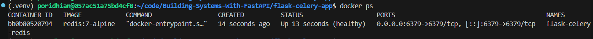

The output should show `flask-celery-redis` running.

**Terminal 2: Start Celery Worker**

```bash
cd flask-celery-app
source .venv/bin/activate
celery -A app.celery worker --loglevel=info
```

Wait for the worker initialization to complete. The terminal will display `[ready]` when the worker is ready to accept tasks.

**Terminal 3: Start Flask Application**

```bash
cd flask-celery-app
source .venv/bin/activate
python run.py
```

The Flask application should start on `http://127.0.0.1:5000`.

If all three components are running, your infrastructure is ready for monitoring.

### 2.3 Launch Flower Dashboard

Open a fourth terminal and launch Flower:

```bash
cd flask-celery-app
source .venv/bin/activate
celery -A app.celery flower --port=5555
```

The `-A app.celery` parameter tells Flower which Celery application instance to monitor. The `--port=5555` parameter specifies the web interface port. Port 5555 is the conventional Flower port.

Expected output:

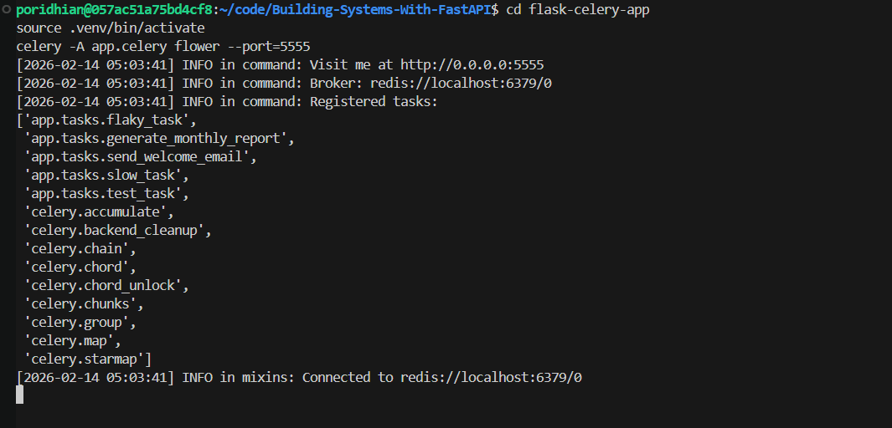

Leave this terminal open. Flower must remain running to provide real-time monitoring.

### 2.4: Access Flower using Poridhi's Load Balancer

To access the Flower with Poridhi's Load Balancer, first find your wt0 IP address by running `ifconfig` and looking for the `wt0` interface. Note the IP address (something like `100.125.246.186`).

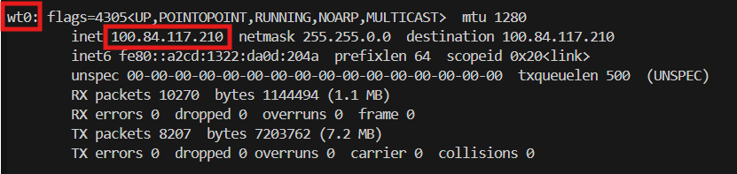

**Create Load Balancer:**

Go to Poridhi's Load Balancer dashboard, create a new Load Balancer, use your wt0 IP address with port 8000, and click "Create".

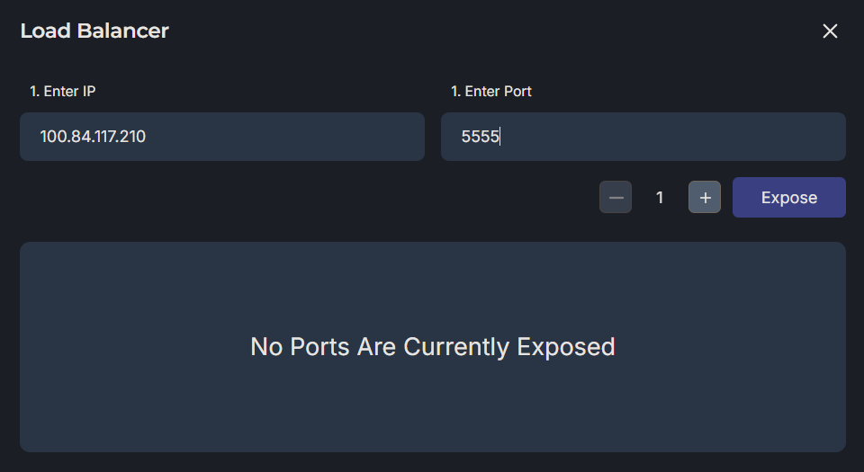

You'll receive a public URL like `https://lb-xxxxx.poridhi.io` that you can use to access Flower from anywhere.

### 2.4 Access the Flower Web Interface from your local pc

Open a web browser and navigate to:

```
`https://lb-xxxxx.poridhi.io`
```

The Flower homepage displays:

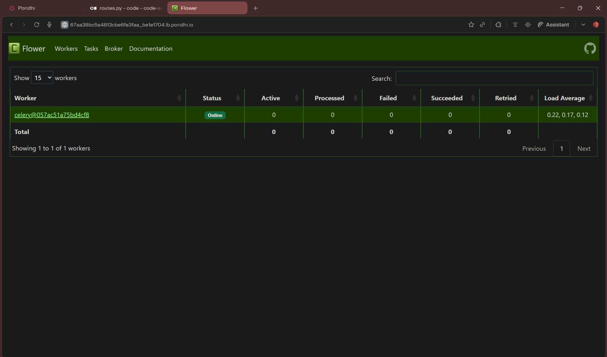

The Tasks page will initially be empty because no tasks have executed since Flower started.

### 2.5 Checkpoint

Before triggering tasks, verify:

- [ ] Four terminals are running: Redis (docker), Celery worker, Flask app, Flower
- [ ] Flower web interface loads at `https://lb-xxxxx.poridhi.io`
- [ ] Flask API responds to HTTP requests

---

## Chapter 3: Monitoring Task Execution

Trigger tasks and observe their execution through the Flower interface.

### 3.1 Monitor a Successful Task

Open a fifth terminal for triggering tasks:

```bash
cd flask-celery-app
```

Trigger the `send_welcome_email` task by registering a user:

```bash
curl -X POST http://localhost:5000/register \
  -H "Content-Type: application/json" \
  -d '{"email": "alice@example.com"}'
```

The Flask API returns immediately with a task ID:

```json
{
  "message": "User registered. Welcome email is being sent in the background.",
  "task_id": "a1b2c3d4-5678-90ef-ghij-klmnopqrstuv"
}
```

Switch to the Flower browser tab. Click the **Tasks** navigation item.

The Tasks page displays your task. The State column will transition:

1. `PENDING` (task queued, not yet started)
2. `STARTED` (worker picked up task)
3. `SUCCESS` (task completed)

The transition from PENDING to SUCCESS takes approximately 5 seconds because `send_welcome_email` includes a 5-second sleep to simulate email API latency.

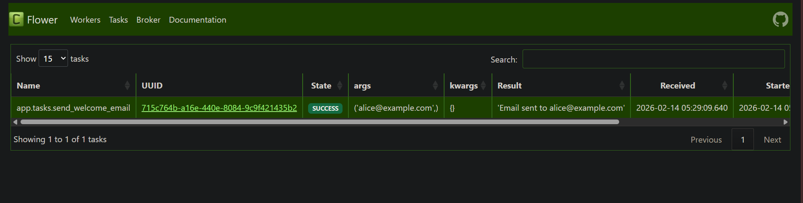

The task row shows:

- **Name**: `app.tasks.send_welcome_email`
- **UUID**: The task ID returned by Flask
- **State**: Current execution state
- **Args**: Task arguments (`('alice@example.com',)`)
- **Kwargs**: Keyword arguments (empty for this task)
- **Result**: Return value (`"Welcome email sent to alice@example.com"`)
- **Received**: Timestamp when task was queued
- **Started**: Timestamp when worker began execution
- **Runtime**: Execution duration in seconds
- **Worker**: Which worker executed the task

Click on the task row to view full details:

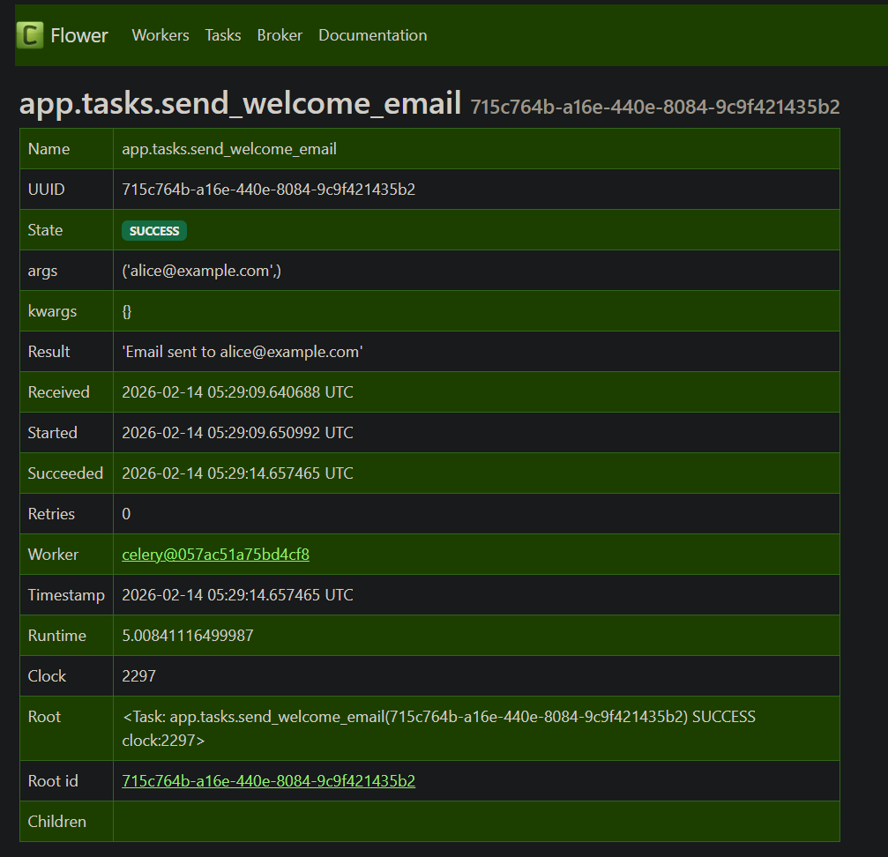

The detail view includes:

- **Arguments**: Positional and keyword arguments passed to the task
- **Result**: Complete return value
- **Exception**: Exception message and traceback (empty for successful tasks)
- **Traceback**: Full Python stack trace (empty for successful tasks)
- **Task State History**: State transitions with timestamps

This level of detail eliminates the need to search worker logs when debugging task behavior.

### 3.2 Monitor a Task with Retries

The `flaky_task` from Module 54 randomly fails 70% of the time to demonstrate retry behavior. Trigger it:

```bash
curl -X POST http://localhost:5000/test-reliability \
  -H "Content-Type: application/json" \
  -d '{"task_number": 1}'
```

Now check flower:

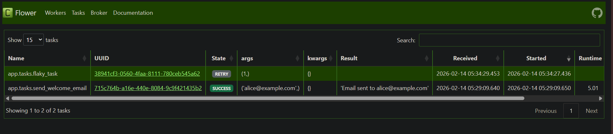

The timeline shows when tasks start and when they complete. For the flaky task, you might observe:

1. Task starts 
2. Task fails after 2 seconds (bar changes color)
3. After exponential backoff delay (510/20 seconds), task restarts
4. If it fails again, another retry occurs
5. Eventually, the task either succeeds or exhausts retries and enters FAILURE state

Return to the **Tasks** tab and locate the `flaky_task` entry. Click it to view details.

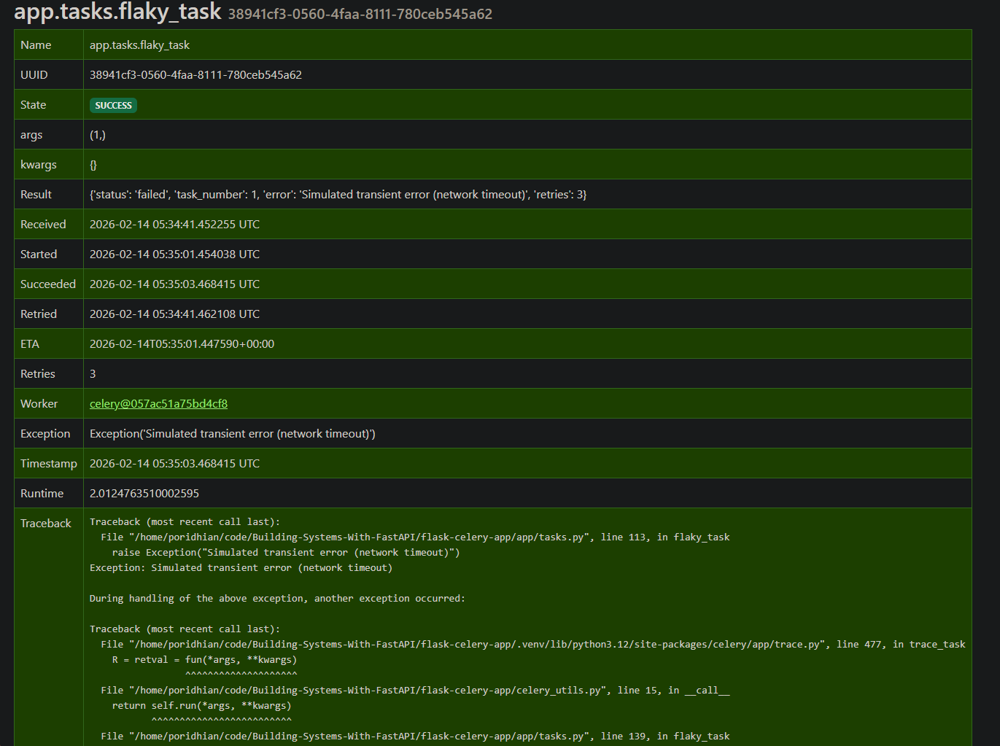

The detail view shows:

- **Retries**: Number of retry attempts (e.g., `2/3` means 2 retries out of maximum 3)
- **Exception**: The error that triggered the retry: `"Simulated transient error (network timeout)"`
- **Traceback**: Full Python stack trace showing where the exception was raised

This visibility is critical for production debugging. When a task fails, you can immediately see the exception and traceback without accessing server logs or searching through gigabytes of data.

### 3.3 Monitor a Task That Times Out

The `slow_task` from Module 54 accepts a duration parameter and enforces a soft timeout of 8 seconds. Trigger it with a duration that exceeds the timeout:

```bash
curl -X POST http://localhost:5000/test-timeout \
  -H "Content-Type: application/json" \
  -d '{"duration": 20}'
```

Switch to Flower's **Tasks** tab and observe the task:

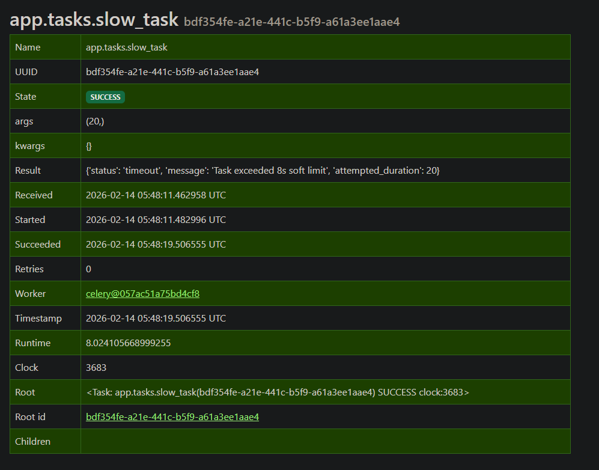

The task transitions:

1. `PENDING` → Task queued
2. `STARTED` → Worker begins execution
3. After 8 seconds (the soft timeout), the task catches `SoftTimeLimitExceeded`
4. `SUCCESS` → Task completes gracefully with result: `{"status": "timeout", "message": "Task exceeded time limit"}`

If you trigger the task with a duration longer than the hard timeout (10 seconds), or if the task does not handle `SoftTimeLimitExceeded`, the state will change to `FAILURE` with exception `TimeLimitExceeded`.

The Flower timeline visualizes this entire lifecycle without requiring you to watch worker logs.

### 3.4 Understanding Task State Transitions

Flower displays tasks in six possible states:

| State | Meaning |
|-------|---------|
| **PENDING** | Task queued but not yet picked up by worker|
| **STARTED** | Worker currently executing task |
| **SUCCESS** | Task completed without exception |
| **FAILURE** | Task raised unhandled exception |
| **RETRY** | Task failed but will retry |
| **REVOKED** | Task cancelled before execution |

Common state transition patterns:

**Successful task:**
```
PENDING → STARTED → SUCCESS
```

**Task with retries that eventually succeeds:**
```
PENDING → STARTED → RETRY → PENDING → STARTED → SUCCESS
```

**Task that exhausts retries:**
```
PENDING → STARTED → RETRY → PENDING → STARTED → RETRY → PENDING → STARTED → FAILURE
```

**Task that times out:**
```
PENDING → STARTED → FAILURE (TimeLimitExceeded)
```

Understanding these patterns helps you diagnose task failures quickly during production incidents.

### 3.5 Checkpoint

Verify you can perform these operations:

- [ ] Trigger a task via Flask API and see it appear in Flower
- [ ] Observe state transitions in the Tasks tab (PENDING → STARTED → SUCCESS)
- [ ] Click a task to view arguments and return value
- [ ] Trigger `flaky_task` and view retry history and exception traceback
- [ ] Trigger `slow_task` with timeout and observe graceful handling

---

## Chapter 4: Worker Health and Queue Monitoring

Monitor worker status and identify queue backlogs that indicate capacity problems.

### 4.1 Inspect Worker Configuration

Click the **Workers** tab in Flower:

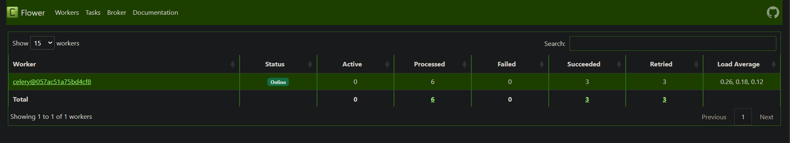

The Workers page displays all active workers with their metrics:

- **Worker**: Worker identifier (e.g., `celery@057ac51a75b4cf8`)
- **Status**: Online or Offline
- **Active**: Number of tasks currently executing
- **Processed**: Total tasks processed since worker started
- **Failed**: Number of tasks that failed
- **Succeeded**: Number of tasks that completed successfully
- **Retried**: Number of tasks that were retried
- **Load Average**: System load average for the worker

The **Processed** count increases each time a worker completes a task. If you have multiple workers, comparing processed counts reveals whether tasks are distributed evenly. The **Succeeded** and **Failed** columns provide a quick health overview of worker performance.

Click on a worker's hostname to view detailed configuration:

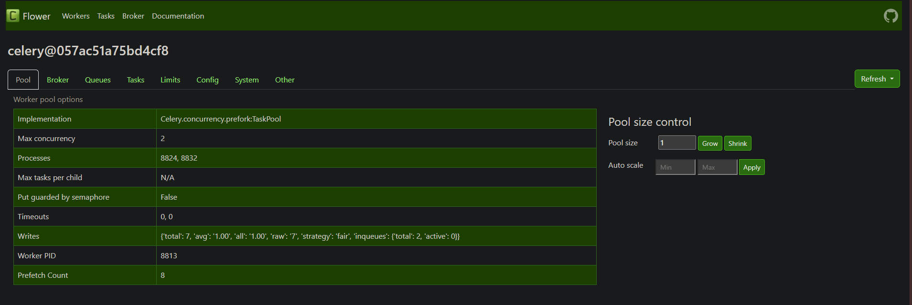


This information verifies your worker configuration without requiring SSH access to production servers.

### 4.2 Testing Worker Failure Detection

Flower detects when workers go offline. Test this behavior:

In Terminal 2 (where your Celery worker is running), press `Ctrl+C` to stop the worker.

Return to the Flower browser tab. After a few seconds, refresh the **Workers** page.

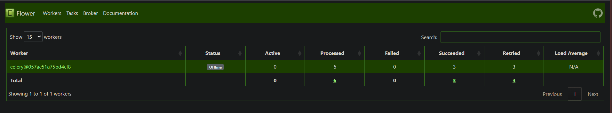

The worker status changes to "Offline". This visibility helps you detect worker crashes or deployments that accidentally terminate workers.

Restart the worker:

```bash
cd flask-celery-app
source .venv/bin/activate
celery -A app.celery worker --loglevel=info
```

Refresh the Flower Workers page. The worker status returns to "Online".

### 4.3 Monitor Queue Backlogs

Queue backlogs occur when tasks are submitted faster than workers can process them. This leads to increased latency and eventual timeout failures. Flower can identify backlogs before they cause user-visible problems.

Stop your Celery worker (Terminal 2: `Ctrl+C`).

Queue 20 tasks while the worker is offline:

```bash
for i in {1..20}; do
  curl -X POST http://localhost:5000/register \
    -H "Content-Type: application/json" \
    -d "{\"email\": \"user$i@example.com\"}"
done
```

Switch to Flower and click the **Broker** tab:

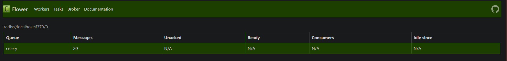

The Broker page displays:

- **Messages in Queue**: 20 (tasks waiting for a worker)
- **Queue Name**: `celery` (the default queue)

This metric indicates tasks are backing up. In production, you would configure alerts when queue length exceeds a threshold (e.g., 100 tasks) to trigger worker auto-scaling.

Restart your Celery worker:

```bash
cd flask-celery-app
source .venv/bin/activate
celery -A app.celery worker --loglevel=info
```

Return to the Flower Broker tab and refresh periodically. The "Messages in Queue" count decreases as the worker processes tasks.

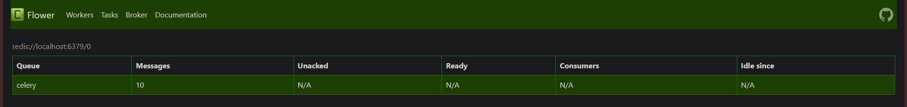
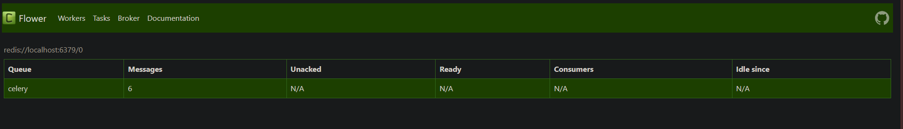
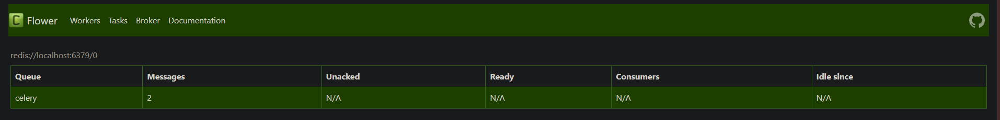
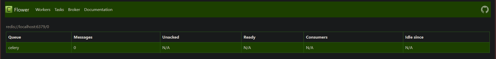
This capability lets you monitor queue health without writing custom Redis queries.

### 4.4 Checkpoint

Confirm you can:

- [ ] View active workers in the Workers tab
- [ ] See worker concurrency and pool configuration
- [ ] Detect when a worker goes offline
- [ ] Monitor queue backlog in the Broker tab
- [ ] Observe queue length decrease as worker processes tasks

---

## Chapter 5: Production Security and Deployment

Configure authentication and reverse proxy setup for production Flower deployments.

### 5.1 The Security Problem

By default, Flower has no authentication. Anyone who can access port 5555 can view all tasks, including task arguments that might contain sensitive data (user IDs, email addresses, API keys). In production, you must restrict access.

### 5.2 Enable Basic Authentication

Stop your Flower process (Terminal 4: `Ctrl+C`).

Restart Flower with basic authentication:

```bash
celery -A app.celery flower \
  --port=5555 \
  --basic_auth=admin:securepassword123
```

Navigate to `http://localhost:5555`. The browser displays an authentication prompt:

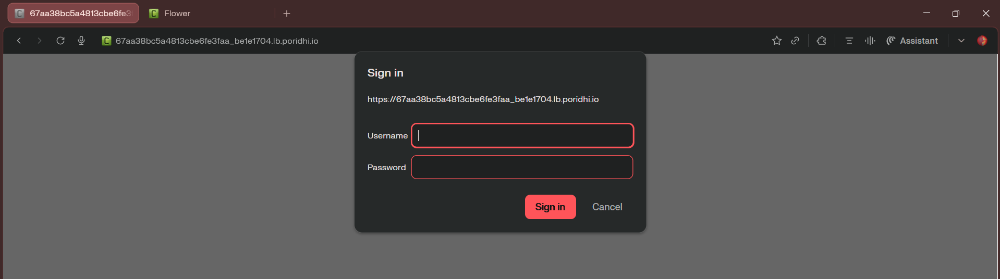

Enter:
- **Username**: `admin`
- **Password**: `securepassword123`

After authentication, the dashboard loads.

For multiple users, provide a comma-separated list:

```bash
celery -A app.celery flower \
  --port=5555 \
  --basic_auth=admin:adminpass,developer:devpass
```

This configuration allows both `admin:adminpass` and `developer:devpass` credentials.

**Important:** Basic authentication transmits credentials in base64 encoding, which is easily decoded. Never use basic authentication over unencrypted HTTP in production. Always use HTTPS (TLS/SSL).

### 5.3 Deploy Behind Nginx Reverse Proxy

Production deployments should place Flower behind a reverse proxy like Nginx. This provides:

- SSL/TLS termination for encrypted traffic
- IP-based access control
- Custom domain names
- Load balancing across multiple Flower instances

Create an Nginx configuration file:

```nginx
server {
    listen 80;
    server_name flower.yourcompany.com;

    # Redirect HTTP to HTTPS in production
    # return 301 https://$server_name$request_uri;

    location / {
        proxy_pass http://localhost:5555;
        proxy_set_header Host $host;
        proxy_set_header X-Real-IP $remote_addr;
        proxy_set_header X-Forwarded-For $proxy_add_x_forwarded_for;
        proxy_set_header X-Forwarded-Proto $scheme;

        # WebSocket support for real-time updates
        proxy_http_version 1.1;
        proxy_set_header Upgrade $http_upgrade;
        proxy_set_header Connection "upgrade";
    }

    # Optional: IP-based access control
    # allow 192.168.1.0/24;  # Your office network
    # deny all;
}
```

Save this as `flower-nginx.conf`.

Install Nginx:

```bash
sudo apt update
sudo apt install nginx -y
```

Deploy the configuration:

```bash
sudo cp flower-nginx.conf /etc/nginx/sites-available/flower
sudo ln -s /etc/nginx/sites-available/flower /etc/nginx/sites-enabled/
sudo nginx -t
sudo systemctl reload nginx
```

Access Flower via `http://your-server-ip` instead of `http://your-server-ip:5555`.

For SSL/TLS, use Let's Encrypt:

```bash
sudo apt install certbot python3-certbot-nginx -y
sudo certbot --nginx -d flower.yourcompany.com
```

Certbot automatically configures Nginx with SSL and redirects HTTP to HTTPS.

### 5.4 Create a Startup Script

For operational convenience, create a shell script that launches Flower with standard configuration.

Create `start_flower.sh`:

```bash
#!/bin/bash

# Activate virtual environment
source .venv/bin/activate

# Launch Flower with authentication and persistence
celery -A app.celery flower \
  --port=5555 \
  --basic_auth=admin:securepassword123 \
  --max_tasks=10000 \
  --persistent=True \
  --db=/tmp/flower.db
```

The `--max_tasks` parameter limits in-memory task history to prevent memory bloat. The `--persistent=True` flag persists task history to a SQLite database, allowing Flower to survive restarts without losing historical data.

Make the script executable:

```bash
chmod +x start_flower.sh
```

Launch Flower:

```bash
./start_flower.sh
```

This script encapsulates your standard configuration in a single command.

### 5.5 Checkpoint

Verify production readiness:

- [ ] Flower requires authentication (username/password)
- [ ] You understand that basic auth over HTTP is insecure
- [ ] You can configure Nginx as a reverse proxy
- [ ] You have a startup script for consistent Flower launches

---

## Chapter 6: Filtering, Searching, and Task History

Use Flower's search and filter capabilities to find specific tasks in large task histories.

### 6.1 Generate Sample Task Data

Trigger multiple tasks to populate Flower's history:

```bash
# Send 5 welcome emails
for i in {1..5}; do
  curl -X POST http://localhost:5000/register \
    -H "Content-Type: application/json" \
    -d "{\"email\": \"user$i@example.com\"}"
  sleep 1
done

# Generate 3 reports
for i in {1..3}; do
  curl -X POST http://localhost:5000/reports/generate \
    -H "Content-Type: application/json" \
    -d "{\"user_id\": $i}"
  sleep 1
done

# Trigger 3 flaky tasks (some will fail)
for i in {1..3}; do
  curl -X POST http://localhost:5000/test-reliability
  sleep 1
done
```

These commands create a mix of successful, failed, and retried tasks.

### 6.2 Filter by Task State

In Flower, navigate to the **Tasks** tab. The page displays all tasks with a filter bar at the top.


Click the filter options:

- **State Filter**: Click "SUCCESS" to display only successful tasks. Click "FAILURE" to show only failed tasks. Click "RETRY" to display tasks currently retrying.
- **Task Name Filter**: Select `app.tasks.send_welcome_email` to isolate email tasks. Select `app.tasks.flaky_task` to view only flaky task attempts.
- **Time Range**: Filter to "Last Hour", "Last 24 Hours", or custom date range.

Filtering is essential in production where thousands of tasks execute per minute. Without filters, finding a specific failed task would require scrolling through dense lists.

### 6.2 Search for Specific Tasks

The search box at the top of the Tasks page searches across:

- Task IDs
- Task arguments
- Task return values

To find all tasks triggered for a specific user email:

1. Enter `user3@example.com` in the search box
2. Press Enter

Flower displays only tasks where the argument or result contains that email address.

To find a specific task by ID:

1. Copy a task UUID from a previous Flask API response
2. Paste it into the search box
3. Press Enter

Flower displays only that task.

This search capability eliminates the need to grep through log files when debugging production issues.

### 6.3 Checkpoint

Confirm you can:

- [ ] Filter tasks by state (SUCCESS, FAILURE, RETRY)
- [ ] Filter tasks by name
- [ ] Search for tasks by argument values
- [ ] Search for tasks by task ID

---

## Epilogue: The Complete Monitoring System

You have implemented real-time monitoring for your Flask-Celery task queue. Your system now provides visibility into task execution, worker health, and queue backlogs.

### Monitoring Capabilities

| Metric | Flower provides |
|--------|-----------------|
| **Task Execution** | Real-time state transitions (PENDING → STARTED → SUCCESS/FAILURE/RETRY) |
| **Task Details** | Arguments, return values, exception tracebacks, execution duration |
| **Worker Health** | Active worker count, concurrency, processed task count, uptime |
| **Queue Performance** | Pending task count (backlog), tasks per second rate |
| **Task History** | Searchable and filterable history of all executed tasks |

### Verification Commands

Verify your monitoring system is operational:

```bash
# Trigger a successful task
curl -X POST http://localhost:5000/register \
  -H "Content-Type: application/json" \
  -d '{"email": "test@example.com"}'

# Trigger a task with retries
curl -X POST http://localhost:5000/test-reliability

# Trigger a task that times out
curl -X POST http://localhost:5000/test-timeout \
  -H "Content-Type: application/json" \
  -d '{"duration": 20}'
```

Observe each task in Flower's Tasks tab. Verify state transitions appear correctly. Check that exception tracebacks display for failed tasks.

---

## The Principles

These generalizable principles apply beyond Celery monitoring:

1. **Observability is not optional**: Production systems without real-time monitoring are undebuggable during incidents. Invest in observability before failures occur.

2. **Separate monitoring from execution**: Monitoring tools should read system state without modifying it. Flower does not execute tasks—it observes them.

3. **Expose actionable metrics**: Effective monitoring surfaces metrics that drive decisions: queue backlogs trigger auto-scaling, failure rates trigger alerts, slow workers trigger investigation.

4. **Security requires authentication and encryption**: Monitoring dashboards expose sensitive data (task arguments, user IDs). Always require authentication and use HTTPS in production.

5. **Filtering is essential at scale**: Systems that process millions of tasks cannot rely on manual log searches. Searchable, filterable interfaces make large-scale debugging feasible.

6. **State transitions reveal system behavior**: Tracking state over time (PENDING → STARTED → SUCCESS) provides more insight than point-in-time snapshots.

7. **Visibility reduces mean time to recovery**: When failures occur, the time spent identifying the failure dominates the time spent fixing it. Real-time dashboards reduce identification time from hours to seconds.

---

## Troubleshooting

### Tasks do not appear in Flower

**Symptoms:** The Tasks page remains empty after triggering tasks via Flask API.

**Diagnosis:**

1. Verify Flower connects to the correct broker: Check the Flower startup log for the broker URL. It should match the `CELERY_BROKER_URL` in your Flask configuration.
2. Verify the result backend is configured: Celery requires a result backend to store task states. Check that `CELERY_RESULT_BACKEND` is set in your configuration.
3. Confirm tasks are actually executing: Check the Celery worker terminal. You should see log messages indicating task receipt and execution.

**Resolution:**

Ensure your `config.py` contains:

```python
CELERY_BROKER_URL = 'redis://localhost:6379/0'
CELERY_RESULT_BACKEND = 'redis://localhost:6379/1'
```

Restart Celery worker and Flower after configuration changes.

### Workers show as Offline

**Symptoms:** The Workers page displays no active workers or shows workers as "Offline".

**Diagnosis:**

1. Verify the Celery worker is running: In the worker terminal, you should see `[ready]` and task logs.
2. Check broker connectivity: Ensure Redis is running and accessible.
3. Confirm worker and Flower use the same broker: Mismatched broker URLs prevent Flower from detecting workers.

**Resolution:**

Test Redis connectivity:

```bash
redis-cli ping
```

Expected response: `PONG`.

Verify the worker runs with the same `-A` parameter as Flower:

```bash
celery -A app.celery worker --loglevel=info
celery -A app.celery flower --port=5555
```

### Task details are incomplete

**Symptoms:** Tasks appear in the list, but clicking them shows no arguments or results.

**Diagnosis:**

1. Verify result backend is configured.
2. Check result expiration settings: Celery deletes task results after a TTL (default 24 hours).
3. Confirm tasks completed recently: Expired results cannot be retrieved.

**Resolution:**

Set a longer result expiration in `config.py`:

```python
CELERY_RESULT_EXPIRES = 3600 * 48  # 48 hours
```

For critical tasks, consider using a permanent database backend (PostgreSQL, MySQL) instead of Redis.

### Cannot access Flower from remote machine

**Symptoms:** Flower loads at `http://localhost:5555` but not at `http://your-server-ip:5555`.

**Diagnosis:**

1. Verify Flower binds to all interfaces: By default, Flower may bind only to localhost.
2. Check firewall rules: The server firewall may block port 5555.

**Resolution:**

Launch Flower with explicit address binding:

```bash
celery -A app.celery flower --address=0.0.0.0 --port=5555
```

Configure firewall to allow port 5555:

```bash
sudo ufw allow 5555
```

For production, use a reverse proxy instead of exposing Flower directly.

---

## Next Steps

You have implemented operational monitoring for Celery task queues. However, Flower shows only what happens inside the Celery system. It does not answer broader questions:

- How long did the entire user request take (Flask API + Celery task execution)?
- If a task calls an external API, how much time was spent waiting versus processing?
- How do tasks interact with databases?
- Which service in a multi-service architecture is the bottleneck?

These questions require **distributed tracing**—a technique that tracks requests across multiple services and visualizes the complete execution timeline.

Module 56 introduces distributed tracing with Grafana Tempo and OpenTelemetry. You will instrument your Flask-Celery application to generate trace spans, export them to Tempo, and visualize end-to-end request flows in Grafana. This visibility extends beyond individual task monitoring to full-system observability.

---

## Additional Resources

### Official Documentation

- **Flower Documentation**: https://flower.readthedocs.io/
- **Celery Monitoring Guide**: https://docs.celeryproject.org/en/stable/userguide/monitoring.html
- **Redis Monitoring**: https://redis.io/topics/monitoring

### Production Best Practices

- **Flower Security**: https://flower.readthedocs.io/en/latest/auth.html
- **Celery Deployment**: https://docs.celeryproject.org/en/stable/userguide/deployment.html
- **Nginx Reverse Proxy Configuration**: https://docs.nginx.com/nginx/admin-guide/web-server/reverse-proxy/

### Alternative Monitoring Tools

- **Prometheus + Celery Exporter**: Metrics-based monitoring with alerting
- **Grafana + Loki**: Log aggregation and visualization
- **ELK Stack (Elasticsearch, Logstash, Kibana)**: Enterprise log management
- **Datadog / New Relic**: Commercial APM platforms with Celery integrations

### Advanced Topics

- **Flower API**: https://flower.readthedocs.io/en/latest/api.html (programmatic access to task data)
- **Custom Celery Monitoring**: https://docs.celeryproject.org/en/stable/userguide/monitoring.html#custom-camera
- **Celery Events**: https://docs.celeryproject.org/en/stable/userguide/monitoring.html#events
