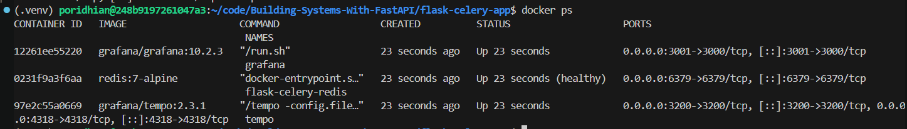
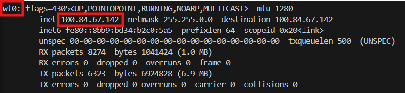
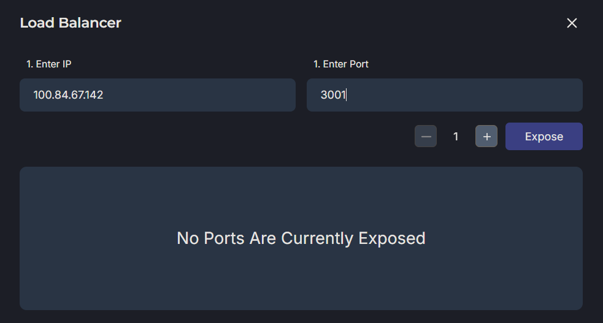
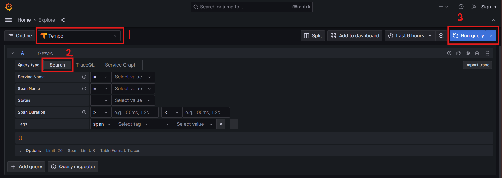
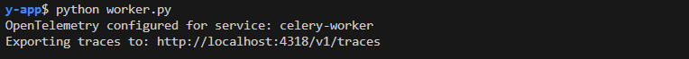
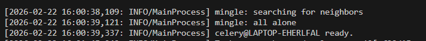

# Lab 1: Local Tracing Setup with Grafana Tempo

In Module 55, you added real-time monitoring to your Celery workers using Flower. You can now see which tasks are running, which ones failed, and what the exception tracebacks look like. This is incredibly valuable for debugging individual task failures.

But Flower has a fundamental limitation: **it only shows you the Celery layer**. It can't answer questions like:

- "How long did the entire user request take from the initial API call to task completion?"
- "When a task fails, how much time was spent before the failure occurred?"
- "Is the slowness caused by database queries, Redis operations, or external API calls?"
- "How does a single user request flow through multiple services (Flask → Redis → Celery)?"

These questions require a different approach called **distributed tracing**. Instead of looking at isolated components (Flask logs, Celery logs, Flower dashboard), distributed tracing gives you a unified timeline that shows the complete journey of a request across all services.

## What is Distributed Tracing?

Distributed tracing is a technique for instrumenting your application to capture detailed timing information about every operation. Here's how it works:

**Traditional Logging:**
```
[Flask Log]  10:30:15 - Received POST /register
[Flask Log]  10:30:15 - Queued task abc-123
[Celery Log] 10:30:16 - Task abc-123 started
[Celery Log] 10:30:21 - Task abc-123 succeeded
```

You see four separate log entries, but you have to manually correlate them. You know the task took 5 seconds, but you don't know:
- How long did Flask take before queuing the task?
- How long did the task wait in the queue?
- What operations happened inside the task?

**Distributed Tracing:**
```
Trace ID: abc-123
├─ Span: POST /register [Flask API] ────────── 50ms
│  ├─ Span: Validate email ───── 5ms
│  ├─ Span: Queue task to Redis ─ 10ms
│  └─ Span: Return response ───── 5ms
└─ Span: send_welcome_email [Celery Worker] ─── 5000ms
   ├─ Span: Connect to SMTP ───── 1000ms
   ├─ Span: Send email ────────── 3000ms
   └─ Span: Update database ───── 1000ms
```

Now you can see:
- The entire request took 5050ms
- Flask responded in 50ms (good!)
- The task waited <1ms in the queue (no backlog)
- Most time (3000ms) was spent sending the email
- SMTP connection took 1000ms (potential optimization target)

This visibility is exactly what we're building in this lab.

## Key Concepts

Before we start, let's understand the terminology:

### 1. Trace
A **trace** represents the complete journey of a single request through your system. It has a unique **Trace ID** that ties all related operations together.

Think of it as the "story" of a single user request from start to finish.

### 2. Span
A **span** represents a single operation within a trace. Each span has:
- A name (e.g., "POST /register", "send_email", "query_database")
- A start time and duration
- A parent span (except for the root span)
- Attributes (key-value metadata like `user_id`, `email`, `http.method`)

Spans are nested to show parent-child relationships:
```
Root Span: HTTP Request
├─ Child Span: Validate input
├─ Child Span: Database query
└─ Child Span: Queue background task
```

### 3. OpenTelemetry
**OpenTelemetry (OTel)** is the industry-standard framework for instrumenting applications to generate traces, metrics, and logs. It provides:
- SDKs for multiple languages (Python, Go, Java, Node.js, etc.)
- Auto-instrumentation for popular frameworks (Flask, Django, FastAPI, requests, psycopg2)
- Exporters to send data to various backends (Tempo, Jaeger, Zipkin, Datadog, etc.)

### 4. Grafana Tempo
**Tempo** is a distributed tracing backend that stores traces efficiently. It's designed for high-volume environments and integrates seamlessly with Grafana for visualization.

### 5. OTLP (OpenTelemetry Protocol)
**OTLP** is the protocol used to send traces from your application to the tracing backend. It supports both gRPC and HTTP transports.

## Architecture Diagram

Here's what we're building:

```
┌──────────────────────────────────────────────────────────────────┐
│                         Client (curl)                            │
└────────────────────────┬─────────────────────────────────────────┘
                         │
                         │ HTTP POST /register
                         │ (Request with Trace ID)
                         ▼
┌─────────────────────────────────────────────────────────────────┐
│              Flask Application (Port 5000)                       │
│              Instrumented with OpenTelemetry                     │
│                                                                  │
│  ┌────────────────────────────────────────────────────────┐    │
│  │  Root Span: POST /register                             │    │
│  │  ├─ Span: Validate input                               │    │
│  │  ├─ Span: Redis RPUSH (queue task)                     │    │
│  │  └─ Span: Return HTTP 201                              │    │
│  └────────────────────────────────────────────────────────┘    │
│                                                                  │
│  Sends spans via OTLP HTTP ──────────────────────┐              │
└──────────────────────────────────────────────────┼──────────────┘
                         │                         │
                         │ Queue task              │
                         ▼                         │
┌─────────────────────────────────────────────────┼──────────────┐
│              Redis (Port 6379)                   │              │
│              Broker + Result Backend             │              │
└──────────────────────┬───────────────────────────┼──────────────┘
                       │                           │
                       │ Poll for tasks            │
                       ▼                           │
┌─────────────────────────────────────────────────┼──────────────┐
│         Celery Worker (Background Process)       │              │
│         Instrumented with OpenTelemetry          │              │
│                                                  │              │
│  ┌────────────────────────────────────────────┐ │              │
│  │  Child Span: send_welcome_email            │ │              │
│  │  ├─ Span: Simulate network delay (5s)     │ │              │
│  │  └─ Span: Return result                   │ │              │
│  └────────────────────────────────────────────┘ │              │
│                                                  │              │
│  Sends spans via OTLP HTTP ──────────────────────┘              │
└─────────────────────────────────────────────────────────────────┘
                                                  │
                                                  │ OTLP HTTP Export
                                                  ▼
┌─────────────────────────────────────────────────────────────────┐
│              Grafana Tempo (Port 4318)                           │
│              Trace Storage Backend                               │
│                                                                  │
│  Stores traces with:                                             │
│  - Trace ID: abc-123                                             │
│  - All spans from Flask and Celery                               │
│  - Span relationships (parent-child)                             │
│  - Span attributes (user_id, email, etc.)                        │
└────────────────────────┬─────────────────────────────────────────┘
                         │
                         │ Query traces via HTTP API
                         ▼
┌─────────────────────────────────────────────────────────────────┐
│              Grafana (Port 3000)                                 │
│              Trace Visualization UI                              │
│                                                                  │
│  Displays:                                                       │
│  - Complete trace timeline (Flask → Celery)                      │
│  - Span duration breakdown                                       │
│  - Span attributes and metadata                                  │
│  - Service dependency graph                                      │
└─────────────────────────────────────────────────────────────────┘
```

**Key Flow:**

1. **Client** sends HTTP request to Flask
2. **Flask** creates a root span with a new Trace ID, processes the request, queues a task, and sends spans to Tempo
3. **Celery Worker** picks up the task, creates a child span with the same Trace ID, executes the task, and sends spans to Tempo
4. **Tempo** stores all spans and links them by Trace ID
5. **Grafana** queries Tempo and visualizes the complete trace timeline

## Objectives

By the end of this lab, you will:

1. Deploy Grafana and Tempo locally using Docker Compose
2. Install OpenTelemetry SDK and auto-instrumentation packages for Flask and Celery
3. Use auto-instrumentation to capture HTTP requests, Redis operations, and task execution
4. Configure the OTLP HTTP exporter to send traces to Tempo
5. Trigger Flask API requests and visualize complete traces in Grafana
6. Understand span hierarchy, duration breakdowns, and timing analysis
7. Add custom spans to instrument specific business logic
8. Enrich spans with custom attributes for better filtering and debugging
9. Observe trace propagation from Flask to Celery across process boundaries
10. Identify performance bottlenecks using the trace timeline

## Prerequisites

This lab builds on Module 54. You should have:
- A working Flask-Celery application with reliability features
- Redis running via Docker Compose
- Basic understanding of HTTP, task queues, and asynchronous processing

## Project Structure

We'll extend the Module 54 project with OpenTelemetry instrumentation:

```
flask-celery-app/
├── app/
│   ├── __init__.py
│   ├── routes.py
│   └── tasks.py           # Will add custom spans
├── celery_utils.py
├── config.py
├── docker-compose.yml      # Will add Grafana + Tempo services
├── requirements.txt        # Will add OpenTelemetry packages
├── run.py
├── otel_config.py          # New: OpenTelemetry configuration
└── .venv/
```

## Step 1: Deploy Grafana and Tempo

First, let's set up the observability stack. We'll add Grafana and Tempo to your existing Docker Compose file.

Navigate to your project directory:

```bash
cd flask-celery-app
```

Update your `docker-compose.yml` to include Grafana and Tempo:

```yaml
version: '3.8'

services:
  # Existing Redis service
  redis:
    image: redis:7-alpine
    container_name: flask-celery-redis
    ports:
      - "6379:6379"
    command: redis-server
    healthcheck:
      test: ["CMD", "redis-cli", "ping"]
      interval: 5s
      timeout: 3s
      retries: 5

  # Grafana Tempo - Trace storage backend
  tempo:
    image: grafana/tempo:2.3.1
    container_name: tempo
    command: [ "-config.file=/etc/tempo.yaml" ]
    volumes:
      - ./tempo-config.yaml:/etc/tempo.yaml
      - tempo-data:/tmp/tempo
    ports:
      - "4318:4318"  # OTLP HTTP
      - "3200:3200"  # Tempo HTTP API

  # Grafana - Visualization UI
  grafana:
    image: grafana/grafana:10.2.3
    container_name: grafana
    environment:
      - GF_AUTH_ANONYMOUS_ENABLED=true
      - GF_AUTH_ANONYMOUS_ORG_ROLE=Admin
      - GF_AUTH_DISABLE_LOGIN_FORM=true
    volumes:
      - ./grafana-datasources.yaml:/etc/grafana/provisioning/datasources/datasources.yaml
    ports:
      - "3000:3000"
    depends_on:
      - tempo

volumes:
  tempo-data:
```

Create the Tempo configuration file `tempo-config.yaml`:

```yaml
server:
  http_listen_port: 3200

distributor:
  receivers:
    otlp:
      protocols:
        http:
          endpoint: 0.0.0.0:4318

storage:
  trace:
    backend: local
    local:
      path: /tmp/tempo/blocks
    wal:
      path: /tmp/tempo/wal
```

**What this configures:**
- **OTLP HTTP receiver** on port 4318 to accept traces from your application
- **Local storage** for traces (suitable for development; use S3/GCS for production)
- **Write-Ahead Log (WAL)** for durability

Create the Grafana datasource configuration `grafana-datasources.yaml`:

```yaml
apiVersion: 1

datasources:
  - name: Tempo
    type: tempo
    access: proxy
    url: http://tempo:3200
    uid: tempo
    editable: true
    isDefault: true
```

This tells Grafana to use Tempo as the default tracing backend.

Start the updated stack:

```bash
docker compose up -d
```

Verify all containers are running:

```bash
docker ps
```

You should see three containers: `flask-celery-redis`, `tempo`, and `grafana`.

Access Grafana:

```
http://localhost:3000
```

You should see the Grafana homepage (no login required due to our anonymous auth configuration).



Click on **Explore** (compass icon in the left sidebar), then select **Tempo** as the datasource. You won't see any traces yet because we haven't instrumented our application.

## Step 2: Install OpenTelemetry Dependencies

Now let's install the OpenTelemetry SDK and auto-instrumentation packages.

Activate your virtual environment:

```bash
source .venv/bin/activate
```

Install the required packages:

```bash
pip install \
  opentelemetry-distro==0.43b0 \
  opentelemetry-exporter-otlp==1.22.0 \
  opentelemetry-instrumentation-flask==0.43b0 \
  opentelemetry-instrumentation-redis==0.43b0 \
  opentelemetry-instrumentation-celery==0.43b0
```

**What each package does:**

- **opentelemetry-distro**: Meta-package that includes the core SDK and auto-instrumentation tools
- **opentelemetry-exporter-otlp**: OTLP exporter for sending traces to Tempo
- **opentelemetry-instrumentation-flask**: Auto-instruments Flask to create spans for HTTP requests
- **opentelemetry-instrumentation-redis**: Auto-instruments Redis operations (LPUSH, RPUSH, GET, SET)
- **opentelemetry-instrumentation-celery**: Auto-instruments Celery task execution

Update your `requirements.txt`:

```bash
cat >> requirements.txt << EOF
opentelemetry-distro==0.43b0
opentelemetry-exporter-otlp==1.22.0
opentelemetry-instrumentation-flask==0.43b0
opentelemetry-instrumentation-redis==0.43b0
opentelemetry-instrumentation-celery==0.43b0
EOF
```

## Step 3: Configure OpenTelemetry

Create a new file `otel_config.py` to centralize OpenTelemetry configuration:

```python
from opentelemetry import trace
from opentelemetry.sdk.trace import TracerProvider
from opentelemetry.sdk.trace.export import BatchSpanProcessor
from opentelemetry.exporter.otlp.proto.http.trace_exporter import OTLPSpanExporter
from opentelemetry.sdk.resources import Resource, SERVICE_NAME

def configure_opentelemetry(service_name: str):
    """
    Configure OpenTelemetry with OTLP HTTP exporter.

    Args:
        service_name: Name of the service (e.g., 'flask-api', 'celery-worker')
    """
    # Create a resource with the service name
    # This appears in Grafana to identify which service generated the span
    resource = Resource(attributes={
        SERVICE_NAME: service_name
    })

    # Create a tracer provider with the resource
    provider = TracerProvider(resource=resource)

    # Create OTLP HTTP exporter pointing to Tempo
    otlp_exporter = OTLPSpanExporter(
        endpoint="http://localhost:4318/v1/traces",
        timeout=10  # seconds
    )

    # Use BatchSpanProcessor to batch spans before sending
    # This is more efficient than sending each span individually
    span_processor = BatchSpanProcessor(otlp_exporter)
    provider.add_span_processor(span_processor)

    # Set the tracer provider as the global default
    trace.set_tracer_provider(provider)

    print(f"✓ OpenTelemetry configured for service: {service_name}")
    print(f"✓ Exporting traces to: http://localhost:4318/v1/traces")
```

**Key Concepts:**

- **Resource**: Metadata about the service generating traces (service name, version, environment)
- **TracerProvider**: Factory for creating tracers
- **SpanExporter**: Sends spans to the backend (Tempo)
- **BatchSpanProcessor**: Batches spans for efficiency instead of sending one at a time

## Step 4: Instrument the Flask Application

Now let's add OpenTelemetry instrumentation to your Flask app.

Update `app/__init__.py` to enable auto-instrumentation:

```python
from flask import Flask
from celery import Celery
from config import Config
from celery_utils import make_celery

# Import OpenTelemetry instrumentation
from opentelemetry.instrumentation.flask import FlaskInstrumentor
from opentelemetry.instrumentation.redis import RedisInstrumentor
from otel_config import configure_opentelemetry

def create_app(config_class=Config):
    app = Flask(__name__)
    app.config.from_object(config_class)

    # Configure OpenTelemetry for Flask service
    configure_opentelemetry(service_name="flask-api")

    # Auto-instrument Flask
    # This automatically creates spans for all HTTP requests
    FlaskInstrumentor().instrument_app(app)

    # Auto-instrument Redis
    # This creates spans for all Redis operations (RPUSH, GET, SET, etc.)
    RedisInstrumentor().instrument()

    # Register blueprints
    from app.routes import bp
    app.register_blueprint(bp)

    return app

# Create Celery instance
celery = make_celery(create_app())

# Import tasks to register them with Celery
from app import tasks
```

**What this does:**

- **FlaskInstrumentor**: Automatically creates a span for every HTTP request with details like method, path, status code, duration
- **RedisInstrumentor**: Creates spans for Redis operations showing which commands were executed and how long they took

## Step 5: Instrument the Celery Worker

The Celery worker also needs instrumentation to create spans when executing tasks.

Create a new file `worker.py` to run the Celery worker with OpenTelemetry:

```python
from app import celery
from opentelemetry.instrumentation.celery import CeleryInstrumentor
from otel_config import configure_opentelemetry

# Configure OpenTelemetry for Celery worker
configure_opentelemetry(service_name="celery-worker")

# Auto-instrument Celery
# This creates spans for task execution
CeleryInstrumentor().instrument()

if __name__ == '__main__':
    # Start the Celery worker
    celery.start()
```

**What this does:**

- **CeleryInstrumentor**: Automatically creates spans when tasks are executed, showing task name, arguments, duration, and result

## Step 6: Start the Instrumented Application

Now let's run everything with OpenTelemetry enabled.

**Terminal 1: Redis + Tempo + Grafana (already running)**

```bash
docker compose up -d
docker ps  # Verify all containers are running
```

**Terminal 2: Flask Application**

```bash
source .venv/bin/activate
python run.py
```

You should see the OpenTelemetry initialization message:

```
✓ OpenTelemetry configured for service: flask-api
✓ Exporting traces to: http://localhost:4318/v1/traces
 * Running on http://127.0.0.1:5000
```

**Terminal 3: Celery Worker**

Instead of the old command, use the new instrumented worker:

```bash
source .venv/bin/activate
celery -A app.celery worker --loglevel=info
```

The worker will automatically pick up the instrumentation from `app/__init__.py` where we imported and registered `CeleryInstrumentor`.

You should see:

```
✓ OpenTelemetry configured for service: celery-worker
✓ Exporting traces to: http://localhost:4318/v1/traces
[...] celery@hostname ready.
```

## Step 7: Generate Traces

Now let's trigger some requests and see the traces appear in Grafana.

**Terminal 4: Trigger requests**

```bash
# Send a welcome email task
curl -X POST http://localhost:5000/register \
  -H "Content-Type: application/json" \
  -d '{"email": "alice@example.com"}'
```

You'll get the usual response:

```json
{
  "message": "User registered. Welcome email is being sent in the background.",
  "task_id": "abc-123-def-456"
}
```

Wait for the task to complete (5 seconds for `send_welcome_email`).

## Step 8: Visualize Traces in Grafana

Open Grafana in your browser:

```
http://localhost:3000
```

Click on **Explore** (compass icon in the left sidebar).

Select **Tempo** as the datasource from the dropdown at the top.

In the query section, click **Search** tab and then click **Run query** without any filters to see all recent traces.



You should see trace entries. Click on one to open the trace details:



**What you're seeing:**

The trace timeline shows the complete journey of your request:

```
Trace Timeline (Total: ~5050ms)
├─ POST /register [flask-api] ───────────────── 50ms
│  ├─ Validate input ──────────────────────────── 5ms
│  ├─ RPUSH celery (Redis) ────────────────────── 10ms
│  └─ Return HTTP 201 ──────────────────────────── 5ms
└─ send_welcome_email [celery-worker] ─────── 5000ms
   └─ time.sleep(5) ───────────────────────────── 5000ms
```

**Key Observations:**

1. **Two services**: `flask-api` and `celery-worker` (shown in different colors)
2. **Parent-child relationship**: The Celery span is a child of the Flask span
3. **Same Trace ID**: Both spans share the same trace ID, linking them together
4. **Timing breakdown**: You can see exactly how long each operation took

Click on individual spans to see attributes:


For the Flask span, you'll see:
- `http.method`: POST
- `http.route`: /register
- `http.status_code`: 201
- `http.url`: http://localhost:5000/register

For the Celery span, you'll see:
- `celery.task_name`: app.tasks.send_welcome_email
- `celery.action`: run
- `celery.state`: SUCCESS

## Step 9: Add Custom Spans

Auto-instrumentation is great, but it doesn't capture your business logic. Let's add custom spans to measure specific operations.

Update `app/tasks.py` to add custom spans:

```python
from celery import Task
from celery.exceptions import SoftTimeLimitExceeded
import time
import random
import logging

# Import OpenTelemetry for manual instrumentation
from opentelemetry import trace

# Get a tracer for this module
tracer = trace.get_tracer(__name__)

logger = logging.getLogger(__name__)

# ... existing task configuration ...

@celery.task(bind=True, max_retries=3, default_retry_delay=5)
def send_welcome_email(self, user_email):
    """Send welcome email with custom span instrumentation."""

    # Create a custom span for email validation
    with tracer.start_as_current_span("validate_email") as span:
        # Add custom attributes to the span
        span.set_attribute("email.address", user_email)
        span.set_attribute("email.domain", user_email.split('@')[-1])

        logger.info(f"send_welcome_email: Validating email {user_email}")
        time.sleep(0.1)  # Simulate validation

        # Check for invalid email format
        if '@' not in user_email:
            span.set_attribute("email.valid", False)
            span.set_attribute("error", True)
            raise ValueError("Invalid email format")

        span.set_attribute("email.valid", True)

    # Create a custom span for SMTP connection
    with tracer.start_as_current_span("smtp_connect") as span:
        span.set_attribute("smtp.server", "smtp.example.com")
        span.set_attribute("smtp.port", 587)

        logger.info(f"send_welcome_email: Connecting to SMTP server")
        time.sleep(1)  # Simulate SMTP connection

        span.set_attribute("smtp.connected", True)

    # Create a custom span for sending email
    with tracer.start_as_current_span("send_email_message") as span:
        span.set_attribute("email.to", user_email)
        span.set_attribute("email.subject", "Welcome to Our Platform")

        logger.info(f"send_welcome_email: Sending email to {user_email}")
        time.sleep(3)  # Simulate email sending

        span.set_attribute("email.sent", True)
        span.set_attribute("email.message_id", f"<{int(time.time())}@example.com>")

    # Create a custom span for database update
    with tracer.start_as_current_span("update_user_record") as span:
        span.set_attribute("db.operation", "UPDATE")
        span.set_attribute("db.table", "users")
        span.set_attribute("user.email", user_email)

        logger.info(f"send_welcome_email: Updating user record")
        time.sleep(0.5)  # Simulate database update

        span.set_attribute("db.rows_affected", 1)

    logger.info(f"send_welcome_email: Successfully sent to {user_email}")
    return f"Welcome email sent to {user_email}"
```

**What we added:**

- **Custom spans**: Using `tracer.start_as_current_span()` to create nested spans
- **Custom attributes**: Adding metadata like email address, SMTP server, database table
- **Business logic visibility**: Each step of the email sending process is now visible in the trace

Restart your Flask app and Celery worker to pick up the changes.

Trigger another request:

```bash
curl -X POST http://localhost:5000/register \
  -H "Content-Type: application/json" \
  -d '{"email": "bob@example.com"}'
```

Go back to Grafana and find the new trace:


Now you'll see a much more detailed timeline:

```
Trace Timeline (Total: ~5700ms)
├─ POST /register [flask-api] ───────────────── 50ms
│  ├─ RPUSH celery (Redis) ────────────────────── 10ms
│  └─ Return HTTP 201 ──────────────────────────── 5ms
└─ send_welcome_email [celery-worker] ─────── 5650ms
   ├─ validate_email ──────────────────────────── 100ms
   ├─ smtp_connect ────────────────────────────── 1000ms
   ├─ send_email_message ──────────────────────── 3000ms
   └─ update_user_record ──────────────────────── 500ms
```

Click on the `send_email_message` span to see custom attributes:



You'll see:
- `email.to`: bob@example.com
- `email.subject`: Welcome to Our Platform
- `email.sent`: true
- `email.message_id`: <1675789234@example.com>

This is incredibly powerful for debugging. If an email fails to send, you can:
1. Find the trace in Grafana
2. See which step failed (SMTP connection? Email sending? Database update?)
3. See the exact error message and attributes
4. Measure how long each step took before the failure

## Step 10: Add Custom Spans to Flask Routes

Let's also add custom spans to the Flask API layer.

Update `app/routes.py`:

```python
from flask import Blueprint, request, jsonify
from app.tasks import send_welcome_email, generate_monthly_report, flaky_task, slow_task
from app import celery

# Import OpenTelemetry for manual instrumentation
from opentelemetry import trace
import logging

tracer = trace.get_tracer(__name__)
logger = logging.getLogger(__name__)

bp = Blueprint('main', __name__)

@bp.route('/register', methods=['POST'])
def register():
    """Register user and send welcome email."""

    # Get request data
    data = request.get_json()
    email = data.get('email')

    # Create a custom span for input validation
    with tracer.start_as_current_span("validate_request") as span:
        span.set_attribute("request.email", email)

        if not email:
            span.set_attribute("validation.failed", True)
            span.set_attribute("validation.error", "Email is required")
            return jsonify({"error": "Email is required"}), 400

        span.set_attribute("validation.passed", True)

    # Create a custom span for task queuing
    with tracer.start_as_current_span("queue_email_task") as span:
        span.set_attribute("task.name", "send_welcome_email")
        span.set_attribute("task.args", email)

        logger.info(f"Endpoint /register: Queuing email task for {email}")
        result = send_welcome_email.delay(email)

        span.set_attribute("task.id", result.id)
        span.set_attribute("task.state", result.state)

    # Create a custom span for response construction
    with tracer.start_as_current_span("build_response") as span:
        response_data = {
            "message": "User registered. Welcome email is being sent in the background.",
            "task_id": result.id
        }
        span.set_attribute("response.status_code", 201)
        span.set_attribute("response.task_id", result.id)

    logger.info(f"Endpoint /register: Returned task_id {result.id}")
    return jsonify(response_data), 201

# ... other routes remain the same ...
```

Restart the Flask app and trigger a request:

```bash
curl -X POST http://localhost:5000/register \
  -H "Content-Type: application/json" \
  -d '{"email": "charlie@example.com"}'
```

In Grafana, you'll now see even more detail in the Flask portion of the trace:



```
Trace Timeline
├─ POST /register [flask-api] ───────────────── 50ms
│  ├─ validate_request ────────────────────────── 5ms
│  ├─ queue_email_task ────────────────────────── 10ms
│  │  └─ RPUSH celery (Redis) ──────────────────── 8ms
│  └─ build_response ──────────────────────────── 2ms
└─ send_welcome_email [celery-worker] ─────── 5650ms
   ├─ validate_email ──────────────────────────── 100ms
   ├─ smtp_connect ────────────────────────────── 1000ms
   ├─ send_email_message ──────────────────────── 3000ms
   └─ update_user_record ──────────────────────── 500ms
```

This gives you complete visibility from the HTTP request all the way through to task completion.

## Step 11: Understanding Trace Propagation

You might be wondering: "How does Celery know to continue the same trace that Flask started?"

The answer is **trace propagation**—the process of passing trace context (Trace ID and Span ID) from one service to another.

Here's how it works:

1. **Flask receives HTTP request**
   - OpenTelemetry generates a new Trace ID: `abc-123`
   - Creates a root span with Span ID: `span-1`

2. **Flask queues Celery task**
   - OpenTelemetry automatically injects trace context into the task payload
   - The task message in Redis includes: `{"trace_id": "abc-123", "parent_span_id": "span-1", ...}`

3. **Celery worker picks up task**
   - OpenTelemetry extracts trace context from the task payload
   - Creates a new span with the same Trace ID: `abc-123`
   - Sets parent to `span-1` (the Flask span)

4. **Both spans end up in Tempo**
   - Tempo stitches them together using the Trace ID
   - Grafana displays them as a single unified trace

You can verify this by looking at the span details in Grafana:



- **Flask span**: `trace_id=abc-123`, `span_id=span-1`, `parent_span_id=null`
- **Celery span**: `trace_id=abc-123`, `span_id=span-2`, `parent_span_id=span-1`

This is what makes distributed tracing "distributed"—traces automatically propagate across service boundaries.

## Step 12: Performance Analysis with Traces

Now let's use traces to identify performance bottlenecks.

Trigger a report generation task (which simulates heavy CPU work):

```bash
curl -X POST http://localhost:5000/reports/generate \
  -H "Content-Type: application/json" \
  -d '{"user_id": 42}'
```

Find the trace in Grafana. You'll see:


```
Trace Timeline (Total: ~10050ms)
├─ POST /reports/generate [flask-api] ──────── 50ms
└─ generate_monthly_report [celery-worker] ─ 10000ms
   └─ time.sleep(10) ──────────────────────────── 10000ms
```

The bottleneck is obvious: 99.5% of the time is spent in the task execution.

**Use Case: Optimizing Slow Endpoints**

Imagine you have a production endpoint that's slow. Without tracing, you might guess:
- "Maybe the database is slow?"
- "Is Redis the bottleneck?"
- "Is the external API taking too long?"

With tracing, you just look at the timeline and see exactly where the time is spent:

```
Trace: GET /user/profile
├─ Database query: users ───────────── 150ms  ← Slow!
├─ Database query: orders ──────────── 50ms
├─ External API: payment_service ───── 20ms
├─ Redis GET: user_cache ───────────── 5ms
└─ Template rendering ──────────────── 10ms
Total: 235ms
```

Now you know to optimize the `users` query, not the external API or Redis.

## Step 13: Filtering and Searching Traces

As your system processes thousands of requests, you need to filter traces to find specific ones.

Grafana Tempo supports several search methods:

### Search by Trace ID

If you have a task ID from your Flask API, you can find the corresponding trace.

Copy a task ID from a previous curl response:

```json
{"task_id": "a1b2c3d4-5678-90ef-ghij-klmnopqrstuv"}
```

In Grafana Explore, switch to the **TraceQL** tab and search:

```
{span.task.id="a1b2c3d4-5678-90ef-ghij-klmnopqrstuv"}
```

This finds the exact trace for that task.

### Search by Service Name

Find all traces from the Flask API:

```
{resource.service.name="flask-api"}
```

Find all traces from the Celery worker:

```
{resource.service.name="celery-worker"}
```

### Search by Span Attributes

Find all traces for a specific user's email:

```
{span.email.address="alice@example.com"}
```

Find all failed email validations:

```
{span.email.valid=false}
```

Find traces where SMTP connection was slow (>2 seconds):

```
{resource.service.name="celery-worker" && name="smtp_connect"} | duration > 2s
```

### Search by HTTP Status Code

Find all failed API requests:

```
{span.http.status_code>=400}
```

These search capabilities make it easy to debug production issues when you have millions of traces.

## Step 14: Monitoring Error Traces

Let's trigger an error and see how it appears in traces.

Trigger the flaky task that randomly fails:

```bash
curl -X POST http://localhost:5000/test-reliability
```

If it fails (70% chance), go to Grafana and find the trace:


You'll see:
- The span is marked with a red error indicator
- Span status: `ERROR`
- Exception type: `Exception`
- Exception message: `"Simulated random failure"`
- Full stack trace attached to the span

Click on the span to see error details:


Attributes include:
- `exception.type`: Exception
- `exception.message`: Simulated random failure
- `exception.stacktrace`: [full Python traceback]

This is incredibly valuable for debugging production errors—you can see the exact error, the full stack trace, and the context (what arguments were passed, what the state was before the error).

## Step 15: Creating a Simple Performance Dashboard

While Grafana Explore is great for ad-hoc investigation, you can also create dashboards for ongoing monitoring.

In Grafana, click **Dashboards** → **New** → **New Dashboard** → **Add visualization**.

Select **Tempo** as the datasource.

In the query editor, use TraceQL to find slow traces:

```
{resource.service.name="celery-worker"} | duration > 3s
```

Configure the visualization as a **Table** showing:
- Trace ID
- Service name
- Duration
- Timestamp

Save the panel as "Slow Celery Tasks (>3s)".

Add another panel for error rate:

```
{resource.service.name="flask-api" && span.http.status_code>=500}
```

Now you have a dashboard showing:
- Recent slow tasks
- Recent API errors
- Service health overview

This gives you continuous visibility without manually searching traces.

## Best Practices for Distributed Tracing

Based on your experience in this lab, here are key best practices:

### 1. Use Semantic Attribute Names

Follow OpenTelemetry semantic conventions for attribute names:

**Good:**
```python
span.set_attribute("http.method", "POST")
span.set_attribute("db.operation", "SELECT")
span.set_attribute("messaging.destination", "celery")
```

**Bad:**
```python
span.set_attribute("method", "POST")  # Too generic
span.set_attribute("operation", "SELECT")  # Unclear
span.set_attribute("queue", "celery")  # Not standard
```

Semantic conventions make traces searchable and correlatable across services.

### 2. Don't Trace Everything

Tracing adds overhead. Focus on:
- HTTP requests (automatic)
- Database queries (automatic with instrumentation)
- External API calls (automatic with instrumentation)
- Key business operations (manual spans)

**Don't trace:**
- Utility functions (string formatting, logging)
- Tight loops (millions of spans will overwhelm the backend)
- Hot code paths that run thousands of times per request

### 3. Add Contextual Attributes

The value of tracing comes from attributes:

```python
# Minimal span (not very useful)
with tracer.start_as_current_span("process_order"):
    process_order(order_id)

# Rich span (very useful for debugging)
with tracer.start_as_current_span("process_order") as span:
    span.set_attribute("order.id", order_id)
    span.set_attribute("order.amount", order.amount)
    span.set_attribute("order.currency", order.currency)
    span.set_attribute("user.id", order.user_id)
    span.set_attribute("payment.method", order.payment_method)
    process_order(order_id)
```

When debugging "Why did order 12345 fail?", the rich span tells you everything you need.

### 4. Use Sampling in Production

Tracing every single request in production is expensive. Use sampling:

```python
from opentelemetry.sdk.trace.sampling import TraceIdRatioBased

# Trace 10% of requests
sampler = TraceIdRatioBased(0.1)
provider = TracerProvider(sampler=sampler, resource=resource)
```

For critical endpoints, use 100% sampling. For high-traffic endpoints, use 1-10%.

### 5. Set Trace Retention Policies

Traces take up storage. Set retention policies:

- **Recent traces**: Keep for 7 days (for debugging current issues)
- **Sampled historical traces**: Keep for 30 days (for trend analysis)
- **Long-term storage**: Export to S3/GCS and keep for 1 year (for compliance)

In production Tempo, configure retention in `tempo.yaml`:

```yaml
storage:
  trace:
    backend: s3
    s3:
      bucket: my-traces
      endpoint: s3.amazonaws.com
    pool:
      max_workers: 100
    wal:
      path: /tmp/tempo/wal
    blocklist_poll: 5m
```

### 6. Correlate Traces with Logs

Add trace IDs to your logs:

```python
from opentelemetry import trace
import logging

logger = logging.getLogger(__name__)

def my_function():
    # Get current trace context
    span = trace.get_current_span()
    trace_id = span.get_span_context().trace_id

    # Log with trace ID
    logger.info(f"Processing request [trace_id={trace_id:032x}]")
```

Now when you see an error in your logs, you can copy the trace ID and find the full trace in Grafana.

## Common Troubleshooting

### Issue 1: No Traces Appear in Grafana

**Symptoms:** You trigger requests but don't see traces in Grafana.

**Possible Causes:**
1. Tempo is not running or not accessible
2. OTLP exporter is configured incorrectly
3. Flask/Celery didn't initialize OpenTelemetry
4. Firewall blocking port 4318

**Solution:**
```bash
# Check Tempo is running
docker ps | grep tempo

# Check Tempo logs
docker logs tempo

# Test OTLP endpoint
curl -X POST http://localhost:4318/v1/traces \
  -H "Content-Type: application/json" \
  -d '{}'

# Verify Flask logs show OTel initialization
# Should see: "✓ OpenTelemetry configured for service: flask-api"
```

### Issue 2: Traces Are Fragmented (Flask and Celery Not Linked)

**Symptoms:** You see two separate traces instead of one unified trace.

**Possible Causes:**
1. Celery instrumentation not enabled
2. Trace context not propagating through Redis

**Solution:**
- Ensure `CeleryInstrumentor().instrument()` is called in the worker
- Verify both Flask and Celery are using the same OTLP endpoint
- Check Celery task logs for OpenTelemetry messages

### Issue 3: Too Many Spans, Overwhelming the UI

**Symptoms:** Trace has hundreds of spans and is hard to read.

**Possible Causes:**
1. Auto-instrumentation is too aggressive
2. Tracing inside tight loops

**Solution:**
```python
# Disable specific auto-instrumentation
from opentelemetry.instrumentation.redis import RedisInstrumentor
RedisInstrumentor().uninstrument()  # Disable Redis tracing

# Or conditionally create spans
if condition_worth_tracing:
    with tracer.start_as_current_span("operation"):
        do_work()
else:
    do_work()  # No span
```

## Summary

In this lab, you built a complete local observability stack with Grafana Tempo and instrumented your Flask-Celery application for distributed tracing. You learned how to:

1. **Deploy observability infrastructure** with Grafana and Tempo using Docker Compose
2. **Auto-instrument** Flask, Redis, and Celery using OpenTelemetry to capture traces automatically
3. **Configure OTLP exporter** to send traces from your application to Tempo
4. **Visualize traces** in Grafana showing complete request timelines across services
5. **Add custom spans** to instrument business logic and measure specific operations
6. **Enrich spans** with custom attributes for better debugging and filtering
7. **Understand trace propagation** across service boundaries (Flask → Celery)
8. **Identify performance bottlenecks** by analyzing span durations in the trace timeline
9. **Search and filter traces** using TraceQL to find specific requests or errors
10. **Debug production errors** using exception details and stack traces attached to spans

**Key Takeaways:**

- **Distributed tracing provides end-to-end visibility** across your entire application stack
- **Auto-instrumentation** gives you immediate value with minimal code changes
- **Custom spans** let you measure business logic that auto-instrumentation can't capture
- **Span attributes** make traces searchable and provide debugging context
- **Trace propagation** automatically links operations across service boundaries
- **Performance analysis** is straightforward when you can see exact timing breakdowns

However, there's still room for improvement. In the traces you created, the Celery task spans are children of the Flask API spans, but they're executing in a separate process. This works fine, but what if you want to add even more detail—like custom spans for database queries, external API calls, or nested function calls?

In **Module 57**, you'll dive deeper into advanced instrumentation techniques:
- Adding custom spans to measure internal function-level latency
- Instrumenting database queries to see slow queries in traces
- Tracing external API calls with detailed request/response attributes
- Using nested spans to create detailed timing hierarchies
- Measuring query performance and identifying N+1 query problems

You'll also learn how to correlate traces with logs and metrics for a complete observability solution.
