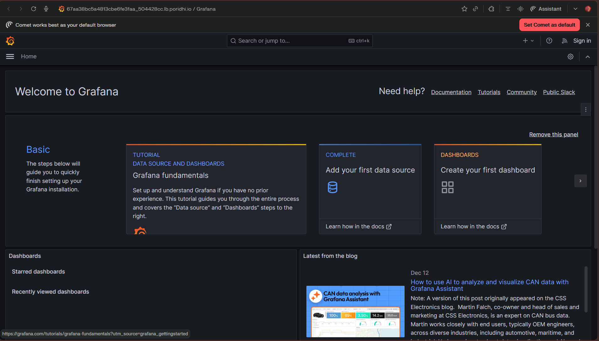
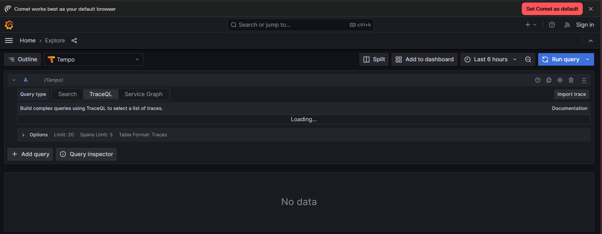
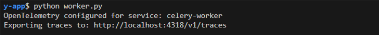
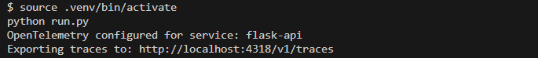
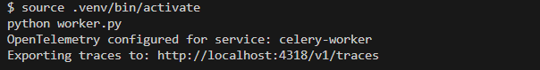

# Lab 1: Local Tracing Setup with Grafana Tempo

## Introduction

This lab teaches you to implement distributed tracing for a Flask-Celery application using OpenTelemetry and Grafana Tempo. Building on Module 55's task-level monitoring with Flower, you will deploy an observability stack, instrument your application to generate trace spans, and visualize end-to-end request flows in Grafana. By the end of this lab, you will have full-stack visibility that shows the complete journey of a request from the Flask API through Redis to the Celery worker, with timing breakdowns for every operation.

## Architecture Diagram

The tracing system adds two new components—Grafana Tempo and Grafana—alongside the existing Flask-Celery-Redis infrastructure:

```
┌──────────────────────────────────────────────────────────────────┐
│                         Client (curl)                            │
└────────────────────────┬─────────────────────────────────────────┘
                         │
                         │ HTTP POST /register
                         │ (Request with Trace ID)
                         ▼
┌─────────────────────────────────────────────────────────────────┐
│              Flask Application (Port 5000)                       │
│              Instrumented with OpenTelemetry                     │
│                                                                  │
│  ┌────────────────────────────────────────────────────────┐    │
│  │  Root Span: POST /register                             │    │
│  │  ├─ Span: Validate input                               │    │
│  │  ├─ Span: Redis RPUSH (queue task)                     │    │
│  │  └─ Span: Return HTTP 201                              │    │
│  └────────────────────────────────────────────────────────┘    │
│                                                                  │
│  Sends spans via OTLP HTTP ──────────────────────┐              │
└──────────────────────────────────────────────────┼──────────────┘
                         │                         │
                         │ Queue task              │
                         ▼                         │
┌─────────────────────────────────────────────────┼──────────────┐
│              Redis (Port 6379)                   │              │
│              Broker + Result Backend             │              │
└──────────────────────┬───────────────────────────┼──────────────┘
                       │                           │
                       │ Poll for tasks            │
                       ▼                           │
┌─────────────────────────────────────────────────┼──────────────┐
│         Celery Worker (Background Process)       │              │
│         Instrumented with OpenTelemetry          │              │
│                                                  │              │
│  ┌────────────────────────────────────────────┐ │              │
│  │  Child Span: send_welcome_email            │ │              │
│  │  ├─ Span: Simulate network delay (5s)     │ │              │
│  │  └─ Span: Return result                   │ │              │
│  └────────────────────────────────────────────┘ │              │
│                                                  │              │
│  Sends spans via OTLP HTTP ──────────────────────┘              │
└─────────────────────────────────────────────────────────────────┘
                                                  │
                                                  │ OTLP HTTP Export
                                                  ▼
┌─────────────────────────────────────────────────────────────────┐
│              Grafana Tempo (Port 4318)                           │
│              Trace Storage Backend                               │
│                                                                  │
│  Stores traces with:                                             │
│  - Trace ID: abc-123                                             │
│  - All spans from Flask and Celery                               │
│  - Span relationships (parent-child)                             │
│  - Span attributes (user_id, email, etc.)                        │
└────────────────────────┬─────────────────────────────────────────┘
                         │
                         │ Query traces via HTTP API
                         ▼
┌─────────────────────────────────────────────────────────────────┐
│              Grafana (Port 3000)                                 │
│              Trace Visualization UI                              │
│                                                                  │
│  Displays:                                                       │
│  - Complete trace timeline (Flask → Celery)                      │
│  - Span duration breakdown                                       │
│  - Span attributes and metadata                                  │
│  - Service dependency graph                                      │
└─────────────────────────────────────────────────────────────────┘
```

**Key Flow:**

1. **Client** sends an HTTP request to Flask
2. **Flask** creates a root span with a new Trace ID, processes the request, queues a task, and sends spans to Tempo
3. **Celery Worker** picks up the task, creates a child span with the same Trace ID, executes it, and sends spans to Tempo
4. **Tempo** stores all spans and links them by Trace ID
5. **Grafana** queries Tempo and visualizes the complete trace timeline

## Learning Objectives

By the end of this lab, you will be able to:

1. Deploy Grafana and Tempo locally using Docker Compose as a trace collection backend
2. Install and configure OpenTelemetry SDK with OTLP HTTP exporter for Python applications
3. Auto-instrument Flask, Redis, and Celery to capture traces without modifying business logic
4. Generate and visualize distributed traces in Grafana showing cross-service request flows
5. Add custom spans to instrument specific business logic operations
6. Enrich spans with custom attributes for targeted filtering and debugging
7. Trace request propagation from Flask to Celery across process boundaries
8. Search and filter traces using TraceQL to isolate specific requests or errors
9. Identify performance bottlenecks by analyzing span durations in the trace timeline

**Prerequisites:** Completion of Module 54 Lab 1 with a working Flask-Celery application including retry logic, timeout enforcement, and error handling. Redis must be configured as both broker and result backend. Tasks `send_welcome_email`, `generate_monthly_report`, `flaky_task`, and `slow_task` must be defined.

## Prologue: The Challenge

You join the platform engineering team responsible for a Flask-Celery application that processes thousands of background tasks daily: welcome emails, report generation, data processing, and notification delivery. Module 54 gave the system retry logic, timeout enforcement, and error handling. Module 55 added Flower for real-time task monitoring. The team can now see which tasks are running, which failed, and what the exception tracebacks look like.

On Monday morning, the support team reports that user registration feels slow. The Flower dashboard shows tasks completing successfully, but users complain that the entire registration flow takes too long. Nobody can determine whether the delay originates in the Flask API, the Redis broker, or the Celery worker. Flower shows that `send_welcome_email` takes 5 seconds, but the total user-facing latency is 8 seconds. Where are the other 3 seconds?

On Tuesday, a production incident occurs. An external SMTP service degrades, causing email tasks to slow from 3 seconds to 30 seconds. Flower shows tasks are succeeding, but the latency spike cascades into queue backlogs. Without visibility into what happens inside each task—which step takes how long—the team cannot determine the root cause.

On Wednesday, the architecture grows to include multiple services. A new microservice processes webhook callbacks, and tasks now flow across three different processes. Correlating log entries across services requires matching timestamps manually, a process that takes 20 minutes during an incident. By then, hundreds of customers are affected.

Your task is to implement distributed tracing that answers these questions instantly: How long does the complete request flow take? Where is the time spent? How do requests propagate across services? Which operation is the bottleneck? You will deploy Grafana Tempo, instrument the application with OpenTelemetry, and visualize end-to-end traces that provide this visibility.

## Environment Setup

This lab extends the Module 55 project on a fresh virtual machine. You will set up the Flask-Celery infrastructure and then add OpenTelemetry instrumentation with Grafana Tempo.

Check Python version:

```bash
python --version
```

If Python 3.12 is not available, install it:

```bash
sudo apt update
sudo apt install python3.12-venv -y
alias python=python3.12
source ~/.bashrc
```

Clone the project codebase:

```bash
git clone https://github.com/poridhioss/Building-Systems-With-FastAPI.git
cd Building-Systems-With-FastAPI/
git checkout -b mod-54/lab-1 origin/mod-54/lab-1
```

Create and activate a virtual environment:

```bash
cd flask-celery-app
python -m venv .venv
source .venv/bin/activate
```

Install the base dependencies:

```bash
pip install -r requirements.txt
```

Verify Redis is running via Docker Compose and confirm the Flask application and Celery worker are functional before proceeding. This lab assumes the Module 55 infrastructure is operational.

---

## Chapter 1: Understanding Distributed Tracing

Flower provides visibility into Celery's internal operations—task states, worker health, queue lengths. However, it cannot show the complete journey of a user request across multiple services. Distributed tracing fills this gap by capturing detailed timing information for every operation in the request lifecycle.

### 1.1 The Visibility Gap

Consider the following scenario. A user calls `POST /register`, which queues a `send_welcome_email` task. Traditional logging produces four separate entries:

```
[Flask Log]  10:30:15 - Received POST /register
[Flask Log]  10:30:15 - Queued task abc-123
[Celery Log] 10:30:16 - Task abc-123 started
[Celery Log] 10:30:21 - Task abc-123 succeeded
```

These log entries are disconnected. To determine total request duration, you must manually correlate timestamps across log files. This manual correlation does not reveal:

- How long Flask spent processing before queuing the task
- How long the task waited in the Redis queue
- What operations happened inside the task and how long each took

Distributed tracing solves this by producing a unified timeline:

```
Trace ID: abc-123
├─ Span: POST /register [Flask API] ────────── 50ms
│  ├─ Span: Validate email ───── 5ms
│  ├─ Span: Queue task to Redis ─ 10ms
│  └─ Span: Return response ───── 5ms
└─ Span: send_welcome_email [Celery Worker] ─── 5000ms
   ├─ Span: Connect to SMTP ───── 1000ms
   ├─ Span: Send email ────────── 3000ms
   └─ Span: Update database ───── 1000ms
```

This timeline shows that the entire request took 5050ms, Flask responded in 50ms, the task waited less than 1ms in the queue (no backlog), and 3000ms of task execution was spent sending the email—a potential optimization target.

### 1.2 Core Terminology

Four concepts form the foundation of distributed tracing:

**Trace** — A trace represents the complete journey of a single request through the system. It has a unique Trace ID that ties all related operations together. One user request produces one trace.

**Span** — A span represents a single operation within a trace. Each span has a name (e.g., "POST /register", "send_email"), a start time, a duration, a parent span (except for the root span), and attributes (key-value metadata like `user_id` or `http.method`). Spans nest to show parent-child relationships:

```
Root Span: HTTP Request
├─ Child Span: Validate input
├─ Child Span: Database query
└─ Child Span: Queue background task
```

**OpenTelemetry (OTel)** — The industry-standard framework for instrumenting applications to generate traces, metrics, and logs. It provides SDKs for multiple languages (Python, Go, Java, Node.js), auto-instrumentation for popular frameworks (Flask, Django, FastAPI), and exporters to send data to various backends (Tempo, Jaeger, Zipkin, Datadog).

**Grafana Tempo** — A distributed tracing backend that stores traces efficiently. It integrates with Grafana for visualization and supports the OTLP (OpenTelemetry Protocol) for receiving trace data over HTTP or gRPC.

### 1.3 Prediction Exercise

Before building the tracing system, consider this scenario:

A `POST /register` request arrives at Flask. Flask validates the input (5ms), queues a Celery task (10ms), and returns a response (5ms). The Celery worker picks up the task and executes `send_welcome_email`, which connects to SMTP (1000ms), sends the email (3000ms), and updates the database (500ms).

**Question:** How many spans will this request generate? What will the parent-child hierarchy look like? Write down your prediction.

<details>
<summary>Reveal Answer</summary>

The request generates at least 7 spans:

1. Root span: `POST /register` (parent of all Flask spans)
2. Child span: `Validate input` (parent: root)
3. Child span: `Queue task to Redis` (parent: root)
4. Child span: `Return response` (parent: root)
5. Child span: `send_welcome_email` (parent: root, different service)
6. Grandchild span: `SMTP connect` (parent: send_welcome_email)
7. Grandchild span: `Send email` (parent: send_welcome_email)
8. Grandchild span: `Update database` (parent: send_welcome_email)

Auto-instrumentation adds additional spans for Redis operations (RPUSH for queuing), making the total higher. All spans share the same Trace ID despite spanning two processes (Flask and Celery).

</details>

### 1.4 Checkpoint

Verify your understanding before proceeding:

- [ ] A trace represents one complete request; a span represents one operation within that request
- [ ] Spans form parent-child hierarchies that show how operations nest
- [ ] OpenTelemetry generates trace data; Tempo stores it; Grafana visualizes it
- [ ] Distributed tracing connects operations across process boundaries using a shared Trace ID

---

## Chapter 2: Deploying the Observability Stack

The tracing infrastructure requires two new services: Grafana Tempo to store traces, and Grafana to visualize them. Both run as Docker containers alongside the existing Redis service.

### 2.1 Updating Docker Compose

Update `docker-compose.yml` to include Tempo and Grafana:

```yaml
version: '3.8'

services:
  # Existing Redis service
  redis:
    image: redis:7-alpine
    container_name: flask-celery-redis
    ports:
      - "6379:6379"
    command: redis-server
    healthcheck:
      test: ["CMD", "redis-cli", "ping"]
      interval: 5s
      timeout: 3s
      retries: 5

  # Grafana Tempo - Trace storage backend
  tempo:
    image: grafana/tempo:2.3.1
    container_name: tempo
    command: [ "-config.file=/etc/tempo.yaml" ]
    volumes:
      - ./tempo-config.yaml:/etc/tempo.yaml
      - tempo-data:/tmp/tempo
    ports:
      - "4318:4318"  # OTLP HTTP
      - "3200:3200"  # Tempo HTTP API

  # Grafana - Visualization UI
  grafana:
    image: grafana/grafana:10.2.3
    container_name: grafana
    environment:
      - GF_AUTH_ANONYMOUS_ENABLED=true
      - GF_AUTH_ANONYMOUS_ORG_ROLE=Admin
      - GF_AUTH_DISABLE_LOGIN_FORM=true
    volumes:
      - ./grafana-datasources.yaml:/etc/grafana/provisioning/datasources/datasources.yaml
    ports:
      - "3001:3000"  # using 3001 instead of 3000 because poridhi vm reserved port 3000 for other purpose
    depends_on:
      - tempo

volumes:
  tempo-data:
```

The Tempo service listens on port 4318 for OTLP HTTP trace data and port 3200 for its HTTP API. Grafana connects to Tempo via the internal Docker network. Anonymous authentication is enabled for development—production deployments require proper authentication.

### 2.2 Configuring Tempo

Create the Tempo configuration file `tempo-config.yaml`:

```yaml
server:
  http_listen_port: 3200

distributor:
  receivers:
    otlp:
      protocols:
        http:
          endpoint: 0.0.0.0:4318

storage:
  trace:
    backend: local
    local:
      path: /tmp/tempo/blocks
    wal:
      path: /tmp/tempo/wal
```

This configuration sets up:

- **OTLP HTTP receiver** on port 4318 to accept traces from the application
- **Local storage** for trace data (suitable for development; use S3/GCS in production)
- **Write-Ahead Log (WAL)** for durability during restarts

### 2.3 Configuring the Grafana Datasource

Create the Grafana datasource configuration `grafana-datasources.yaml`:

```yaml
apiVersion: 1

datasources:
  - name: Tempo
    type: tempo
    access: proxy
    url: http://tempo:3200
    uid: tempo
    editable: true
    isDefault: true
```

This file auto-provisions Tempo as the default tracing datasource when Grafana starts.

### 2.4 Starting the Stack

Start all containers:

```bash
docker compose up -d
```

Verify all three containers are running:

```bash
docker ps
```


Expected output shows three containers: `flask-celery-redis`, `tempo`, and `grafana`.

### 2.5 Accessing Grafana using Poridhi's Load Balancer

To access Grafana through Poridhi's Load Balancer, first find your wt0 IP address by running `ifconfig` and looking for the `wt0` interface. Note the IP address (something like `100.125.246.186`).


**Create Load Balancer:**

Go to Poridhi's Load Balancer dashboard, create a new Load Balancer, use your wt0 IP address with port 3000, and click "Create".


You will receive a public URL like `https://lb-xxxxx.poridhi.io` that provides access to Grafana from anywhere.

Open the URL in a browser. The Grafana homepage loads without requiring login due to the anonymous authentication configuration.



Click **Explore** (compass icon in the left sidebar), then select **Tempo** as the datasource. No traces appear yet because the application has not been instrumented.



### 2.6 Checkpoint

Before proceeding, verify:

- [ ] Three Docker containers are running: `flask-celery-redis`, `tempo`, `grafana`
- [ ] Grafana is accessible via the Load Balancer URL
- [ ] Tempo appears as a datasource in Grafana Explore

---

## Chapter 3: Configuring OpenTelemetry

With the tracing backend running, the next step is configuring the application to generate and export trace data. This requires installing the OpenTelemetry SDK and creating a centralized configuration module.

### 3.1 Installing OpenTelemetry Packages

Activate the virtual environment and install the required packages:

```bash
source .venv/bin/activate
```

```bash
pip install \
  setuptools==68.0.0 \
  opentelemetry-api==1.22.0 \
  opentelemetry-sdk==1.22.0 \
  opentelemetry-instrumentation==0.43b0 \
  opentelemetry-distro==0.43b0 \
  opentelemetry-exporter-otlp==1.22.0 \
  opentelemetry-instrumentation-flask==0.43b0 \
  opentelemetry-instrumentation-redis==0.43b0 \
  opentelemetry-instrumentation-celery==0.43b0
```

The `setuptools` package at version 68.0.0 provides `pkg_resources`, which OpenTelemetry packages require for dependency management. Newer versions of setuptools (70+) changed the `pkg_resources` interface, causing compatibility issues. The `opentelemetry-api`, `opentelemetry-sdk`, and `opentelemetry-instrumentation` packages must be installed explicitly at matching versions. Without pinning these, pip may resolve transitive dependencies to incompatible versions, causing `ImportError` at startup.

Each package serves a specific role:

| Package | Purpose |
|---------|---------|
| `setuptools==68.0.0` | Provides `pkg_resources` required by OpenTelemetry (newer versions incompatible) |
| `opentelemetry-api` | Core tracing API interfaces |
| `opentelemetry-sdk` | SDK implementation of the tracing API |
| `opentelemetry-instrumentation` | Base classes for all instrumentors (`BaseInstrumentor`) |
| `opentelemetry-distro` | Meta-package for auto-instrumentation tools |
| `opentelemetry-exporter-otlp` | OTLP exporter for sending traces to Tempo |
| `opentelemetry-instrumentation-flask` | Auto-instruments Flask HTTP requests |
| `opentelemetry-instrumentation-redis` | Auto-instruments Redis operations (LPUSH, RPUSH, GET, SET) |
| `opentelemetry-instrumentation-celery` | Auto-instruments Celery task execution |

Update `requirements.txt` to include the new dependencies:

```bash
cat >> requirements.txt << EOF
setuptools==68.0.0
opentelemetry-api==1.22.0
opentelemetry-sdk==1.22.0
opentelemetry-instrumentation==0.43b0
opentelemetry-distro==0.43b0
opentelemetry-exporter-otlp==1.22.0
opentelemetry-instrumentation-flask==0.43b0
opentelemetry-instrumentation-redis==0.43b0
opentelemetry-instrumentation-celery==0.43b0
EOF
```

### 3.2 Creating the OpenTelemetry Configuration Module

Create a new file `otel_config.py` to centralize tracing configuration:

```python
from opentelemetry import trace
from opentelemetry.sdk.trace import TracerProvider
from opentelemetry.sdk.trace.export import BatchSpanProcessor
from opentelemetry.exporter.otlp.proto.http.trace_exporter import OTLPSpanExporter
from opentelemetry.sdk.resources import Resource, SERVICE_NAME


_configured = False

def configure_opentelemetry(service_name: str):
    global _configured

    # Prevent double-configuration in the same process
    if _configured:
        print(f"OpenTelemetry already configured, skipping configuration for: {service_name}")
        return

    # Create a resource identifying this service in traces
    resource = Resource(attributes={
        SERVICE_NAME: service_name
    })

    # Create a tracer provider with the resource
    provider = TracerProvider(resource=resource)

    # Configure OTLP HTTP exporter pointing to Tempo
    otlp_exporter = OTLPSpanExporter(
        endpoint="http://localhost:4318/v1/traces",
        timeout=10
    )

    # Batch spans before sending for efficiency
    span_processor = BatchSpanProcessor(otlp_exporter)
    provider.add_span_processor(span_processor)

    # Set as the global tracer provider
    trace.set_tracer_provider(provider)

    _configured = True
    print(f"OpenTelemetry configured for service: {service_name}")
    print(f"Exporting traces to: http://localhost:4318/v1/traces")
```

The `_configured` guard prevents double-configuration. This is critical because when `worker.py` imports the Flask app, the app module would otherwise try to reconfigure OpenTelemetry with a different service name, overriding or conflicting with the worker's configuration.

Four components work together in this configuration:

- **Resource** — Metadata identifying the service generating traces (name, version, environment)
- **TracerProvider** — Factory that creates tracers for generating spans
- **OTLPSpanExporter** — Sends spans to Tempo via HTTP
- **BatchSpanProcessor** — Batches spans before export, reducing network overhead compared to sending each span individually

### 3.3 Prediction Exercise

The configuration uses `BatchSpanProcessor` rather than sending each span immediately.

**Question:** What would happen if the application sent every span individually to Tempo instead of batching? What trade-offs does batching introduce?

<details>
<summary>Reveal Answer</summary>

Without batching, every span generates an HTTP request to Tempo. In a high-throughput application processing hundreds of requests per second, this could produce thousands of HTTP calls per second, overwhelming both the application and the tracing backend with network overhead.

Batching collects spans over a time window (default 5 seconds) or until a batch size threshold is reached, then sends them in a single HTTP request. The trade-off: if the application crashes before a batch is exported, those spans are lost. For development this is acceptable. In production, configure the batch size and export interval based on throughput and durability requirements.

</details>

### 3.4 Checkpoint

Verify your understanding:

- [ ] Nine packages are installed with pinned versions: setuptools, OpenTelemetry api/sdk/instrumentation base, distro, OTLP exporter, Flask/Redis/Celery instrumentors
- [ ] The `otel_config.py` module creates a TracerProvider with a service name Resource
- [ ] BatchSpanProcessor batches spans before sending to reduce network overhead
- [ ] The OTLP exporter targets `http://localhost:4318/v1/traces` (Tempo's HTTP endpoint)

---

## Chapter 4: Instrumenting Flask and Celery

OpenTelemetry's auto-instrumentation creates spans automatically for Flask HTTP requests, Redis operations, and Celery task executions. The key design principle is: **configure OpenTelemetry in the entry point files (`run.py` and `worker.py`), NOT inside the app module**. This ensures each process gets the correct service name.

### 4.1 Updating the Flask Application Module

Update `app/__init__.py` to add instrumentors. **Do NOT call `configure_opentelemetry` here** — that will be done in the entry points:

```python
from flask import Flask
from celery_utils import make_celery
from config import Config
import logging

from opentelemetry.instrumentation.flask import FlaskInstrumentor
from opentelemetry.instrumentation.redis import RedisInstrumentor


logging.basicConfig(
    level=logging.INFO,
    format='[%(asctime)s] %(levelname)s in %(module)s: %(message)s',
    datefmt='%Y-%m-%d %H:%M:%S'
)

def create_app(config_class=Config):
    app = Flask(__name__)
    app.config.from_object(config_class)

    # Auto-instrument Flask: creates spans for all HTTP requests
    FlaskInstrumentor().instrument_app(app)

    # Auto-instrument Redis: creates spans for all Redis operations
    RedisInstrumentor().instrument()

    # Register blueprints
    from app.routes import bp
    app.register_blueprint(bp)

    return app

app = create_app()
celery = make_celery(app)

from app import tasks
```

**Why no `configure_opentelemetry` here?** Because this module is imported by BOTH `run.py` (Flask process) and `worker.py` (Celery process). If `configure_opentelemetry(service_name="flask-api")` were called here, the worker process would also get `flask-api` as its service name — hiding the Celery service in Grafana. By keeping this module free of OpenTelemetry configuration, each entry point controls its own service name.

`FlaskInstrumentor` automatically creates a span for every HTTP request, capturing method, path, status code, and duration. `RedisInstrumentor` creates spans for Redis operations showing which commands executed and their latency. These instrumentors use whatever TracerProvider was set before the import — which is why the entry point must configure OpenTelemetry first.

### 4.2 Creating the Flask Entry Point

Update `run.py` to configure OpenTelemetry BEFORE importing the app:

```python
from otel_config import configure_opentelemetry

# Configure OpenTelemetry FIRST, before any app imports
configure_opentelemetry(service_name="flask-api")

from app import app

if __name__ == '__main__':
    app.run(host='0.0.0.0', port=5000, debug=False)
```

**Critical: The call to `configure_opentelemetry` MUST come before `from app import app`.** When Python executes `from app import app`, it runs all module-level code in `app/__init__.py`, including `FlaskInstrumentor().instrument_app(app)`. The instrumentor attaches to whatever TracerProvider is currently set. If no provider is set yet, the instrumentor uses a no-op provider and **Flask spans are silently discarded** — this is the most common reason for missing Flask traces in Grafana.

**Note:** `debug=False` is used because Flask's debug reloader spawns a child process that can interfere with OpenTelemetry initialization. For development debugging, use print statements or logging instead.

### 4.3 Creating the Celery Worker Entry Point

**Important:** You must create a separate `worker.py` file to properly instrument the Celery worker with the correct service name. Using `celery -A app.celery worker` will use the Flask app's configuration and show the wrong service name.

Create a new file `worker.py` to run the Celery worker with OpenTelemetry:

```python
from otel_config import configure_opentelemetry
from opentelemetry.instrumentation.celery import CeleryInstrumentor

# Configure OpenTelemetry for the Celery worker service FIRST
# (before importing anything from the app)
configure_opentelemetry(service_name="celery-worker")

# Auto-instrument Celery: creates spans for task execution
CeleryInstrumentor().instrument()

# Import celery instance AFTER OpenTelemetry setup
# This import triggers app/__init__.py, which calls FlaskInstrumentor
# and RedisInstrumentor. Since otel_config has _configured=True,
# the flask-api configuration is skipped.
from app import celery

if __name__ == '__main__':
    # worker_main() starts the worker directly without CLI argument parsing
    celery.worker_main([
        'worker',
        '--loglevel=info'
    ])
```

`CeleryInstrumentor` creates spans when tasks execute, capturing task name, arguments, duration, and result status.

**Why `worker_main()` instead of `start()`?** The `celery.start()` method parses command-line arguments and would interpret `worker.py` as a Celery subcommand, causing a "No such command 'worker.py'" error. `worker_main()` starts the worker process directly.

### 4.4 Understanding the Import Order

The import order is critical for correct service naming. Here is what happens in each process:

**Flask process (`python run.py`):**

```
1. configure_opentelemetry("flask-api")  → Sets TracerProvider with flask-api
2. from app import app                   → Triggers create_app()
3.   FlaskInstrumentor().instrument_app() → Attaches to flask-api TracerProvider ✓
4.   RedisInstrumentor().instrument()     → Attaches to flask-api TracerProvider ✓
5. app.run()                              → Serves requests, spans go to flask-api ✓
```

**Celery process (`python worker.py`):**

```
1. configure_opentelemetry("celery-worker") → Sets TracerProvider with celery-worker
2. CeleryInstrumentor().instrument()         → Attaches to celery-worker TracerProvider ✓
3. from app import celery                    → Triggers create_app()
4.   FlaskInstrumentor().instrument_app()    → Attaches to celery-worker provider (harmless)
5.   RedisInstrumentor().instrument()        → Attaches to celery-worker provider ✓
6. celery.worker_main()                      → Processes tasks, spans go to celery-worker ✓
```

If `configure_opentelemetry` were called inside `create_app()` instead, the worker process would set the TracerProvider to `flask-api` before `worker.py` could set it to `celery-worker`, and all worker spans would be incorrectly labeled.

### 4.5 Prediction Exercise

Two different service names are configured: `flask-api` for the Flask application and `celery-worker` for the Celery worker.

**Question:** Why use separate service names instead of a single name for the entire application? What would happen in Grafana if both services used the same name?

<details>
<summary>Reveal Answer</summary>

Separate service names allow Grafana to distinguish which process generated each span. In the trace timeline, spans from `flask-api` and `celery-worker` appear in different colors, making it visually clear which service handled each operation. If both used the same name, all spans would appear as a single service, losing the ability to identify cross-service transitions and making it difficult to determine whether latency originates in the API layer or the worker layer.

</details>

### 4.6 Checkpoint

Verify your instrumentation:

- [ ] `app/__init__.py` contains `FlaskInstrumentor` and `RedisInstrumentor` but does NOT call `configure_opentelemetry`
- [ ] `run.py` calls `configure_opentelemetry(service_name="flask-api")` BEFORE `from app import app`
- [ ] `worker.py` calls `configure_opentelemetry(service_name="celery-worker")` BEFORE `from app import celery`
- [ ] Flask and Celery use different service names (`flask-api` and `celery-worker`)
- [ ] The worker is started with `python worker.py`, not `celery -A app.celery worker`
- [ ] Auto-instrumentation creates spans without modifying business logic code

---

## Chapter 5: Generating and Visualizing Traces

With instrumentation in place, start the application and generate traces to verify the tracing pipeline works end to end.

### 5.1 Starting the Instrumented Application

Open three terminals.

**Terminal 1 — Docker containers (already running):**

```bash
docker compose up -d
docker ps
```

**Terminal 2 — Flask application:**

```bash
source .venv/bin/activate
python run.py
```

The output MUST include the OpenTelemetry initialization message:

```
OpenTelemetry configured for service: flask-api
Exporting traces to: http://localhost:4318/v1/traces
 * Running on http://0.0.0.0:5000
```

**If you do NOT see "OpenTelemetry configured for service: flask-api" in this terminal, Flask traces will NOT appear in Grafana.** Go back to Chapter 4.2 and verify that `run.py` calls `configure_opentelemetry` before importing the app.

**Terminal 3 — Celery worker:**

**Important:** Use the instrumented `worker.py` file, not the standard `celery` command:

```bash
source .venv/bin/activate
python worker.py
```

The worker output should include:

```
OpenTelemetry configured for service: celery-worker
Exporting traces to: http://localhost:4318/v1/traces
[...] celery@hostname ready.
```

**Critical:** The service name must show ONLY `celery-worker`. You should NOT see `flask-api` in the worker logs. If you see both service names, your `worker.py` imports are in the wrong order.

### 5.2 Triggering a Request

From a fourth terminal, send a registration request:

```bash
curl -X POST http://localhost:5000/register \
  -H "Content-Type: application/json" \
  -d '{"email": "alice@example.com"}'
```

Expected response:

```json
{
  "message": "User registered. Welcome email is being sent in the background.",
  "task_id": "abc-123-def-456"
}
```

Wait 5 seconds for the `send_welcome_email` task to complete.

### 5.3 Viewing Traces in Grafana

Open Grafana in your browser via the Load Balancer URL.


Navigate to **Explore** (compass icon in the left sidebar) and select **Tempo** as the datasource from the dropdown.

In the query section, click the **Search** tab. **Important:** Ensure all filter fields are set to "Select value" (no filters applied), then click **Run query** to display all recent traces.

**Common mistake:** Do NOT set "Span Name" to "celery-worker" or "flask-api" - these are service names, not span names. Applying incorrect filters will hide traces from one of the services.


Click on a trace entry to open the trace details:

**Important:** You should see a SINGLE trace that contains spans from BOTH services (`flask-api` and `celery-worker`). If you only see spans from one service, check your Grafana filters or troubleshooting section.

The trace timeline shows the complete journey of the request:

```
Trace Timeline (Total: ~5050ms)
├─ POST /register [flask-api] ───────────────── 50ms
│  ├─ Validate input ──────────────────────────── 5ms
│  ├─ RPUSH celery (Redis) ────────────────────── 10ms
│  └─ Return HTTP 201 ──────────────────────────── 5ms
└─ send_welcome_email [celery-worker] ─────── 5000ms
   └─ time.sleep(5) ───────────────────────────── 5000ms
```

Key observations from this trace:

1. **Two services** appear: `flask-api` and `celery-worker` (shown in different colors)
2. **Parent-child relationship**: The Celery span is a child of the Flask span
3. **Same Trace ID**: Both spans share the same trace ID, linking them together
4. **Timing breakdown**: Each operation's duration is visible

### 5.4 Inspecting Span Attributes

Click on individual spans to view their attributes:


The Flask span attributes include:

- `http.method`: POST
- `http.route`: /register
- `http.status_code`: 201
- `http.url`: http://localhost:5000/register

The Celery span attributes include:

- `celery.task_name`: app.tasks.send_welcome_email
- `celery.action`: run
- `celery.state`: SUCCESS

These attributes are added automatically by the instrumentors—no manual code required.

### 5.5 Checkpoint

Verify your tracing pipeline:

- [ ] Flask shows "OpenTelemetry configured for service: flask-api" on startup
- [ ] Celery shows "OpenTelemetry configured for service: celery-worker" on startup (not flask-api)
- [ ] Traces appear in Grafana after sending a request
- [ ] **CRITICAL:** Each individual trace shows BOTH `flask-api` AND `celery-worker` spans within the same trace (not separate traces)
- [ ] Trace timelines show both services in different colors in a parent-child relationship
- [ ] Total trace duration is around 5+ seconds (not just milliseconds)
- [ ] Clicking a span reveals auto-captured attributes (HTTP method, task name, etc.)

---

## Chapter 6: Adding Custom Spans

Auto-instrumentation captures framework-level operations (HTTP requests, Redis commands, task execution), but it does not capture business logic. Custom spans provide visibility into specific operations within your code.

### 6.1 Custom Spans in Celery Tasks

Update `app/tasks.py` to add custom spans that measure each step of the email sending process:

```python
from celery import Task
from celery.exceptions import SoftTimeLimitExceeded
import time
import random
import logging

from opentelemetry import trace

tracer = trace.get_tracer(__name__)

logger = logging.getLogger(__name__)

# ... existing task configuration ...

@celery.task(bind=True, max_retries=3, default_retry_delay=5)
def send_welcome_email(self, user_email):

    # Custom span for email validation
    with tracer.start_as_current_span("validate_email") as span:
        span.set_attribute("email.address", user_email)
        span.set_attribute("email.domain", user_email.split('@')[-1])

        logger.info(f"send_welcome_email: Validating email {user_email}")
        time.sleep(0.1)

        if '@' not in user_email:
            span.set_attribute("email.valid", False)
            span.set_attribute("error", True)
            raise ValueError("Invalid email format")

        span.set_attribute("email.valid", True)

    # Custom span for SMTP connection
    with tracer.start_as_current_span("smtp_connect") as span:
        span.set_attribute("smtp.server", "smtp.example.com")
        span.set_attribute("smtp.port", 587)

        logger.info(f"send_welcome_email: Connecting to SMTP server")
        time.sleep(1)

        span.set_attribute("smtp.connected", True)

    # Custom span for sending the email
    with tracer.start_as_current_span("send_email_message") as span:
        span.set_attribute("email.to", user_email)
        span.set_attribute("email.subject", "Welcome to Our Platform")

        logger.info(f"send_welcome_email: Sending email to {user_email}")
        time.sleep(3)

        span.set_attribute("email.sent", True)
        span.set_attribute("email.message_id", f"<{int(time.time())}@example.com>")

    # Custom span for database update
    with tracer.start_as_current_span("update_user_record") as span:
        span.set_attribute("db.operation", "UPDATE")
        span.set_attribute("db.table", "users")
        span.set_attribute("user.email", user_email)

        logger.info(f"send_welcome_email: Updating user record")
        time.sleep(0.5)

        span.set_attribute("db.rows_affected", 1)

    logger.info(f"send_welcome_email: Successfully sent to {user_email}")
    return f"Welcome email sent to {user_email}"
```

Each `tracer.start_as_current_span()` call creates a nested span within the parent `send_welcome_email` span. Custom attributes attached to each span provide metadata for debugging and filtering—email addresses, SMTP server details, database operations.

### 6.2 Custom Spans in Flask Routes

Update `app/routes.py` to add custom spans to the API layer:

```python
from flask import Blueprint, request, jsonify
from app.tasks import send_welcome_email, generate_monthly_report, flaky_task, slow_task
from app import celery

from opentelemetry import trace
import logging

tracer = trace.get_tracer(__name__)
logger = logging.getLogger(__name__)

bp = Blueprint('main', __name__)

@bp.route('/register', methods=['POST'])
def register():
    data = request.get_json()
    email = data.get('email')

    # Custom span for input validation
    with tracer.start_as_current_span("validate_request") as span:
        span.set_attribute("request.email", email)

        if not email:
            span.set_attribute("validation.failed", True)
            span.set_attribute("validation.error", "Email is required")
            return jsonify({"error": "Email is required"}), 400

        span.set_attribute("validation.passed", True)

    # Custom span for task queuing
    with tracer.start_as_current_span("queue_email_task") as span:
        span.set_attribute("task.name", "send_welcome_email")
        span.set_attribute("task.args", email)

        logger.info(f"Endpoint /register: Queuing email task for {email}")
        result = send_welcome_email.delay(email)

        span.set_attribute("task.id", result.id)
        span.set_attribute("task.state", result.state)

    # Custom span for response construction
    with tracer.start_as_current_span("build_response") as span:
        response_data = {
            "message": "User registered. Welcome email is being sent in the background.",
            "task_id": result.id
        }
        span.set_attribute("response.status_code", 201)
        span.set_attribute("response.task_id", result.id)

    logger.info(f"Endpoint /register: Returned task_id {result.id}")
    return jsonify(response_data), 201

# ... other routes remain the same ...
```

### 6.3 Testing Custom Spans

Restart the Flask application and Celery worker to pick up the changes.

Trigger a new request:

```bash
curl -X POST http://localhost:5000/register \
  -H "Content-Type: application/json" \
  -d '{"email": "bob@example.com"}'
```

In Grafana, find the new trace. The timeline now shows detailed breakdowns for both services:


```
Trace Timeline (Total: ~5700ms)
├─ POST /register [flask-api] ───────────────── 50ms
│  ├─ validate_request ────────────────────────── 5ms
│  ├─ queue_email_task ────────────────────────── 10ms
│  │  └─ RPUSH celery (Redis) ──────────────────── 8ms
│  └─ build_response ──────────────────────────── 2ms
└─ send_welcome_email [celery-worker] ─────── 5650ms
   ├─ validate_email ──────────────────────────── 100ms
   ├─ smtp_connect ────────────────────────────── 1000ms
   ├─ send_email_message ──────────────────────── 3000ms
   └─ update_user_record ──────────────────────── 500ms
```

Click on the `send_email_message` span to view custom attributes:


The attributes show:

- `email.to`: bob@example.com
- `email.subject`: Welcome to Our Platform
- `email.sent`: true
- `email.message_id`: <1675789234@example.com>

If an email fails to send, these attributes immediately reveal which step failed (SMTP connection? Email delivery? Database update?), the exact error, and how long each step took before the failure.

### 6.4 Checkpoint

Verify your custom instrumentation:

- [ ] Custom spans appear in the trace timeline for both Flask and Celery operations
- [ ] Each custom span carries relevant attributes (email address, SMTP server, task ID)
- [ ] The span hierarchy nests correctly: HTTP request > validate_request > queue_email_task
- [ ] Auto-instrumented spans (Redis RPUSH) still appear alongside custom spans

---

## Chapter 7: Trace Propagation and Performance Analysis

Distributed tracing works across process boundaries because trace context propagates automatically from Flask to Celery. This chapter examines how propagation works and demonstrates performance analysis using traces.

### 7.1 How Trace Propagation Works

When Flask queues a Celery task, four steps occur:

1. **Flask receives the HTTP request** — OpenTelemetry generates a new Trace ID (e.g., `abc-123`) and creates a root span with a Span ID (e.g., `span-1`)
2. **Flask queues the Celery task** — OpenTelemetry automatically injects trace context into the task payload. The task message in Redis includes `{"trace_id": "abc-123", "parent_span_id": "span-1", ...}`
3. **Celery worker picks up the task** — OpenTelemetry extracts trace context from the task payload, creates a new span with the same Trace ID (`abc-123`), and sets its parent to `span-1`
4. **Both spans arrive in Tempo** — Tempo stitches them together using the shared Trace ID. Grafana displays them as a single unified trace

Verify this by examining span details in Grafana:


- Flask span: `trace_id=abc-123`, `span_id=span-1`, `parent_span_id=null`
- Celery span: `trace_id=abc-123`, `span_id=span-2`, `parent_span_id=span-1`

This automatic propagation is what makes distributed tracing "distributed"—traces follow requests across service boundaries without manual correlation.

### 7.2 Performance Analysis with Traces

Trigger a report generation task to observe how traces reveal performance bottlenecks:

```bash
curl -X POST http://localhost:5000/reports/generate \
  -H "Content-Type: application/json" \
  -d '{"user_id": 42}'
```

Find the trace in Grafana:



```
Trace Timeline (Total: ~10050ms)
├─ POST /reports/generate [flask-api] ──────── 50ms
└─ generate_monthly_report [celery-worker] ─ 10000ms
   └─ time.sleep(10) ──────────────────────────── 10000ms
```

The bottleneck is immediately visible: 99.5% of the total time is spent in task execution. Flask's contribution is negligible at 50ms.

Without tracing, debugging a slow endpoint requires guessing: Is the database slow? Is Redis the bottleneck? Is an external API taking too long? With tracing, the timeline shows exactly where the time is spent:

```
Trace: GET /user/profile
├─ Database query: users ───────────── 150ms
├─ Database query: orders ──────────── 50ms
├─ External API: payment_service ───── 20ms
├─ Redis GET: user_cache ───────────── 5ms
└─ Template rendering ──────────────── 10ms
Total: 235ms
```

The `users` database query consumes 64% of the total time—the optimization target is immediately clear.

### 7.3 Checkpoint

Verify your understanding of trace propagation:

- [ ] Trace context (Trace ID and Span ID) propagates automatically from Flask to Celery
- [ ] OpenTelemetry injects trace context into the Redis task payload
- [ ] Both Flask and Celery spans share the same Trace ID
- [ ] Performance bottlenecks are identifiable by comparing span durations in the timeline

---

## Chapter 8: Searching and Monitoring Traces

As the system processes thousands of requests, finding specific traces requires filtering and search capabilities. Grafana Tempo supports TraceQL, a query language for searching traces by attributes.

### 8.1 Searching by Service Name

In Grafana Explore, switch to the **TraceQL** tab.

Find all traces from the Flask API:

```
{resource.service.name="flask-api"}
```

Find all traces from the Celery worker:

```
{resource.service.name="celery-worker"}
```

### 8.2 Searching by Span Attributes

Custom attributes added in Chapter 6 enable targeted searches.

Find all traces for a specific email:

```
{span.email.address="alice@example.com"}
```

Find all failed email validations:

```
{span.email.valid=false}
```

Find traces where SMTP connection exceeded 2 seconds:

```
{resource.service.name="celery-worker" && name="smtp_connect"} | duration > 2s
```

### 8.3 Searching by HTTP Status Code

Find all failed API requests:

```
{span.http.status_code>=400}
```

Find server errors specifically:

```
{span.http.status_code>=500}
```

### 8.4 Monitoring Error Traces

Trigger the flaky task that fails randomly (70% failure rate):

```bash
curl -X POST http://localhost:5000/test-reliability
```

If the task fails, find its trace in Grafana:



Error traces display:

- A red error indicator on the span
- Span status: `ERROR`
- Exception type: `Exception`
- Exception message: `"Simulated random failure"`

Click on the span to see the full error details:



Span attributes for errors include:

- `exception.type`: Exception
- `exception.message`: Simulated random failure
- `exception.stacktrace`: The complete Python traceback

This visibility eliminates the need to search through log files for error context. The trace shows the exact error, the full stack trace, and all contextual attributes (task arguments, timing, service name).

### 8.5 Checkpoint

Verify your understanding of trace search capabilities:

- [ ] TraceQL filters traces by service name, span attributes, and duration
- [ ] Custom span attributes (added in Chapter 6) are searchable in Grafana
- [ ] Error traces display exception type, message, and full stack trace
- [ ] HTTP status code filtering enables monitoring API error rates

---

## Epilogue: The Complete System

Your Flask-Celery application now has a complete distributed tracing pipeline:

| Component | Role | Port |
|-----------|------|------|
| Flask API | Generates root spans for HTTP requests | 5000 |
| Celery Worker | Generates child spans for task execution | — |
| Redis | Broker and result backend; propagates trace context | 6379 |
| Grafana Tempo | Stores and indexes trace data | 4318 (OTLP), 3200 (API) |
| Grafana | Visualizes traces and supports TraceQL queries | 3000 |

| File | Purpose |
|------|---------|
| `docker-compose.yml` | Defines Redis, Tempo, and Grafana services |
| `tempo-config.yaml` | Configures Tempo's OTLP receiver and storage |
| `grafana-datasources.yaml` | Auto-provisions Tempo as Grafana's datasource |
| `otel_config.py` | Centralizes OpenTelemetry configuration |
| `app/__init__.py` | Instruments Flask and Redis with auto-instrumentors |
| `worker.py` | Instruments Celery with auto-instrumentor |
| `app/tasks.py` | Custom spans for business logic in Celery tasks |
| `app/routes.py` | Custom spans for API layer operations |

Verify the complete system by running these commands in sequence:

```bash
# Verify containers are running
docker ps

# Trigger a traced request
curl -X POST http://localhost:5000/register \
  -H "Content-Type: application/json" \
  -d '{"email": "verify@example.com"}'

# Wait for task completion
sleep 6

# Trigger a report generation
curl -X POST http://localhost:5000/reports/generate \
  -H "Content-Type: application/json" \
  -d '{"user_id": 42}'

# Trigger a flaky task
curl -X POST http://localhost:5000/test-reliability
```

Open Grafana and verify that traces appear for all three requests, showing span hierarchies, custom attributes, and timing breakdowns.

---

## The Principles

1. **Trace at service boundaries** — Auto-instrument HTTP requests, message queues, and database operations to capture the complete request flow without manual code changes.

2. **Add custom spans for business logic** — Auto-instrumentation captures framework operations but not domain-specific steps. Custom spans reveal precisely where time is spent within application logic.

3. **Enrich spans with attributes** — Spans without attributes show timing but not context. Adding relevant metadata (email addresses, user IDs, task names) makes traces searchable and debuggable.

4. **Batch span exports** — Individual span exports generate excessive network overhead. BatchSpanProcessor reduces this by collecting spans before sending, trading slight latency for significant throughput improvement.

5. **Use semantic attribute names** — Follow OpenTelemetry semantic conventions (`http.method`, `db.operation`, `messaging.destination`) rather than inventing custom names. Semantic conventions enable cross-service correlation and standard tooling.

6. **Sample in production** — Tracing every request in high-throughput production systems is expensive. Use ratio-based sampling to capture a representative subset while maintaining full tracing for critical endpoints.

---

## Troubleshooting

### Only seeing one service in traces (celery-worker OR flask-api, not both)

**Cause:** Incorrect filters applied in Grafana are hiding spans from one service, or trace context is not propagating correctly between Flask and Celery.

**Solution:**

1. **Check Grafana filters:** In Grafana Explore, ensure ALL filter fields are set to "Select value":
   - Service Name: "Select value" (or leave empty)
   - Span Name: "Select value" (NOT "celery-worker" or "flask-api")
   - Status: "Select value"
   - Clear any other applied filters

2. **Verify both services are running and configured:**
   - Flask should log: `OpenTelemetry configured for service: flask-api`
   - Celery should log: `OpenTelemetry configured for service: celery-worker`

3. **Check trace timeline:** When you click on a trace, you should see BOTH services in the same trace:
   ```
   ├─ POST /register [flask-api] ───────────────── 50ms
   └─ send_welcome_email [celery-worker] ─────── 5000ms
   ```

4. **Common mistake:** Do not set "Span Name" filter to service names like "celery-worker" - this will hide all spans from other services.

### No traces appear in Grafana

**Cause:** Tempo is not running, the OTLP exporter is misconfigured, or the application did not initialize OpenTelemetry.

**Solution:**

```bash
# Verify Tempo is running
docker ps | grep tempo

# Check Tempo logs for errors
docker logs tempo

# Test OTLP endpoint directly
curl -X POST http://localhost:4318/v1/traces \
  -H "Content-Type: application/json" \
  -d '{}'

# Verify Flask logs show OpenTelemetry initialization
# Expected: "OpenTelemetry configured for service: flask-api"
```

### Traces are fragmented (Flask and Celery not linked)

**Cause:** Celery instrumentation is not enabled, trace context is not propagating through Redis, or the Celery worker is using the wrong service name.

**Solution:**

- **Check service name:** Ensure the Celery worker shows `OpenTelemetry configured for service: celery-worker`, not `flask-api`
- **Use correct startup:** Start with `python worker.py`, not `celery -A app.celery worker`
- Verify `CeleryInstrumentor().instrument()` is called in the worker
- Confirm both Flask and Celery target the same OTLP endpoint
- Check Celery worker logs for OpenTelemetry initialization messages

### "Overriding of current TracerProvider is not allowed" warning

**Cause:** OpenTelemetry is being configured multiple times, typically when the Flask app is imported before the Celery worker configures its own OpenTelemetry instance.

**Solution:**

Ensure OpenTelemetry is configured for the Celery worker BEFORE importing the Flask app in `worker.py`:

```python
# Correct order:
# 1. Configure OpenTelemetry for celery-worker
configure_opentelemetry(service_name="celery-worker")

# 2. Instrument Celery
CeleryInstrumentor().instrument()

# 3. THEN import the Flask app
from app import celery
```

If you see both service names ("flask-api" and "celery-worker") in the startup logs, reorder your imports.

### No such command 'worker.py' error

**Cause:** The `celery.start()` method tries to parse command line arguments and doesn't recognize `worker.py` as a valid Celery command.

**Solution:**

Use `celery.worker_main()` instead of `celery.start()` in your `worker.py` file:

```python
if __name__ == '__main__':
    # Wrong - causes command parsing error
    celery.start()
    
    # Correct - starts worker directly
    celery.worker_main([
        'worker',
        '--loglevel=info'
    ])
```

This method bypasses the command-line parsing and starts the worker process directly.

### Worker shows wrong service name (flask-api instead of celery-worker)

**Cause:** Starting the worker with `celery -A app.celery worker` imports the Flask app configuration, which sets the service name to `flask-api`. Or the `worker.py` file imports the Flask app before configuring OpenTelemetry, causing Flask's configuration to run first.

**Solution:**

Always use the instrumented worker file that configures OpenTelemetry BEFORE importing the Flask app:

```bash
# Wrong - uses Flask app configuration
celery -A app.celery worker --loglevel=info

# Correct - uses dedicated worker configuration
python worker.py
```

If you see both "flask-api" and "celery-worker" service names in the startup logs, your `worker.py` is importing the Flask app too early. The correct order is:

1. Configure OpenTelemetry with `service_name="celery-worker"`
2. Instrument Celery
3. Import the Flask app
4. Start the worker

Restart the worker with the correct command. You should see ONLY `OpenTelemetry configured for service: celery-worker` in the output.

### ModuleNotFoundError: No module named 'pkg_resources'

**Cause:** The `setuptools` package is missing or incompatible. OpenTelemetry packages require `pkg_resources` from `setuptools`, but setuptools 70+ changed the `pkg_resources` interface.

**Solution:**

Downgrade to a compatible setuptools version:

```bash
pip install setuptools==68.0.0
```

This error occurs when setuptools 70+ is installed, as these versions changed how `pkg_resources` works. OpenTelemetry requires the older interface.

### ImportError from opentelemetry.instrumentation.instrumentor

**Cause:** The `opentelemetry-instrumentation` base package is missing or its version is incompatible with the instrumentor packages. This occurs when pip resolves transitive dependencies to mismatched versions.

**Solution:**

Install the base packages explicitly at matching versions:

```bash
pip install setuptools==68.0.0 \
  opentelemetry-api==1.22.0 \
  opentelemetry-sdk==1.22.0 \
  opentelemetry-instrumentation==0.43b0
```

The version `0.43b0` (instrumentation) corresponds to `1.22.0` (API/SDK). These must match. If versions drift, the `BaseInstrumentor` import fails.

### Too many spans overwhelm the UI

**Cause:** Auto-instrumentation captures every operation including high-frequency internal calls.

**Solution:**

```python
# Disable specific auto-instrumentation
from opentelemetry.instrumentation.redis import RedisInstrumentor
RedisInstrumentor().uninstrument()

# Or create spans conditionally
if condition_worth_tracing:
    with tracer.start_as_current_span("operation"):
        do_work()
else:
    do_work()
```

---

## Next Steps

This lab established local distributed tracing. Several extensions deepen observability capabilities:

- **Custom spans for database queries** — Instrument database operations to identify slow queries and N+1 query problems in traces
- **Nested span hierarchies** — Create multi-level span trees that map to internal function call chains
- **External API tracing** — Add spans for outbound HTTP calls with request/response attributes
- **Trace-log correlation** — Embed trace IDs in log entries so log searches link directly to trace visualizations
- **Production sampling strategies** — Configure ratio-based or priority-based sampling to control trace volume
- **Performance dashboards** — Create Grafana dashboards with TraceQL queries to monitor slow tasks and API error rates continuously

Module 57 covers advanced instrumentation techniques: function-level latency measurement, database query tracing, external API spans, and trace-log-metric correlation for a complete observability solution.

---

## Additional Resources

### Official Documentation

- **OpenTelemetry Python SDK**: https://opentelemetry.io/docs/languages/python/
- **OpenTelemetry Auto-Instrumentation**: https://opentelemetry.io/docs/languages/python/automatic/
- **Grafana Tempo Documentation**: https://grafana.com/docs/tempo/latest/
- **TraceQL Query Language**: https://grafana.com/docs/tempo/latest/traceql/

### Specification and Standards

- **OpenTelemetry Specification**: https://opentelemetry.io/docs/specs/otel/
- **Semantic Conventions**: https://opentelemetry.io/docs/specs/semconv/
- **OTLP Protocol**: https://opentelemetry.io/docs/specs/otlp/

### Grafana Ecosystem

- **Grafana Documentation**: https://grafana.com/docs/grafana/latest/
- **Grafana Tempo Configuration**: https://grafana.com/docs/tempo/latest/configuration/
- **Grafana Datasource Provisioning**: https://grafana.com/docs/grafana/latest/administration/provisioning/#data-sources
